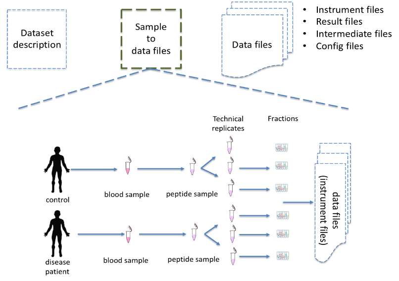

Introduction
=============================

Many resources have emerged that provide raw or integrated proteomics data in the public domain. Among them, ProteomeXchange consortium (including PRIDE Archive, MassIVE, JPOST or IProx) define a group of guidelines to ensure the quality of the data and the metadata associated with the datasets.

Unfortunately, proteomics experimental design and sample related information are often missing in public repositories or stored in very diverse ways and formats. For example:

 - `CPTAC consortium <https://cptac-data-portal.georgetown.edu/>`_ provides for every dataset a set of excel files with the information on each sample (e.g. `S048 <https://cptac-data-portal.georgetown.edu/study-summary/S048>`_) including tumor size, origin, but also how every sample is related to a specific raw file (e.g. instrument configuration parameters).
 - ProteomicsDB, captures for each sample in the database a minimum number of properties to describe the sample and the related experimental protocol such as tissue, digestion method and instrument (e.g. `Project 4267 <https://www.proteomicsdb.org/#projects/4267/6228>`_).
 -  ProteomeXchange submissions only required a minimum unstructured metadata such as species, instruments, post-translational modifications or disease. This metadata is captured at the project level making difficult to associate each specific metadata term with the samples in the study (Figure 1).

.. note:: The lack of detailed and well-structure metadata at a sample level  prevents data interpretation, reproducibility, and integration of data from different resources.

**Figure 1**: SDRF-Proteomics file format stores the information of the sample and its relation to the data files in the dataset. The file format includes not only information about the sample but also about how the data was acquired and processed.

.. Important::
   The following use cases can be defined for the format:

   - Capturing the experimental design of a proteomics experiment, particularly the relationship between the samples analyzed and the instrument files generated during data acquisition in the laboratory.
   - Capturing sample metadata, including information on the source and any treatments applied that could affect data analysis.
   - Providing comprehensive metadata for instrument files, so that users can have a general understanding of how the data was acquired.

Specifications
---------------------

The SDRF-Proteomics format describes the sample characteristics and the relationships between samples and data files included in a dataset. The information in SDRF files is organised so that it follows the natural flow of a proteomics experiment. The main requirements to be fulfilled for the SDRF-Proteomics format are:

- The SDRF file is a tab-delimited format where each ROW corresponds to a relationship between a Sample and a Data file.
- Each column MUST correspond to an attribute/property of the Sample or the Data file.
- Each value in each cell MUST be the property for a given Sample or Data file.
- The SDRF file must start with columns describing the properties of the sample (e.g. organism, disease, phenotype etc), followed by the properties of data files which was generated from the analysis of the experimental results (e.g. label, faction identifier, data file etc).
- Support for handling unknown values/characteristics.

.. Caution::
   The SDRF-Proteomics aims to capture the sample metadata and its relationship with the data files (e.g., raw files from mass spectrometers). The SDRF-Proteomics does not aim to capture the downstream analysis part of the experimental design including details of which samples were compared to which other samples, how samples are combined into study variables or parameters for the downstream analysis such as FDR or p-values thresholds.
