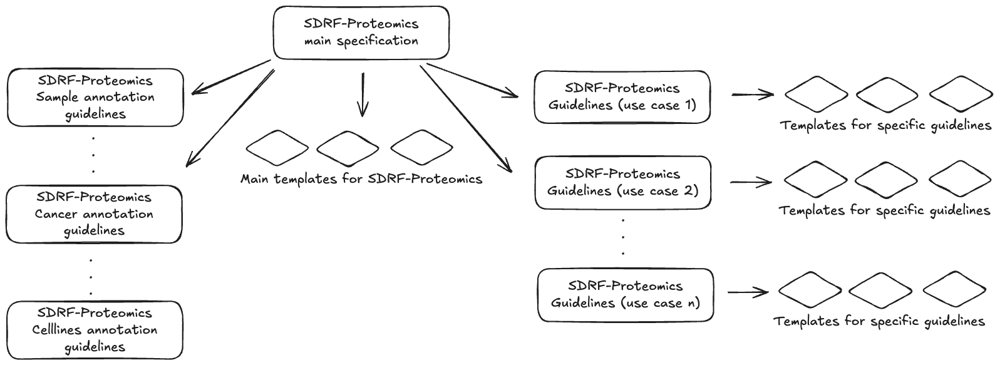

// suppress inspection "GrazieInspection" for whole file
= Sample and Data Relationship Format for Proteomics (SDRF-Proteomics)
:sectnums:
:toc: left
:doctype: book
//only works on some backends, not HTML
:showcomments:
//use style like Section 1 when referencing within the document.
:xrefstyle: short
:figure-caption: Figure
:pdf-page-size: A4

//GitHub specific settings
ifdef::env-github[]
:tip-caption: :bulb:
:note-caption: :information_source:
:important-caption: :heavy_exclamation_mark:
:caution-caption: :fire:
:warning-caption: :warning:
endif::[]

[[status]]
== Status of this document

This document provides information to the proteomics community about a proposed standard for sample metadata annotations in public repositories called Sample and Data Relationship Format (SDRF)-Proteomics. Distribution is unlimited.

**Version v1.1.0** - 2025-01

[[abstract]]
== Abstract

The Human Proteome Organisation (HUPO) Proteomics Standards Initiative (PSI) defines community standards for data representation in proteomics to facilitate data comparison, exchange, and verification. This document presents a specification for the Sample and Data Relationship Format (SDRF-Proteomics).

Further detailed information, including any updates to this document, implementations, and examples is available at https://github.com/bigbio/proteomics-metadata-standard[SDRF GitHub Repository]. The official PSI web page for the document is: https://www.psidev.info/sdrf-sample-data-relationship-format[HUPO-PSI SDRF].

[[motivation]]
== Motivation

Many resources have emerged that provide raw or integrated proteomics data in the public domain. If these are valuable individually, their integration through re-analysis represents a huge asset for the community <<ref1>>.

Unfortunately, proteomics experimental design and sample related information are often missing in public repositories or stored in very diverse ways and formats. For example:

- The https://cptac-data-portal.georgetown.edu/[CPTAC Consortium] provides for every dataset a set of Excel files with the information on https://cptac-data-portal.georgetown.edu/study-summary/S048[each sample] including tumor size, origin, but also how every sample is related to a specific raw file (e.g. instrument configuration parameters).

- As a resource routinely re-analysing public datasets, https://www.proteomicsdb.org/[ProteomicsDB] captures for each sample in the database a minimum number of properties to describe the sample and the related experimental protocol such as tissue, digestion method and instrument.

Such heterogeneity often prevents data interpretation, reproducibility, and integration of data from different resources. For every proteomics dataset we propose to capture at least three levels of metadata:

- (i) dataset description
- (ii) the sample metadata and data files acquisition metadata.
- (iii) The relation between the sample and the data files. The experimental design.

The general description includes minimum information to describe the study overall: http://proteomecentral.proteomexchange.org/cgi/GetDataset?ID=PXD016060.0-1&outputMode=XML[title, description, date of publication, type of experiment]. In ProteomeXchange partners this metadata is captured at the dataset level, in other omics resources this is captured as IDF file format (e.g. MAGE-TAB). Currently, all ProteomeXchange partners mandate this information for each dataset. However, the information regarding the sample and its relation to the data files (**Figure 1**) is mostly missing <<ref1>>.

image::https://github.com/bigbio/proteomics-metadata-standard/raw/master/sdrf-proteomics/images/sample-metadata.png[]

**Figure 1**: SDRF-Proteomics file format stores the information of the sample and its relation to the data files in the dataset. The file format includes not only information about the sample but also about how the data was acquired and processed.

Here, we introduced the Sample and Data Relationship Format (SDRF-Proteomics) to capture the sample metadata and its relation to the data files for proteomics experiments. The SDRF-Proteomics format is a tab-delimited file format that describes the sample characteristics and the relationships between samples and data files included in a dataset.

This specification, which is a community effort, aims to provide a standard for the proteomics community to annotate the sample metadata and its relation to the data files.

[[quick-start]]
== Quick Start

If you're new to SDRF-Proteomics, here's a minimal example to get you started. An SDRF file is a tab-separated file where each row represents a sample-to-data-file relationship.

=== Minimal Example

ifdef::backend-html5[]
++++

<table>
<thead>
<tr>
<th class="sample-col">source name</th>
<th class="sample-col">characteristics[organism]</th>
<th class="sample-col">characteristics[organism part]</th>
<th class="sample-col">characteristics[disease]</th>
<th class="sample-col">characteristics[biological replicate]</th>
<th class="data-col">assay name</th>
<th class="data-col">technology type</th>
<th class="data-col">comment[proteomics data acquisition method]</th>
<th class="data-col">comment[label]</th>
<th class="data-col">comment[instrument]</th>
<th class="data-col">comment[cleavage agent details]</th>
<th class="data-col">comment[fraction identifier]</th>
<th class="data-col">comment[technical replicate]</th>
<th class="data-col">comment[data file]</th>
<th class="factor-col">factor value[disease]</th>
</tr>
</thead>
<tbody>
<tr>
<td class="sample-col">sample_1</td>
<td class="sample-col">homo sapiens</td>
<td class="sample-col">liver</td>
<td class="sample-col">normal</td>
<td class="sample-col">1</td>
<td class="data-col">run_1</td>
<td class="data-col">proteomic profiling by mass spectrometry</td>
<td class="data-col">Data-dependent acquisition</td>
<td class="data-col">label free sample</td>
<td class="data-col">Q Exactive HF</td>
<td class="data-col">NT=Trypsin;AC=MS:1001251</td>
<td class="data-col">1</td>
<td class="data-col">1</td>
<td class="data-col">sample_1.raw</td>
<td class="factor-col">normal</td>
</tr>
<tr>
<td class="sample-col">sample_2</td>
<td class="sample-col">homo sapiens</td>
<td class="sample-col">liver</td>
<td class="sample-col">hepatocellular carcinoma</td>
<td class="sample-col">1</td>
<td class="data-col">run_2</td>
<td class="data-col">proteomic profiling by mass spectrometry</td>
<td class="data-col">Data-dependent acquisition</td>
<td class="data-col">label free sample</td>
<td class="data-col">Q Exactive HF</td>
<td class="data-col">NT=Trypsin;AC=MS:1001251</td>
<td class="data-col">1</td>
<td class="data-col">1</td>
<td class="data-col">sample_2.raw</td>
<td class="factor-col">hepatocellular carcinoma</td>
</tr>
</tbody>
</table>

 Sample metadata (characteristics)
 Data file metadata (comments)
 Factor values

++++
endif::[]

ifndef::backend-html5[]
[%header,cols="1,1,1,1,1,1,1,1,1,1,1,1,1,1,1"]
|===
|source name |characteristics[organism] |characteristics[organism part] |characteristics[disease] |characteristics[biological replicate] |assay name |technology type |comment[proteomics data acquisition method] |comment[label] |comment[instrument] |comment[cleavage agent details] |comment[fraction identifier] |comment[technical replicate] |comment[data file] |factor value[disease]

|sample_1 |homo sapiens |liver |normal |1 |run_1 |proteomic profiling by mass spectrometry |Data-dependent acquisition |label free sample |Q Exactive HF |NT=Trypsin;AC=MS:1001251 |1 |1 |sample_1.raw |normal
|sample_2 |homo sapiens |liver |hepatocellular carcinoma |1 |run_2 |proteomic profiling by mass spectrometry |Data-dependent acquisition |label free sample |Q Exactive HF |NT=Trypsin;AC=MS:1001251 |1 |1 |sample_2.raw |hepatocellular carcinoma
|===
_Blue: Sample metadata | Green: Data file metadata | Orange: Factor values_
endif::[]

NOTE: This minimal example shows a **mass spectrometry-based** proteomics experiment. For detailed requirements see the link:templates/ms-base.html[MS-Base template]. For **affinity-based proteomics** (Olink, SomaScan), different columns are required - see the link:templates/affinity-base.html[Affinity-Base template].

=== Key Concepts

1. **Sample metadata** uses `characteristics[...]` columns (e.g., organism, disease)
2. **Data file metadata** uses `comment[...]` columns (e.g., instrument, label)
3. **Factor values** use `factor value[...]` columns to indicate variables under study
4. Each row links one sample to one data file

=== Format Requirements

The SDRF-Proteomics format has the following core requirements:

- The SDRF file is a **tab-delimited format** where each row corresponds to a relationship between a Sample and a Data file.
- Each column MUST correspond to an attribute/property of the Sample or the Data file.
- Each cell value MUST be the property value for the corresponding Sample or Data file.
- The file MUST start with columns describing sample properties (e.g., organism, disease), followed by data file properties (e.g., label, fraction identifier, data file).
- Unknown values MUST be handled using <<reserved-words,reserved words>>: `not available` (value is unknown), `not applicable` (property doesn't apply), or `pooled` (value is a mixture from multiple samples).

=== Scope

The SDRF-Proteomics format aims to capture the **sample metadata** and its **relationship with data files** (e.g., raw files from mass spectrometers).

IMPORTANT: SDRF-Proteomics does **not** aim to capture downstream analysis details, including: which samples were compared to which other samples, how samples are combined into study variables, or analysis parameters such as FDR thresholds or p-value cutoffs.

=== Getting Started Steps

1. Choose a <<templates,technology template>> based on your <<technology-type,technology type>>: `ms-base` for _proteomic profiling by mass spectrometry_, `affinity-base` for _protein expression profiling by antibody/aptamer array_ (Olink, SomaScan)
2. Add the appropriate <<templates,sample template>> for your organism (Human, Vertebrates, Invertebrates, Plants, or Cell-lines)
3. Fill in sample metadata (characteristics columns)
4. Fill in data file metadata (comment columns)
5. Add factor values for your experimental variables
6. Validate your file using https://github.com/bigbio/sdrf-pipelines[sdrf-pipelines]

For detailed guidance, continue reading the full specification below.

[[validation]]
== Validating SDRF Files

The official validator for SDRF-Proteomics files is **sdrf-pipelines**, a Python tool that checks your SDRF file for errors and compliance with the specification.

Installation:

[source,bash]
----
pip install sdrf-pipelines
----

Basic Validation:

[source,bash]
----
# Validate an SDRF file
parse_sdrf validate-sdrf --sdrf_file your_file.sdrf.tsv

# Validate with a specific template
parse_sdrf validate-sdrf --sdrf_file your_file.sdrf.tsv --template human
----

For more information, visit: https://github.com/bigbio/sdrf-pipelines[sdrf-pipelines on GitHub]

== Specification structure

This document describes the main specification of SDRF-Proteomics, the structure of the specification (**Figure 2**), how to contribute, and extend the specification. SDRF-Proteomics uses a three-tier system for organizing metadata requirements:

* https://github.com/bigbio/proteomics-metadata-standard/blob/master/sdrf-proteomics/README.adoc[The SDRF-Proteomics core specification]: This document contains the main specification, requirements and rules for the SDRF-Proteomics format. It also includes the notational conventions and the relationship to other specifications.

* https://github.com/bigbio/proteomics-metadata-standard/tree/master/sdrf-proteomics/templates[Templates]: All templates are organized in the `templates/` directory. This includes:
- **Core templates** (organism-based): link:templates/human.html[human], link:templates/vertebrates.html[vertebrates], link:templates/invertebrates.html[invertebrates], link:templates/plants.html[plants]
- **Specialized templates** (experiment-type): link:templates/cell-lines.html[cell-lines] (sample), link:templates/dda-acquisition.html[DDA acquisition] (data), link:templates/dia-acquisition.html[DIA acquisition] (data), link:templates/single-cell.html[single-cell] (mixed), link:templates/affinity-proteomics.html[affinity-proteomics] (data), link:templates/crosslinking.html[crosslinking] (data), link:templates/immunopeptidomics.html[immunopeptidomics] (mixed), link:templates/metaproteomics.html[metaproteomics] (mixed)

Each template has its own directory containing a detailed README.adoc with checklists and examples, plus a template file ({name}-template.sdrf.tsv) with column headers. See the <<templates,Templates>> section.

**Figure 2**: SDRF-Proteomics specification structure. The main specification defines the core rules and is extended by technology templates (ms-base, affinity-base), sample templates (human, vertebrates, etc.), and specialized experiment-type templates.

NOTE: The main specification is in the `sdrf-proteomics` directory. All templates are organized in `sdrf-proteomics/templates/`. Templates are extensions of the core specification and should follow all the rules and requirements in the main specification. Each template includes its own detailed documentation with checklists, examples, and annotation guidelines specific to that template type. 

The official website for SDRF-Proteomics project is https://github.com/bigbio/proteomics-metadata-standard. New use cases, changes to the specification and examples can be added by using Pull requests or issues in GitHub to reach the bigbio team.

A set of examples and annotated projects from ProteomeXchange can be found here: https://github.com/bigbio/proteomics-metadata-standard/tree/master/annotated-projects

Multiple tools have been implemented to validate, annotate and convert SDRF-Proteomics files. The official validator of SDRF-Proteomics is sdrf-pipelines (Python - https://github.com/bigbio/sdrf-pipelines). This tool allows to validate an SDRF-Proteomics file. In addition, it allows converting SDRF to other popular pipelines and software configure files such as MaxQuant or OpenMS.

[[versioning]]
=== Versioning

The SDRF-Proteomics specification is versioned using the Semantic Versioning 2.0.0 (https://semver.org/) scheme. The version number is in the format MAJOR.MINOR.PATCH, where:

* MAJOR version is incremented for incompatible changes to the specification, when major changes are done to the specification.

* MINOR version is incremented for new features that are backward compatible with the previous version. Guidelines and templates are added or modified.

* PATCH version is incremented for bug fixes and minor changes that do not affect the specification or the templates. This includes typos, formatting changes, and other minor updates.

Every change in the specification should be done in GitHub using pull requests into the dev branch. The pull request should include a description of the changes and the reason for the changes. The pull request will be reviewed by the community and merged into the main branch when approved. After the merge, the version number will be updated according to the changes made, the release will be performed, and the Zenodo record will be updated.

NOTE: We added the prefix v to the version number to indicate that it is the version of the specification that was used to create the file. Examples: v1.1.0, v2.0.0, v3.0.0.

[[notation-conventions]]
=== Notational Conventions

The key words “MUST”, “MUST NOT”, “REQUIRED”, “SHALL”, “SHALL NOT”, “SHOULD”, “SHOULD NOT”, “RECOMMEND/RECOMMENDED”, “MAY”, “COULD BE”, and “OPTIONAL” are to be interpreted as described in RFC 2119 (https://www.rfc-editor.org/rfc/rfc2119).

[[relationship-specifications]]
=== Relationship to other specifications

SDRF-Proteomics is fully compatible with the SDRF file format part of https://www.ebi.ac.uk/arrayexpress/help/magetab_spec.html[MAGE-TAB]. MAGE-TAB is the file format used to store metadata and sample information for transcriptomics experiments. When the ProteomeXchange project file is converted to idf file (project description in MAGE-TAB) and is combined with the SDRF-Proteomics a valid MAGE-TAB is obtained.

SDRF-Proteomics sample information can be embedded into mzTab metadata files. The sample metadata in mzTab contains properties as the columns in the SDRF-Proteomics and values as Sample cell values.

The SDRF-Proteomics aims to capture the sample metadata and its relationship with the data files (e.g. raw files from mass spectrometers). The SDRF-Proteomics do not aim to capture the downstream analysis part of the experimental design such as what samples should be compared, how they can be combined or parameters for the downstream analysis (FDR or p-values thresholds). The HUPO-PSI community will work in the future to include this information in other file formats such as mzTab or a new type of file format.

== SDRF-Proteomics specification

The SDRF-Proteomics file format describes the sample characteristics and the relationships between samples and data files. The file format is a tab-delimited one where each *ROW* corresponds to a relationship between a Sample and a Data file (in an ms proteomics experiment the data file containing the mass spectra), each *COLUMN* corresponds to an attribute/property of the Sample, the Data file, or the Factor values; and the value in each **CELL** is the specific value of the property for a given Sample/Data file/Factor value (**Figure 3**).

ifdef::backend-html5[]
++++

<table>
<thead>
<tr>
<th class="sample-col">source name</th>
<th class="sample-col">characteristics[organism]</th>
<th class="sample-col">characteristics[...]</th>
<th class="sample-col">characteristics[biological replicate]</th>
<th class="data-col">assay name</th>
<th class="data-col">technology type</th>
<th class="data-col">comment[...]</th>
<th class="data-col">comment[data file]</th>
<th class="factor-col">factor value[...]</th>
</tr>
</thead>
<tbody>
<tr>
<td class="sample-col">sample_1</td>
<td class="sample-col">homo sapiens</td>
<td class="sample-col">...</td>
<td class="sample-col">1</td>
<td class="data-col">run_1</td>
<td class="data-col">proteomic profiling by mass spectrometry</td>
<td class="data-col">...</td>
<td class="data-col">sample_1.raw</td>
<td class="factor-col">...</td>
</tr>
<tr>
<td class="sample-col">sample_2</td>
<td class="sample-col">homo sapiens</td>
<td class="sample-col">...</td>
<td class="sample-col">2</td>
<td class="data-col">run_2</td>
<td class="data-col">proteomic profiling by mass spectrometry</td>
<td class="data-col">...</td>
<td class="data-col">sample_2.raw</td>
<td class="factor-col">...</td>
</tr>
</tbody>
</table>

 Sample metadata (characteristics)
 Data file metadata (comments)
 Factor values

++++
endif::[]

ifndef::backend-html5[]
[%header,cols="1,1,1,1,1,1,1,1,1"]
|===
|source name |characteristics[organism] |characteristics[...] |characteristics[biological replicate] |assay name |technology type |comment[...] |comment[data file] |factor value[...]

|sample_1 |homo sapiens |... |1 |run_1 |proteomic profiling by mass spectrometry |... |sample_1.raw |...
|sample_2 |homo sapiens |... |2 |run_2 |proteomic profiling by mass spectrometry |... |sample_2.raw |...
|===
_Blue: Sample metadata (characteristics) | Green: Data file metadata (comments) | Orange: Factor values_
endif::[]

**Figure 3**: SDRF-Proteomics in a nutshell. Each *row* links a sample to a data file. *Columns* represent sample properties (characteristics), data file properties (comments), or experimental variables (factor values).

The SDRF-Proteomics format contains three main sections:

- The first section contains the <<from-sample-metadata,sample metadata>>.
- The second section contains the <<from-sample-data,data file metadata>>.
- The third section contains the <<study-variables,factor values>> properties.

[[sdrf-file-rules]]
=== Format rules

- **Case sensitivity**: Text values are case-insensitive, but **column names are case-sensitive**. Use lowercase for all column names (e.g., `source name`, `characteristics[organism]`, `comment[label]`). Incorrect casing like `Source Name` or `Characteristics[organism]` will cause validation failures.
- **Space sensitivity**: The SDRF is sensitive to spaces in column names (`sourcename` ≠ `source name`). Column names must include appropriate spaces (e.g., `source name`, not `sourcename`) but must NOT have a space before the bracket (e.g., `characteristics[organism]`, not `characteristics [organism]`).
- **Column order**: The SDRF columns follows some structure; first the sample metadata columns in <<from-sample-metadata>>; then the data file metadata columns in <<from-sample-data>>; followed by the factor values columns in <<study-variables>>.
- **Extension**: The extension of the SDRF file SHOULD be **sdrf.tsv (preferred)** or .txt.

[[reserved-words]]
=== Reserved words

There are general scenarios where cell values cannot be provided with actual data. The following reserved words MUST be used in these cases:

- **not available**: In some cases, the column is mandatory in the format, but for some samples the corresponding value is unknown or could not be determined. In those cases, users SHOULD use *not available*.
- **not applicable**: In some cases, the column is mandatory, but for some samples the corresponding value or concept does not apply. In those cases, users SHOULD use *not applicable*.
- **pooled**: In some cases, the sample is a pool of multiple samples (e.g., TMT reference channels), and the value cannot be represented as a single value. In those cases, users SHOULD use *pooled*.

.Reserved words for SDRF cell values
|===
|Term |Meaning |Example |Use Case

|not available
|Value exists but is unknown or could not be determined
|characteristics[age] = not available
|Patient age was not recorded in the study

|not applicable
|Value or concept does not apply to this sample
|characteristics[age] = not applicable
|Synthetic peptide library has no age

|pooled
|Value represents a mixture of multiple samples
|characteristics[biological replicate] = pooled
|TMT reference channel pooled from multiple replicates
|===

[[file-level-metadata]]
=== SDRF file-level metadata

Since version 1.1.0, SDRF-Proteomics supports optional file-level metadata using header comments at the beginning of the file. These header comments provide information about the SDRF file itself, such as the format version, template used, and validation status. This approach is inspired by other omics formats such as VCF (Variant Call Format) file headers and is fully compatible with pandas and other tabular data processing tools.

Header comments MUST:

- Start with `#` (single hash) followed by a key-value pair
- Appear at the very beginning of the file, before the column header row
- Use the format `#key=value`

The following header fields are supported:

ifdef::backend-html5[]
++++
<table class="tableblock frame-all grid-all stretch requirements-table">
<colgroup>
<col style="width: 18%;">
<col style="width: 35%;">
<col style="width: 20%;">
<col style="width: 14%;">
<col style="width: 13%;">
</colgroup>
<thead>
<tr>
<th>Key</th>
<th>Description</th>
<th>Example</th>
<th>Requirement</th>
<th>Ontology Term</th>
</tr>
</thead>
<tbody>
<tr>
<td><code>file_format</code></td>
<td>Identifier for the file format</td>
<td>SDRF</td>
<td>RECOMMENDED</td>
<td><a href="https://www.ebi.ac.uk/ols4/ontologies/pride/classes/http%253A%252F%252Fpurl.obolibrary.org%252Fobo%252FPRIDE_0000831">PRIDE:0000831</a></td>
</tr>
<tr>
<td><code>version</code></td>
<td>SDRF-Proteomics specification version used</td>
<td>v1.1.0</td>
<td>RECOMMENDED</td>
<td><a href="https://www.ebi.ac.uk/ols4/ontologies/ncit/classes/http%253A%252F%252Fpurl.obolibrary.org%252Fobo%252FNCIT_C25714">NCIT:C25714</a></td>
</tr>
<tr>
<td><code>template</code></td>
<td>Name of the template used</td>
<td>ms-base, human, cell-lines</td>
<td>OPTIONAL</td>
<td><a href="https://www.ebi.ac.uk/ols4/ontologies/pride/classes/http%253A%252F%252Fpurl.obolibrary.org%252Fobo%252FPRIDE_0000832">PRIDE:0000832</a></td>
</tr>
<tr>
<td><code>template_version</code></td>
<td>Version of the template</td>
<td>v1.0.0</td>
<td>OPTIONAL</td>
<td><a href="https://www.ebi.ac.uk/ols4/ontologies/pride/classes/http%253A%252F%252Fpurl.obolibrary.org%252Fobo%252FPRIDE_0000833">PRIDE:0000833</a></td>
</tr>
<tr>
<td><code>source</code></td>
<td>Origin or creator of the file</td>
<td>PRIDE, user-generated</td>
<td>OPTIONAL</td>
<td><a href="https://www.ebi.ac.uk/ols4/ontologies/ncit/classes/http%253A%252F%252Fpurl.obolibrary.org%252Fobo%252FNCIT_C25683">NCIT:C25683</a></td>
</tr>
<tr>
<td><code>validation_hash</code></td>
<td>Hash from validator certification</td>
<td>sha256:abc123...</td>
<td>OPTIONAL</td>
<td><a href="https://www.ebi.ac.uk/ols4/ontologies/pride/classes/http%253A%252F%252Fpurl.obolibrary.org%252Fobo%252FPRIDE_0000834">PRIDE:0000834</a></td>
</tr>
</tbody>
</table>
++++
endif::[]

ifndef::backend-html5[]
[cols="2,4,2,1,2", options="header"]
|===
|Key |Description |Example |Requirement |Ontology Term

|`file_format` |Identifier for the file format |SDRF |RECOMMENDED |PRIDE:0000831
|`version` |SDRF-Proteomics specification version used |v1.1.0 |RECOMMENDED |NCIT:C25714
|`template` |Name of the template used |ms-base, human, cell-lines |OPTIONAL |PRIDE:0000832
|`template_version` |Version of the template |v1.0.0 |OPTIONAL |PRIDE:0000833
|`source` |Origin or creator of the file |PRIDE, user-generated |OPTIONAL |NCIT:C25683
|`validation_hash` |Hash from validator certification |sha256:abc123... |OPTIONAL |PRIDE:0000834
|===
endif::[]

Example of an SDRF file with header comments (simplified example showing only select columns; see <<templates>> for complete required columns):

[source,tsv]
----
#file_format=SDRF
#version=v1.1.0
#template=human
#template_version=v1.0.0
#source=PRIDE
source name	characteristics[organism]	characteristics[organism part]	characteristics[disease]	assay name	comment[data file]
sample_1	homo sapiens	liver	normal	run_1	sample_1.raw
----

NOTE: Header comments are OPTIONAL. SDRF files without header comments are still valid. When present, header comments provide valuable provenance information and enable tools to handle version-specific features appropriately. Header property names use underscores (e.g., `file_format`, `template_version`) rather than spaces to maintain consistency with the tab-delimited nature of SDRF files and avoid ambiguity when parsing.

[[column-headers]]
=== Table Column headers

Depending on each section the column headers (property names) will be prefixed with the following prefixes: 

- `characteristics`: Sample metadata (e.g. _characteristics[organism]_)
- `comment`: Data file metadata (e.g. _comment[data file]_) 
- `factor value`: Factor values properties (e.g. _factor value[disease]_)

Each property name MUST be a valid ontology term or a valid controlled vocabulary term. Each section will have some specific order for column headers. 

NOTE: A list of all controlled vocabularies and ontologies supported are in the <<ontologies-supported>> section. On each section we also provide a list of properties that are supported.

[[sdrf-file-standardization]]
=== Table Cell values

The value for each property, (e.g. characteristics, comment, factor value) corresponding to each sample or data file can be represented in multiple ways.

- **Free Text (Human readable)**: In the free text representation, the value is provided as text without Ontology support (e.g. colon or providing accession numbers). This is only RECOMMENDED when the text inserted in the table is the exact name of an ontology/CV term in EFO. If the term is not in EFO, other ontologies can be used.

ifdef::backend-html5[]
++++

<table>
<thead>
<tr>
<th class="sample-col">source name</th>
<th class="sample-col">characteristics[organism]</th>
</tr>
</thead>
<tbody>
<tr>
<td class="sample-col">sample 1</td>
<td class="sample-col">homo sapiens</td>
</tr>
<tr>
<td class="sample-col">sample 2</td>
<td class="sample-col">homo sapiens</td>
</tr>
</tbody>
</table>

++++
endif::[]

ifndef::backend-html5[]
|===
| source name | characteristics[organism]

| sample 1 |homo sapiens
| sample 2 |homo sapiens
|===
endif::[]

- **Ontology url (Computer readable)**: Users can provide the corresponding URI (Uniform Resource Identifier) of the ontology/CV term as a value. This is recommended for enriched files where the user does not want to use intermediate tools to map from free text to ontology/CV terms.

ifdef::backend-html5[]
++++

<table>
<thead>
<tr>
<th class="sample-col">source name</th>
<th class="sample-col">characteristics[organism]</th>
</tr>
</thead>
<tbody>
<tr>
<td class="sample-col">Sample 1</td>
<td class="sample-col">http://purl.obolibrary.org/obo/NCBITaxon_9606</td>
</tr>
<tr>
<td class="sample-col">Sample 2</td>
<td class="sample-col">http://purl.obolibrary.org/obo/NCBITaxon_9606</td>
</tr>
</tbody>
</table>

++++
endif::[]

ifndef::backend-html5[]
|===
| source name | characteristics[organism]

| Sample 1 |http://purl.obolibrary.org/obo/NCBITaxon_9606
| Sample 2 |http://purl.obolibrary.org/obo/NCBITaxon_9606
|===
endif::[]

- **Key=value representation (Human and Computer readable)**: The current representation aims to provide a mechanism to represent the complete information of the ontology/CV term including Accession, Name and other additional properties. In the key=value pair representation, the Value of the property is represented as an Object with multiple properties, where the key is one of the properties of the object and the value is the corresponding value for the particular key. An example of key value pairs is post-translational modification (see link:metadata-guidelines/data-file-metadata.html#protein-modifications[Protein Modifications]):

  NT=Glu->pyro-Glu;MT=fixed;PP=Anywhere;AC=Unimod:27;TA=E

[[from-sample-metadata]]
== SDRF-Proteomics: Samples metadata

The Sample metadata section provides information about the samples of origin and their characteristics. Each sample contains a _source name_ (unique identifier) and a set of _characteristics_ columns. The first column of the file should be the _source name_ and the following columns should be the characteristics of the sample. For example, for any proteomics experiment (human, vertebrate, cell line), the following characteristics should be provided:

- *source name*: Unique sample name (it can be present multiple times if the same sample is used several times in the same dataset)
- *characteristics[organism]*: The organism of the Sample of origin. Values MUST come from https://www.ebi.ac.uk/ols4/ontologies/ncbitaxon[NCBI Taxonomy].
- *characteristics[organism part]*: The part of organism's anatomy or substance arising from an organism from which the biomaterial was derived (e.g., liver). Values SHOULD come from https://www.ebi.ac.uk/ols4/ontologies/uberon[UBERON] or https://www.ebi.ac.uk/ols4/ontologies/bto[BTO].
- *characteristics[disease]*: The disease under study in the Sample. Values SHOULD come from https://www.ebi.ac.uk/ols4/ontologies/mondo[MONDO], https://www.ebi.ac.uk/ols4/ontologies/efo[EFO], or https://www.ebi.ac.uk/ols4/ontologies/doid[DOID]. For healthy/control samples, use `normal` (https://www.ebi.ac.uk/ols4/ontologies/pato/classes/http%253A%252F%252Fpurl.obolibrary.org%252Fobo%252FPATO_0000461[PATO:0000461]) - see link:metadata-guidelines/sample-metadata.html#disease-annotation[Disease Annotation Guidelines].
- *characteristics[cell type]*: A cell type is a distinct morphological or functional form of cell (e.g., epithelial, glial). Values SHOULD come from https://www.ebi.ac.uk/ols4/ontologies/cl[Cell Ontology (CL)] or https://www.ebi.ac.uk/ols4/ontologies/bto[BTO].

Example:

ifdef::backend-html5[]
++++

<table>
<thead>
<tr>
<th class="sample-col">source name</th>
<th class="sample-col">characteristics[organism]</th>
<th class="sample-col">characteristics[organism part]</th>
<th class="sample-col">characteristics[disease]</th>
<th class="sample-col">characteristics[cell type]</th>
</tr>
</thead>
<tbody>
<tr>
<td class="sample-col">sample_treat</td>
<td class="sample-col">homo sapiens</td>
<td class="sample-col">liver</td>
<td class="sample-col">liver cancer</td>
<td class="sample-col">not available</td>
</tr>
<tr>
<td class="sample-col">sample_control</td>
<td class="sample-col">homo sapiens</td>
<td class="sample-col">liver</td>
<td class="sample-col">liver cancer</td>
<td class="sample-col">not available</td>
</tr>
</tbody>
</table>

 Sample metadata

++++
endif::[]

ifndef::backend-html5[]
[%header,cols="1,1,1,1,1"]
|===
|source name |characteristics[organism] |characteristics[organism part] |characteristics[disease] |characteristics[cell type]

|sample_treat |homo sapiens |liver |liver cancer |not available
|sample_control |homo sapiens |liver |liver cancer |not available
|===
endif::[]

NOTE: Additional characteristics can be added depending on the type of the experiment and sample. The https://github.com/bigbio/proteomics-metadata-standard/tree/master/sdrf-proteomics/templates[SDRF-Proteomics templates] defines a set of templates and checklists of properties that should be provided depending on the proteomics experiment. In the core guidelines and templates, main document of SDRF-Proteomics, we explain the major sample properties for different experiments. However, SDRF-Proteomics can be extended using guidelines for specific experiments.

IMPORTANT: Each characteristic name in the column header SHOULD be a CV term from the EFO ontology. For example, the header `characteristics[organism]` corresponds to the ontology term Organism. However the values could be from EFO or other ontologies. For example, we RECOMMEND to use MONDO for diseases because it has better coverage than EFO. For healthy samples, use `normal` (PATO:0000461) - see link:metadata-guidelines/sample-metadata.html#disease-annotation[Disease Annotation Guidelines].

IMPORTANT: Multiple values (columns) for the same `characteristics` term are allowed in SDRF-Proteomics (see <<column-cardinality>>). However, it is RECOMMENDED not to use the same column in the same file. If you have multiple phenotypes, you can specify what it refers to or use another more specific term, e.g., "immunophenotype".

[[biosamples-integration]]
=== BioSamples database integration

https://www.ebi.ac.uk/biosamples/[BioSamples] provides persistent identifiers for biological samples that enable cross-database linking <<ref5>>. Use the optional _characteristics[biosample accession number]_ column to link samples to BioSamples entries (EBI format: SAMEA*, NCBI format: SAMN*).

**Column:** `characteristics[biosample accession number]`

**Examples:** `SAMN12345678` (NCBI), `SAMEA12345678` (EBI)

Example usage:

ifdef::backend-html5[]
++++

<table>
<thead>
<tr>
<th class="sample-col">source name</th>
<th class="sample-col">characteristics[biosample accession number]</th>
<th class="sample-col">characteristics[organism]</th>
<th class="sample-col">characteristics[organism part]</th>
<th class="sample-col">characteristics[disease]</th>
</tr>
</thead>
<tbody>
<tr>
<td class="sample-col">sample_001</td>
<td class="sample-col">SAMN12345678</td>
<td class="sample-col">homo sapiens</td>
<td class="sample-col">liver</td>
<td class="sample-col">liver cancer</td>
</tr>
<tr>
<td class="sample-col">sample_002</td>
<td class="sample-col">SAMN12345679</td>
<td class="sample-col">homo sapiens</td>
<td class="sample-col">liver</td>
<td class="sample-col">normal</td>
</tr>
<tr>
<td class="sample-col">sample_003</td>
<td class="sample-col">SAMEA12345680</td>
<td class="sample-col">mus musculus</td>
<td class="sample-col">brain</td>
<td class="sample-col">normal</td>
</tr>
</tbody>
</table>

 Sample metadata

++++
endif::[]

ifndef::backend-html5[]
[%header,cols="1,1,1,1,1"]
|===
|source name |characteristics[biosample accession number] |characteristics[organism] |characteristics[organism part] |characteristics[disease]

|sample_001 |SAMN12345678 |homo sapiens |liver |liver cancer
|sample_002 |SAMN12345679 |homo sapiens |liver |normal
|sample_003 |SAMEA12345680 |mus musculus |brain |normal
|===
endif::[]

The BioSamples accession number enables connection to sample resources across databases, linking proteomics data with genomics, transcriptomics, and other omics datasets.

NOTE: BioSample accession numbers from NCBI follow the format `SAMNxxxxxxxxxx` and from EBI follow the format `SAMEAxxxxxxxxx`, where `x` represents digits. Either NCBI or EBI BioSample accession numbers can be used depending on where the sample is registered. The _characteristics[biosample accession number]_ column is OPTIONAL, but when available, providing BioSample accession numbers is RECOMMENDED to enhance data integration and reusability. Users must first request BioSample accession numbers from the appropriate service (NCBI or EBI) before including them in their SDRF files.

[[sample-technical-biological-replicates]]
=== Encoding sample technical and biological replicates

SDRF-Proteomics uses two columns to track replicates <<ref4>>:

- **characteristics[biological replicate]**: Identifies independent biological samples within each experimental condition (factor value group). Replicate numbers are assigned per condition, so if you have 2 cancer samples and 2 healthy samples, both groups would have biological replicates numbered 1 and 2.
- **comment[technical replicate]**: Identifies repeated measurements of the same sample (e.g., multiple LC-MS/MS injections)

IMPORTANT: Biological replicate numbering restarts for each experimental condition (factor value). For example, in a disease study with factor value[disease], the cancer samples would be numbered 1, 2, 3... and the normal samples would independently be numbered 1, 2, 3... This establishes the relationship between each sample and its experimental condition.

The following example shows 2 biological replicates, each with 2 fractions and 2 technical replicates:

ifdef::backend-html5[]
++++

<table>
<thead>
<tr>
<th class="sample-col">source name</th>
<th class="sample-col">characteristics[biological replicate]</th>
<th class="data-col">assay name</th>
<th class="data-col">comment[label]</th>
<th class="data-col">comment[fraction identifier]</th>
<th class="data-col">comment[technical replicate]</th>
<th class="data-col">comment[data file]</th>
</tr>
</thead>
<tbody>
<tr>
<td class="sample-col">patient_001_sample</td>
<td class="sample-col">1</td>
<td class="data-col">run_01</td>
<td class="data-col">label free sample</td>
<td class="data-col">1</td>
<td class="data-col">1</td>
<td class="data-col">P001_F1_TR1.raw</td>
</tr>
<tr>
<td class="sample-col">patient_001_sample</td>
<td class="sample-col">1</td>
<td class="data-col">run_02</td>
<td class="data-col">label free sample</td>
<td class="data-col">2</td>
<td class="data-col">1</td>
<td class="data-col">P001_F2_TR1.raw</td>
</tr>
<tr>
<td class="sample-col">patient_001_sample</td>
<td class="sample-col">1</td>
<td class="data-col">run_03</td>
<td class="data-col">label free sample</td>
<td class="data-col">1</td>
<td class="data-col">2</td>
<td class="data-col">P001_F1_TR2.raw</td>
</tr>
<tr>
<td class="sample-col">patient_001_sample</td>
<td class="sample-col">1</td>
<td class="data-col">run_04</td>
<td class="data-col">label free sample</td>
<td class="data-col">2</td>
<td class="data-col">2</td>
<td class="data-col">P001_F2_TR2.raw</td>
</tr>
<tr>
<td class="sample-col">patient_002_sample</td>
<td class="sample-col">2</td>
<td class="data-col">run_05</td>
<td class="data-col">label free sample</td>
<td class="data-col">1</td>
<td class="data-col">1</td>
<td class="data-col">P002_F1_TR1.raw</td>
</tr>
<tr>
<td class="sample-col">patient_002_sample</td>
<td class="sample-col">2</td>
<td class="data-col">run_06</td>
<td class="data-col">label free sample</td>
<td class="data-col">2</td>
<td class="data-col">1</td>
<td class="data-col">P002_F2_TR1.raw</td>
</tr>
<tr>
<td class="sample-col">patient_002_sample</td>
<td class="sample-col">2</td>
<td class="data-col">run_07</td>
<td class="data-col">label free sample</td>
<td class="data-col">1</td>
<td class="data-col">2</td>
<td class="data-col">P002_F1_TR2.raw</td>
</tr>
<tr>
<td class="sample-col">patient_002_sample</td>
<td class="sample-col">2</td>
<td class="data-col">run_08</td>
<td class="data-col">label free sample</td>
<td class="data-col">2</td>
<td class="data-col">2</td>
<td class="data-col">P002_F2_TR2.raw</td>
</tr>
</tbody>
</table>

 Sample metadata
 Data file metadata

++++
endif::[]

ifndef::backend-html5[]
[%header,cols="1,1,1,1,1,1,1"]
|===
|source name |characteristics[biological replicate] |assay name |comment[label] |comment[fraction identifier] |comment[technical replicate] |comment[data file]

|patient_001_sample |1 |run_01 |label free sample |1 |1 |P001_F1_TR1.raw
|patient_001_sample |1 |run_02 |label free sample |2 |1 |P001_F2_TR1.raw
|patient_001_sample |1 |run_03 |label free sample |1 |2 |P001_F1_TR2.raw
|patient_001_sample |1 |run_04 |label free sample |2 |2 |P001_F2_TR2.raw
|patient_002_sample |2 |run_05 |label free sample |1 |1 |P002_F1_TR1.raw
|patient_002_sample |2 |run_06 |label free sample |2 |1 |P002_F2_TR1.raw
|patient_002_sample |2 |run_07 |label free sample |1 |2 |P002_F1_TR2.raw
|patient_002_sample |2 |run_08 |label free sample |2 |2 |P002_F2_TR2.raw
|===
endif::[]

In this example:

- **Biological replicates**: `patient_001_sample` and `patient_002_sample` are different biological samples (different source names), annotated with `characteristics[biological replicate]` values 1 and 2
- **Technical replicates**: Each biological sample is measured twice (`comment[technical replicate]` = 1 and 2)
- **Fractions**: Each technical replicate has 2 fractions (`comment[fraction identifier]` = 1 and 2)

IMPORTANT: Both _characteristics[biological replicate]_ and _comment[technical replicate]_ columns are REQUIRED. When no replicates are performed in a study, set both columns to 1 (i.e., each sample is biological replicate 1 and technical replicate 1). For **pooled samples** (e.g., TMT reference channels), use `pooled` for biological replicate since these samples are mixtures of multiple replicates and assigning a specific replicate number would be misleading.

Some examples with explicit annotation of the biological replicates can be found here:

- https://github.com/bigbio/proteomics-metadata-standard/blob/c3a56b076ef381280dfcb0140d2520126ace53ff/annotated-projects/PXD006401/PXD006401.sdrf.tsv

[[pooled-samples]]
=== Pooled samples

When multiple samples are pooled into one, the general approach is to annotate them separately, abiding by the general rule: one row stands for one sample-to-file relationship. In this case, multiple rows are created for the corresponding data file, much like in multiplexed labeling experiments (see link:metadata-guidelines/data-file-metadata.html#label-annotations[Label Annotations]).

One possible exception is made for the case when one channel (e.g., in a TMT/iTRAQ multiplexed experiment) is used for a sample pooled from all other channels, typically for normalization purposes. In this case, it is not necessary to repeat all sample annotations. Instead, the _characteristics[pooled sample]_ column SHOULD be used.

==== Allowed values for characteristics[pooled sample]

The _characteristics[pooled sample]_ column accepts the following values:

|===
|Value |Description |When to Use

|not pooled
|Sample is not pooled, represents a single biological sample
|Regular individual samples

|pooled
|Sample is pooled but individual source samples cannot be annotated
|When pooling details are unknown or samples are from external sources

|SN=sample1;SN=sample2;...
|Structured format listing source names of pooled samples
|When individual samples are known and annotated in the same SDRF file
|===

NOTE: The `SN` key stands for "source name" and lists the `source name` values of samples that are annotated in the same file and used in the same experiment and same MS run. Use semicolons to separate multiple entries.

==== Example with simple pooled annotation

When pooling details are unknown or samples come from external sources, use the simple `pooled` value:

ifdef::backend-html5[]
++++

<table>
<thead>
<tr>
<th class="sample-col">source name</th>
<th class="sample-col">characteristics[pooled sample]</th>
<th class="sample-col">characteristics[organism]</th>
<th class="data-col">assay name</th>
<th class="data-col">comment[label]</th>
<th class="data-col">comment[data file]</th>
</tr>
</thead>
<tbody>
<tr>
<td class="sample-col">sample_1</td>
<td class="sample-col">not pooled</td>
<td class="sample-col">homo sapiens</td>
<td class="data-col">run_1</td>
<td class="data-col">TMT126</td>
<td class="data-col">file01.raw</td>
</tr>
<tr>
<td class="sample-col">sample_2</td>
<td class="sample-col">not pooled</td>
<td class="sample-col">homo sapiens</td>
<td class="data-col">run_1</td>
<td class="data-col">TMT127N</td>
<td class="data-col">file01.raw</td>
</tr>
<tr>
<td class="sample-col">pooled_ref</td>
<td class="sample-col">pooled</td>
<td class="sample-col">homo sapiens</td>
<td class="data-col">run_1</td>
<td class="data-col">TMT131C</td>
<td class="data-col">file01.raw</td>
</tr>
</tbody>
</table>

 Sample metadata
 Data file metadata

++++
endif::[]

ifndef::backend-html5[]
[%header,cols="1,1,1,1,1,1"]
|===
|source name |characteristics[pooled sample] |characteristics[organism] |assay name |comment[label] |comment[data file]

|sample_1 |not pooled |homo sapiens |run_1 |TMT126 |file01.raw
|sample_2 |not pooled |homo sapiens |run_1 |TMT127N |file01.raw
|pooled_ref |pooled |homo sapiens |run_1 |TMT131C |file01.raw
|===
endif::[]

==== Example with detailed pooled reference

When pooled samples are known and annotated in the same SDRF file, use the `SN=` format:

ifdef::backend-html5[]
++++

<table>
<thead>
<tr>
<th class="sample-col">source name</th>
<th class="sample-col">characteristics[pooled sample]</th>
<th class="sample-col">characteristics[organism]</th>
<th class="sample-col">characteristics[age]</th>
<th class="sample-col">characteristics[sex]</th>
<th class="data-col">assay name</th>
<th class="data-col">comment[label]</th>
<th class="data-col">comment[data file]</th>
</tr>
</thead>
<tbody>
<tr>
<td class="sample-col">sample_1</td>
<td class="sample-col">not pooled</td>
<td class="sample-col">homo sapiens</td>
<td class="sample-col">45Y</td>
<td class="sample-col">male</td>
<td class="data-col">run_1</td>
<td class="data-col">TMT126</td>
<td class="data-col">file01.raw</td>
</tr>
<tr>
<td class="sample-col">sample_2</td>
<td class="sample-col">not pooled</td>
<td class="sample-col">homo sapiens</td>
<td class="sample-col">52Y</td>
<td class="sample-col">female</td>
<td class="data-col">run_1</td>
<td class="data-col">TMT127N</td>
<td class="data-col">file01.raw</td>
</tr>
<tr>
<td class="sample-col">sample_3</td>
<td class="sample-col">not pooled</td>
<td class="sample-col">homo sapiens</td>
<td class="sample-col">38Y</td>
<td class="sample-col">male</td>
<td class="data-col">run_1</td>
<td class="data-col">TMT127C</td>
<td class="data-col">file01.raw</td>
</tr>
<tr>
<td class="sample-col">pooled_ref</td>
<td class="sample-col">SN=sample_1;SN=sample_2;SN=sample_3</td>
<td class="sample-col">homo sapiens</td>
<td class="sample-col">pooled</td>
<td class="sample-col">pooled</td>
<td class="data-col">run_1</td>
<td class="data-col">TMT131C</td>
<td class="data-col">file01.raw</td>
</tr>
</tbody>
</table>

 Sample metadata
 Data file metadata

++++
endif::[]

ifndef::backend-html5[]
[%header,cols="1,2,1,1,1,1,1,1"]
|===
|source name |characteristics[pooled sample] |characteristics[organism] |characteristics[age] |characteristics[sex] |assay name |comment[label] |comment[data file]

|sample_1 |not pooled |homo sapiens |45Y |male |run_1 |TMT126 |file01.raw
|sample_2 |not pooled |homo sapiens |52Y |female |run_1 |TMT127N |file01.raw
|sample_3 |not pooled |homo sapiens |38Y |male |run_1 |TMT127C |file01.raw
|pooled_ref |SN=sample_1;SN=sample_2;SN=sample_3 |homo sapiens |pooled |pooled |run_1 |TMT131C |file01.raw
|===
endif::[]

TIP: For pooled samples (e.g., TMT reference channels), use `pooled` for individual-specific fields including **biological replicate**, age, sex, and individual. This clearly indicates that the value represents a mixture rather than a single sample. If all pooled samples share a value (e.g., all females, or age range 40Y-50Y), that shared value MAY be used instead.

=== Sample Metadata Guidelines

For detailed guidance on annotating sample metadata, refer to the following conventions documents:

* link:metadata-guidelines/sample-metadata.html[Sample Metadata Guidelines] - Detailed guidelines for age, sex, disease, organism part, cell type, developmental stage, spiked-in samples, and other sample characteristics
* link:templates/human.html[Human Sample Metadata Guidelines] - Human-specific metadata including disease staging, treatment history, demographics, and lifestyle factors

[[from-sample-data]]
== SDRF-Proteomics: data files metadata

The connection between samples and data files is done using properties annotated with the `comment` prefix. All properties referring to a data file (e.g., MS run file) are annotated with the category `comment`. This differentiates data file properties from sample properties (characteristics).

[[cv-term-format]]
=== CV Term Format for Data File Metadata

For data file metadata (`comment` columns) that reference ontology terms, use the structured format: `NT={term name};AC={accession}`

Examples: `NT=HCD;AC=PRIDE:0000590`, `NT=Orbitrap;AC=MS:1000484`

This format enables automated validation and software extraction from raw files. Sample metadata (characteristics) can use simple term names since they are typically human-annotated.

The following properties MUST be provided for each data file in **mass spectrometry-based proteomics** experiments. For **affinity-based proteomics** (Olink, SomaScan), see the link:templates/affinity-base.html[Affinity-Base template] for different required columns.

ifdef::backend-html5[]
++++
<table class="tableblock frame-all grid-all stretch requirements-table">
<colgroup>
<col style="width: 30%;">
<col style="width: 12%;">
<col style="width: 38%;">
<col style="width: 20%;">
</colgroup>
<thead>
<tr>
<th>Column</th>
<th>Requirement</th>
<th>Description</th>
<th>Ontology</th>
</tr>
</thead>
<tbody>
<tr>
<td><code>assay name</code></td>
<td>REQUIRED</td>
<td>Unique identifier for an MS run/data file</td>
<td>Free text</td>
</tr>
<tr>
<td><code>technology type</code></td>
<td>REQUIRED</td>
<td>Technology used to capture the data</td>
<td>Fixed values</td>
</tr>
<tr>
<td><code>comment[proteomics data acquisition method]</code></td>
<td>REQUIRED</td>
<td>DDA, DIA, PRM, SRM</td>
<td><a href="https://www.ebi.ac.uk/ols4/ontologies/pride/classes/http%253A%252F%252Fpurl.obolibrary.org%252Fobo%252FPRIDE_0000659">PRIDE:0000659</a></td>
</tr>
<tr>
<td><code>comment[label]</code></td>
<td>REQUIRED</td>
<td>Label applied to sample (or "label free sample")</td>
<td><a href="https://www.ebi.ac.uk/ols4/ontologies/pride/classes/http%253A%252F%252Fpurl.obolibrary.org%252Fobo%252FPRIDE_0000093">PRIDE - Labels</a></td>
</tr>
<tr>
<td><code>comment[instrument]</code></td>
<td>REQUIRED</td>
<td>Mass spectrometer model</td>
<td><a href="https://www.ebi.ac.uk/ols4/ontologies/ms/classes/http%253A%252F%252Fpurl.obolibrary.org%252Fobo%252FMS_1000031">PSI-MS - Instruments</a></td>
</tr>
<tr>
<td><code>comment[cleavage agent details]</code></td>
<td>REQUIRED</td>
<td>Enzyme information (use "not applicable" for top-down/undigested samples)</td>
<td><a href="https://www.ebi.ac.uk/ols4/ontologies/ms/classes/http%253A%252F%252Fpurl.obolibrary.org%252Fobo%252FMS_1001045">PSI-MS - Cleavage agents</a></td>
</tr>
<tr>
<td><code>comment[fraction identifier]</code></td>
<td>REQUIRED</td>
<td>Fraction number (1 if not fractionated)</td>
<td>Integer</td>
</tr>
<tr>
<td><code>comment[technical replicate]</code></td>
<td>REQUIRED</td>
<td>Technical replicate number (1 if none)</td>
<td>Integer</td>
</tr>
<tr>
<td><code>comment[data file]</code></td>
<td>REQUIRED</td>
<td>Name of the raw file</td>
<td>Free text</td>
</tr>
</tbody>
</table>
++++
endif::[]

ifndef::backend-html5[]
[cols="3,1,4,2", options="header"]
|===
|Column |Requirement |Description |Ontology

|`assay name` |REQUIRED |Unique identifier for an MS run/data file |Free text
|`technology type` |REQUIRED |Technology used to capture the data |Fixed values
|`comment[proteomics data acquisition method]` |REQUIRED |DDA, DIA, PRM, SRM |PRIDE:0000659
|`comment[label]` |REQUIRED |Label applied to sample (or "label free sample") |PRIDE - Labels
|`comment[instrument]` |REQUIRED |Mass spectrometer model |PSI-MS - Instruments
|`comment[cleavage agent details]` |REQUIRED |Enzyme information (use "not applicable" for top-down/undigested samples) |PSI-MS - Cleavage agents
|`comment[fraction identifier]` |REQUIRED |Fraction number (1 if not fractionated) |Integer
|`comment[technical replicate]` |REQUIRED |Technical replicate number (1 if none) |Integer
|`comment[data file]` |REQUIRED |Name of the raw file |Free text
|===
endif::[]

Example:

ifdef::backend-html5[]
++++

<table>
<thead>
<tr>
<th class="sample-col">source name</th>
<th class="data-col">assay name</th>
<th class="data-col">technology type</th>
<th class="data-col">comment[proteomics data acquisition method]</th>
<th class="data-col">comment[label]</th>
<th class="data-col">comment[instrument]</th>
<th class="data-col">comment[data file]</th>
</tr>
</thead>
<tbody>
<tr>
<td class="sample-col">sample_1</td>
<td class="data-col">sample1_run1</td>
<td class="data-col">proteomic profiling by mass spectrometry</td>
<td class="data-col">data-dependent acquisition</td>
<td class="data-col">label free sample</td>
<td class="data-col">Q Exactive HF</td>
<td class="data-col">sample1.raw</td>
</tr>
</tbody>
</table>

 Sample metadata
 Data file metadata

++++
endif::[]

ifndef::backend-html5[]
[%header,cols="1,1,2,1,1,1,1"]
|===
|source name |assay name |technology type |comment[proteomics data acquisition method] |comment[label] |comment[instrument] |comment[data file]

|sample_1 |sample1_run1 |proteomic profiling by mass spectrometry |data-dependent acquisition |label free sample |Q Exactive HF |sample1.raw
|===
endif::[]

[[sample-prep-fragmentation]]
=== Sample Preparation and Fragmentation (MS-based only)

NOTE: This section applies to **mass spectrometry-based proteomics** experiments only. For affinity-based proteomics, these properties do not apply.

For detailed documentation of sample preparation and MS/MS fragmentation properties, see the link:metadata-guidelines/data-file-metadata.html[Data File Metadata Guidelines]:

- **Sample preparation**: depletion, reduction reagent, alkylation reagent
- **Fractionation**: fractionation method (used with `comment[fraction identifier]`)
- **Fragmentation**: collision energy, dissociation method

[[data-acquisition-method]]
=== Proteomics data acquisition method

Proteomics data acquisition method can happen in multiple ways: Data Dependent Acquisition (DDA), Data Independent Acquisition (DIA), and targeted approaches. The SDRF-Proteomics file format REQUIRES capturing the method used for the data acquisition in the _comment[proteomics data acquisition method]_ column. The values MUST be children of the PRIDE ontology term https://www.ebi.ac.uk/ols4/ontologies/pride/classes/http%253A%252F%252Fpurl.obolibrary.org%252Fobo%252FPRIDE_0000659[proteomics data acquisition method (PRIDE:0000659)]. The following values are commonly used:

* https://www.ebi.ac.uk/ols4/ontologies/pride/classes/http%253A%252F%252Fpurl.obolibrary.org%252Fobo%252FPRIDE_0000627[data-dependent acquisition]
* https://www.ebi.ac.uk/ols4/ontologies/pride/classes/http%253A%252F%252Fpurl.obolibrary.org%252Fobo%252FPRIDE_0000450[data-independent acquisition]
  - https://www.ebi.ac.uk/ols4/ontologies/pride/classes/http%253A%252F%252Fpurl.obolibrary.org%252Fobo%252FPRIDE_0000650?lang=en[diaPASEF]
  - https://www.ebi.ac.uk/ols4/ontologies/pride/classes/http%253A%252F%252Fpurl.obolibrary.org%252Fobo%252FPRIDE_0000447[SWATH MS]
* https://www.ebi.ac.uk/ols4/ontologies/pride/classes/http%253A%252F%252Fpurl.obolibrary.org%252Fobo%252FPRIDE_0000629[parallel reaction monitoring]
* https://www.ebi.ac.uk/ols4/ontologies/pride/classes/http%253A%252F%252Fpurl.obolibrary.org%252Fobo%252FPRIDE_0000630[selected reaction monitoring]

IMPORTANT: The _comment[proteomics data acquisition method]_ column is REQUIRED for all mass spectrometry-based SDRF files. This field must be explicitly specified and cannot be omitted or assumed.

You can find an example of a DIA experiment in the following link: https://github.com/bigbio/proteomics-metadata-standard/blob/master/annotated-projects/PXD018830/PXD018830-DIA.sdrf.tsv[DIA example]

TIP: For DIA experiments, additional properties like MS1 scan range can be captured. See link:metadata-guidelines/data-file-metadata.html#_dia_scan_window[DIA Scan Window Limits] in the Data File Metadata Guidelines.

=== Data File Metadata Guidelines

For detailed guidance on data file metadata, refer to the conventions document:

* link:metadata-guidelines/data-file-metadata.html[Data File Metadata Guidelines] - Detailed guidelines for labels, instruments, modifications, cleavage agents, mass tolerances, RAW file URIs, and other data file properties

[[additional-sdrf-rules]]
== Additional SDRF Rules

[[column-cardinality]]
=== Column Cardinality

Some columns can appear multiple times for the same sample. The cardinality rules are:

- **Single (1)**: Column appears exactly once per sample (e.g., `characteristics[biological replicate]`)
- **Multiple (*)**: Column can appear multiple times (e.g., `comment[modification parameters]` can specify multiple post-translational modifications)

Example of multiple `comment[modification parameters]` columns:

ifdef::backend-html5[]
++++

<table>
<thead>
<tr>
<th class="sample-col">source name</th>
<th class="sample-col">characteristics[...]</th>
<th class="data-col">comment[modification parameters]</th>
<th class="data-col">comment[modification parameters]</th>
<th class="data-col">...</th>
</tr>
</thead>
<tbody>
<tr>
<td class="sample-col">sample-1</td>
<td class="sample-col">...</td>
<td class="data-col">NT=Carbamidomethyl;AC=UNIMOD:4;TA=C;MT=fixed</td>
<td class="data-col">NT=Oxidation;AC=UNIMOD:35;TA=M;MT=variable</td>
<td class="data-col">...</td>
</tr>
</tbody>
</table>

 Sample metadata
 Data file metadata

++++
endif::[]

ifndef::backend-html5[]
[%header,cols="1,1,2,2,1"]
|===
|source name |characteristics[...] |comment[modification parameters] |comment[modification parameters] |...
|sample-1 |... |NT=Carbamidomethyl;AC=UNIMOD:4;TA=C;MT=fixed |NT=Oxidation;AC=UNIMOD:35;TA=M;MT=variable |...
|===
endif::[]

[[row-uniqueness]]
=== Row Uniqueness Requirements

SDRF files must satisfy specific uniqueness constraints to ensure data integrity and enable proper indexing by analysis tools.

**Error-level constraint (validation fails):** The combination of `source name` + `assay name` + `comment[label]` MUST be unique across all rows in the SDRF file. If two rows have identical values for all three columns, validation will fail with an error. This constraint ensures that each sample-run-label combination can be uniquely identified.

**Warning-level constraint (validation warns):** The combination of `source name` + `assay name` SHOULD be unique across all rows. Non-unique combinations will generate a warning during validation. This constraint helps identify potential issues where the same sample appears to have multiple entries for the same MS run without distinguishing labels.

**Assay name uniqueness:** Each distinct MS run/data file MUST have exactly one globally unique `assay name`, and no two different data files may share an assay name. To ensure uniqueness, it is RECOMMENDED to incorporate sample-specific information in assay names, such as sample IDs or replicate numbers (e.g., "sample1_run1", "sample1_run2", "patient001_fraction01").

NOTE: For multiplexed experiments (e.g., TMT, iTRAQ), multiple SDRF rows will share the same `assay name` because multiple samples are analyzed in a single MS run. In these cases, the `comment[label]` column distinguishes between different samples within the same run, and the combination of `source name` + `assay name` + `comment[label]` remains unique.

Example of valid multiplexed experiment:

ifdef::backend-html5[]
++++

<table>
<thead>
<tr>
<th class="sample-col">source name</th>
<th>...</th>
<th class="data-col">assay name</th>
<th class="data-col">comment[label]</th>
<th>...</th>
<th class="data-col">comment[data file]</th>
</tr>
</thead>
<tbody>
<tr>
<td class="sample-col">sample_A</td>
<td>...</td>
<td class="data-col">TMT_batch1_run1</td>
<td class="data-col">TMT126</td>
<td>...</td>
<td class="data-col">batch1_run1.raw</td>
</tr>
<tr>
<td class="sample-col">sample_B</td>
<td>...</td>
<td class="data-col">TMT_batch1_run1</td>
<td class="data-col">TMT127N</td>
<td>...</td>
<td class="data-col">batch1_run1.raw</td>
</tr>
<tr>
<td class="sample-col">sample_C</td>
<td>...</td>
<td class="data-col">TMT_batch1_run1</td>
<td class="data-col">TMT127C</td>
<td>...</td>
<td class="data-col">batch1_run1.raw</td>
</tr>
<tr>
<td class="sample-col">sample_D</td>
<td>...</td>
<td class="data-col">TMT_batch1_run1</td>
<td class="data-col">TMT128N</td>
<td>...</td>
<td class="data-col">batch1_run1.raw</td>
</tr>
</tbody>
</table>

 Sample metadata
 Data file metadata

++++
endif::[]

ifndef::backend-html5[]
[%header,cols="1,1,1,1,1,1"]
|===
|source name |... |assay name |comment[label] |... |comment[data file]

|sample_A |... |TMT_batch1_run1 |TMT126 |... |batch1_run1.raw
|sample_B |... |TMT_batch1_run1 |TMT127N |... |batch1_run1.raw
|sample_C |... |TMT_batch1_run1 |TMT127C |... |batch1_run1.raw
|sample_D |... |TMT_batch1_run1 |TMT128N |... |batch1_run1.raw
|===
endif::[]

In this example, all four rows share the same `assay name` and `comment[data file]` because they represent different samples multiplexed in a single MS run. The combination of `source name` + `assay name` + `comment[label]` is unique for each row.

[[templates]]
== Templates

=== What is a Template?

A **template** in SDRF-Proteomics is a predefined set of metadata columns (both required and recommended) that ensures consistent and complete annotation for a specific type of experiment or sample. Templates serve the same purpose as **metadata checklists**, **minimum information standards** (like MIAPE), or **validation schemas** in other data standards—they define what information must be captured to make a dataset FAIR (Findable, Accessible, Interoperable, Reusable).

Each template includes both **sample metadata** (characteristics columns describing the biological sample) and **data file metadata** (comment columns describing the MS data files)—everything needed to create a complete, validated SDRF file.

=== Template Layered Architecture

Templates in SDRF-Proteomics follow a **layered architecture** that separates concerns:

|===
|Layer |Purpose |Templates |Valid Alone?

|**BASE**
|Construction artifact with shared columns
|link:templates/base.html[base]
|No - never use directly

|**TECHNOLOGY**
|Minimum valid templates for data acquisition
|link:templates/ms-base.html[ms-base], link:templates/affinity-base.html[affinity-base]
|**Yes** - these are the minimum valid SDRFs

|**SAMPLE**
|Organism-specific sample metadata
|link:templates/human.html[human], link:templates/vertebrates.html[vertebrates], link:templates/invertebrates.html[invertebrates], link:templates/plants.html[plants]
|No - must combine with TECHNOLOGY

|**EXPERIMENT**
|Experiment-specific columns
|link:templates/cell-lines.html[cell-lines], link:templates/single-cell.html[single-cell], link:templates/crosslinking.html[crosslinking], link:templates/dda-acquisition.html[dda-acquisition], link:templates/dia-acquisition.html[dia-acquisition]
|No - must combine with TECHNOLOGY
|===

**Key concepts:**

- **Technology templates** (`ms-base` or `affinity-base`) are **required** - you must use exactly one
- **Sample templates** (`human`, `vertebrates`, etc.) are **recommended** but optional
- **Experiment templates** provide additional methodology-specific columns
- Templates can be **extended**: add custom columns beyond the template requirements for study-specific metadata

When combining templates, include all required columns from each applicable template. The validator will check compliance with all specified templates.

=== Template Inheritance

Templates form a layered inheritance hierarchy. Child templates inherit all columns and validators from parent templates and can add new columns or strengthen requirements.

[source]
----
base                           # Core columns for all SDRF files
├── ms-base                    # Mass spectrometry technology
│   ├── dda-acquisition       # DDA-specific columns
│   ├── dia-acquisition       # DIA-specific columns
│   └── crosslinking          # XL-MS-specific columns
├── affinity-base              # Affinity proteomics technology
│   └── affinity-proteomics   # Platform-specific columns
├── human                      # Human sample metadata
├── vertebrates                # Vertebrate sample metadata
├── invertebrates              # Invertebrate sample metadata
├── plants                     # Plant sample metadata
└── cell-lines                 # Cell line sample metadata
----

**Inheritance rules:**

1. Child templates inherit all columns from parent templates
2. Child templates may add new columns
3. Child templates may promote `optional` → `recommended` → `required`
4. Child templates **must not** weaken requirements (e.g., `required` → `optional`)
5. Multiple templates can be combined (e.g., `ms-base` + `human` + `crosslinking`)

TIP: **For developers and maintainers:** For detailed information on YAML template structure, validators, and LinkML schema, see the link:metadata-guidelines/template-definitions.html[Template Definitions Guidelines].

=== Choosing Templates

First, determine your proteomics technology and select the appropriate technology template:

|===
| Template | Use For | Documentation | Valid Alone?

| **link:templates/ms-base.html[MS-Base]**
| All mass spectrometry-based proteomics (DDA, DIA, SRM/MRM/PRM)
| link:templates/ms-base.html[Full documentation]
| **Yes** - minimum for MS

| **link:templates/affinity-base.html[Affinity-Base]**
| Affinity-based proteomics (Olink, SomaScan, Luminex, RPPA)
| link:templates/affinity-base.html[Full documentation]
| **Yes** - minimum for affinity
|===

=== Sample Templates

Add the appropriate sample template based on your sample organism:

|===
| Template | Use For | Key Additional Columns | Documentation

| **link:templates/human.html[Human]**
| Human clinical samples
| disease, age, sex, ancestry category, individual
| link:templates/human.html[Full documentation]

| **link:templates/vertebrates.html[Vertebrates]**
| Mouse, rat, zebrafish, other vertebrates
| disease, developmental stage, strain/breed, sex
| link:templates/vertebrates.html[Full documentation]

| **link:templates/invertebrates.html[Invertebrates]**
| Drosophila, C. elegans, insects
| disease, developmental stage, strain/breed, genotype
| link:templates/invertebrates.html[Full documentation]

| **link:templates/plants.html[Plants]**
| Arabidopsis, crops, other plants
| disease, developmental stage, strain/breed, growth conditions, treatment
| link:templates/plants.html[Full documentation]
|===

For detailed explanations of each column, see <<from-sample-metadata,sample metadata>> for sample properties and <<from-sample-data,data file metadata>> for data file properties.

NOTE: The link:metadata-guidelines/sample-metadata.html#cell-type-annotation[characteristics[cell type]] column is RECOMMENDED across all templates when the cell type is known or can be determined. Use `not available` if the cell type cannot be determined (e.g., whole tissue samples, mixed cell populations). For cell line experiments, use the cell-lines template which provides more specific guidance.

[[experiment-templates]]
=== Experiment-Type Templates

In addition to sample templates, SDRF-Proteomics provides specialized experiment-type templates. These templates extend the core templates with methodology-specific columns.

- **link:templates/dda-acquisition.html[DDA Acquisition]**: Data-dependent acquisition experiments. Includes columns for dissociation method, collision energy, fractionation method, modification parameters, and mass tolerances.
- **link:templates/dia-acquisition.html[DIA Acquisition]**: Data-independent acquisition experiments. Includes columns for scan window limits, isolation window width, DIA method, and spectral library information.
- **link:templates/cell-lines.html[Cell Lines]**: Experiments using cell line samples. Includes Cellosaurus integration for cell line identification.
- **link:templates/single-cell.html[Single-Cell Proteomics]**: Single-cell proteomics experiments. Includes columns for cell isolation method, carrier proteome, and single-cell identifiers.
- **link:templates/immunopeptidomics.html[Immunopeptidomics]**: MHC peptide immunopeptidomics. Includes columns for MHC class, HLA typing, and enrichment methods.
- **link:templates/crosslinking.html[Crosslinking MS]**: Cross-linking mass spectrometry experiments. Includes columns for crosslinking reagents and enrichment methods.
- **link:templates/metaproteomics.html[Metaproteomics]**: Environmental and microbiome proteomics. Includes columns for environmental sample type and geographic location.
- **link:templates/affinity-proteomics.html[Affinity Proteomics]**: Affinity-based proteomics (Olink, SomaScan). Includes columns specific to these platforms.

The template files can be downloaded from the https://github.com/bigbio/proteomics-metadata-standard/tree/master/sdrf-proteomics/templates[templates] folder.

[[extending-sdrf]]
=== Extending a Template

Templates define the minimum required and recommended columns for a given experiment type. However, SDRF-Proteomics is designed to be **extensible**:

1. **Add experiment-type templates**: If your experiment type has a specialized template (DDA, DIA, cell-lines, etc.), add it to your base configuration. See <<experiment-templates,Experiment-Type Templates>> above.

2. **Add custom columns**: You can add any additional columns to capture study-specific metadata beyond what templates define. This section provides guidance on adding custom columns.

==== When to Add Custom Columns

Add custom columns when your experiment requires metadata that is:

- Not covered by existing templates but important for data interpretation
- Specific to your experimental design or technology
- Required for cross-study integration or data reuse
- Needed to comply with domain-specific standards (e.g., clinical trials, environmental studies)

==== Rules for Custom Columns

1. **Use appropriate column prefixes:**
** `characteristics[...]` - For sample-related metadata (properties of the biological material)
** `comment[...]` - For technical or protocol-related metadata (data acquisition, processing)
** `factor value[...]` - For experimental variables (see <<study-variables>>)

2. **Follow naming conventions:**
** Use lowercase for column names inside brackets
** Use descriptive, specific names (e.g., `characteristics[tumor grade]` not `characteristics[grade]`)
** Use ontology terms when they exist (e.g., `characteristics[patient bmi]` maps to EFO term)

3. **Use controlled vocabularies when available:**
** Reference existing ontologies (EFO, MONDO, UBERON, etc.) for values
** Prefer standardized terms over free text when possible
** For new terms, follow the key=value format if ontology reference is needed

==== Common Additional Columns

The following columns are not required by templates but are commonly used and recommended for specific study types:

|===
|Column |Category |Description |Example Values |When to Use

|characteristics[material type]
|Sample
|Type of biological material (derived from https://www.fged.org/projects/mage-tab/[MAGE-TAB])
|tissue, cell, cell line, organism part, whole organism, synthetic
|Cross-omics integration, clarifying sample origin

|characteristics[treatment]
|Sample
|Treatment applied to the sample
|dexamethasone, vehicle control, untreated
|Drug treatment studies

|characteristics[time point]
|Sample
|Time of sample collection
|0h, 24h, 7d, baseline
|Time-course experiments

|characteristics[dose]
|Sample
|Dose of treatment if applicable
|10 mg/kg, 100 nM, high dose
|Dose-response studies

|characteristics[patient bmi]
|Sample
|Body mass index (for human studies)
|25.3 kg/m2, 30.1 kg/m2
|Metabolic or obesity-related studies

|characteristics[smoking status]
|Sample
|Smoking history of the patient
|never smoked, current smoker, former smoker
|Lung or cardiovascular studies

|comment[sample preparation]
|Data
|Sample preparation method details
|in-solution digestion, FASP, SP3
|Detailed protocol documentation

|comment[enrichment method]
|Data
|Enrichment or depletion strategy
|phosphopeptide enrichment, glycopeptide enrichment
|PTM-focused studies
|===

See link:metadata-guidelines/sample-metadata.html#material-type[Material Type Guidelines] for detailed guidance on the `characteristics[material type]` column.

==== Example: Adding Study-Specific Columns

For a drug treatment time-course study, you might add columns beyond the template requirements:

ifdef::backend-html5[]
++++

<table>
<thead>
<tr>
<th class="sample-col">source name</th>
<th class="sample-col">characteristics[organism]</th>
<th class="sample-col">characteristics[disease]</th>
<th class="sample-col">characteristics[treatment]</th>
<th class="sample-col">characteristics[time point]</th>
<th class="sample-col">characteristics[dose]</th>
<th class="ellipsis-col">...</th>
<th class="factor-col">factor value[treatment]</th>
<th class="factor-col">factor value[time point]</th>
</tr>
</thead>
<tbody>
<tr>
<td class="sample-col">sample_ctrl_0h</td>
<td class="sample-col">homo sapiens</td>
<td class="sample-col">normal</td>
<td class="sample-col">vehicle control</td>
<td class="sample-col">0h</td>
<td class="sample-col">not applicable</td>
<td class="ellipsis-col">...</td>
<td class="factor-col">vehicle control</td>
<td class="factor-col">0h</td>
</tr>
<tr>
<td class="sample-col">sample_drug_24h</td>
<td class="sample-col">homo sapiens</td>
<td class="sample-col">normal</td>
<td class="sample-col">dexamethasone</td>
<td class="sample-col">24h</td>
<td class="sample-col">100 nM</td>
<td class="ellipsis-col">...</td>
<td class="factor-col">dexamethasone</td>
<td class="factor-col">24h</td>
</tr>
</tbody>
</table>

 Sample metadata
 Factor values

++++
endif::[]

ifndef::backend-html5[]
[%header,cols="1,1,1,1,1,1,1,1,1"]
|===
|source name |characteristics[organism] |characteristics[disease] |characteristics[treatment] |characteristics[time point] |characteristics[dose] |... |factor value[treatment] |factor value[time point]

|sample_ctrl_0h |homo sapiens |normal |vehicle control |0h |not applicable |... |vehicle control |0h
|sample_drug_24h |homo sapiens |normal |dexamethasone |24h |100 nM |... |dexamethasone |24h
|===
endif::[]

TIP: When adding custom columns, check the link:metadata-guidelines/sdrf-terms.tsv[SDRF Terms Reference] and https://www.ebi.ac.uk/ols4/[EBI Ontology Lookup Service (OLS)] to find existing terms that match your metadata needs. Using standardized terms improves data interoperability.

[[study-variables]]
== Factor Values (Study Variables)

Factor values identify the experimental variables being studied - the conditions you want to compare in your analysis. They highlight which sample characteristics are the focus of your experiment.

=== Column Format

`factor value[{variable name}]`

=== When to Use Factor Values

Use factor values to indicate:

- The primary variable(s) under investigation
- Conditions being compared (e.g., disease vs. normal, treated vs. untreated)
- Variables that define experimental groups

NOTE: Use `normal` (not "control") in the disease field for healthy samples. "Control" is an experimental design concept, not a disease state. See link:metadata-guidelines/sample-metadata.html#disease-annotation[Disease Annotation Guidelines] for details.

=== Rules

- Factor value columns SHOULD appear after all characteristics and comment columns
- Multiple factor values can be used when studying multiple variables
- The value in a factor value column typically mirrors a characteristics column value

=== Example

In an experiment comparing tumor vs. normal tissue across different cancer stages:

ifdef::backend-html5[]
++++

<table>
<thead>
<tr>
<th class="sample-col">source name</th>
<th>...</th>
<th class="sample-col">characteristics[disease]</th>
<th class="sample-col">characteristics[disease staging]</th>
<th>...</th>
<th class="factor-col">factor value[disease]</th>
<th class="factor-col">factor value[disease staging]</th>
</tr>
</thead>
<tbody>
<tr>
<td class="sample-col">tumor_sample_1</td>
<td>...</td>
<td class="sample-col">breast carcinoma</td>
<td class="sample-col">stage II</td>
<td>...</td>
<td class="factor-col">breast carcinoma</td>
<td class="factor-col">stage II</td>
</tr>
<tr>
<td class="sample-col">normal_sample_1</td>
<td>...</td>
<td class="sample-col">normal</td>
<td class="sample-col">not applicable</td>
<td>...</td>
<td class="factor-col">normal</td>
<td class="factor-col">not applicable</td>
</tr>
<tr>
<td class="sample-col">tumor_sample_2</td>
<td>...</td>
<td class="sample-col">breast carcinoma</td>
<td class="sample-col">stage III</td>
<td>...</td>
<td class="factor-col">breast carcinoma</td>
<td class="factor-col">stage III</td>
</tr>
</tbody>
</table>

 Sample metadata
 Factor values

++++
endif::[]

ifndef::backend-html5[]
[%header,cols="1,1,1,1,1,1,1"]
|===
|source name |... |characteristics[disease] |characteristics[disease staging] |... |factor value[disease] |factor value[disease staging]
|tumor_sample_1 |... |breast carcinoma |stage II |... |breast carcinoma |stage II
|normal_sample_1 |... |normal |not applicable |... |normal |not applicable
|tumor_sample_2 |... |breast carcinoma |stage III |... |breast carcinoma |stage III
|===
endif::[]

In this example, both `disease` and `disease staging` are factor values because the experiment aims to compare expression differences between disease states and across cancer stages.

[[ontologies-supported]]
== Ontologies and Controlled Vocabularies

SDRF-Proteomics uses ontologies and controlled vocabularies (CVs) to standardize metadata values. The following ontologies are supported:

[cols="^1,<3,<3,<2", options="header"]
|===
|Category |Ontology/CV |Description |Notes

4+^s|*General Purpose*

|General
|https://www.ebi.ac.uk/ols4/ontologies/efo[Experimental Factor Ontology (EFO)]
|General experimental metadata
|

|General
|https://www.ebi.ac.uk/ols4/ontologies/pato[PATO]
|Phenotype and Trait Ontology
|

|General
|https://www.ebi.ac.uk/ols4/ontologies/ncit[NCI Thesaurus (NCIT)]
|Biomedical terminology
|

|General
|https://www.ebi.ac.uk/ols4/ontologies/pride[PRIDE Controlled Vocabulary]
|Proteomics-specific terms
|

4+^s|*Organism and Taxonomy*

|Taxonomy
|https://www.ebi.ac.uk/ols4/ontologies/ncbitaxon[NCBI Taxonomy (NCBITaxon)]
|Organism classification
|

4+^s|*Anatomy and Cell Types*

|Anatomy
|https://www.ebi.ac.uk/ols4/ontologies/uberon[UBERON]
|Cross-species anatomy ontology
|

|Cell Type
|https://www.ebi.ac.uk/ols4/ontologies/cl[Cell Ontology (CL)]
|Cell type classification
|

|Anatomy
|https://www.ebi.ac.uk/ols4/ontologies/bto[BRENDA Tissue Ontology (BTO)]
|Tissues and cell lines
|

|Anatomy
|https://www.ebi.ac.uk/ols4/ontologies/po[Plant Ontology (PO)]
|Plant anatomy and development
|For plant samples

|Anatomy
|https://www.ebi.ac.uk/ols4/ontologies/fbbt[FlyBase Anatomy (FBbt)]
|Drosophila anatomy
|For Drosophila samples

|Anatomy
|https://www.ebi.ac.uk/ols4/ontologies/wbbt[WormBase Anatomy (WBbt)]
|C. elegans anatomy
|For C. elegans samples

|Anatomy
|https://www.ebi.ac.uk/ols4/ontologies/zfa[Zebrafish Anatomy (ZFA)]
|Zebrafish anatomy and development
|For zebrafish samples

4+^s|*Disease* (see link:metadata-guidelines/sample-metadata.html#disease-annotation[Disease Annotation Guidelines])

|Disease
|https://www.ebi.ac.uk/ols4/ontologies/mondo[Mondo Disease Ontology (MONDO)]
|Unified disease ontology
|RECOMMENDED

|Disease
|https://www.ebi.ac.uk/ols4/ontologies/efo[Experimental Factor Ontology (EFO)]
|Disease terms from EFO
|

|Healthy samples
|https://www.ebi.ac.uk/ols4/ontologies/pato[Phenotype And Trait Ontology (PATO)]
|Use `normal` (PATO:0000461) for healthy samples
|

4+^s|*Cell Lines*

|Cell Lines
|https://www.cellosaurus.org/[Cellosaurus]
|Cell line knowledge resource
|RECOMMENDED

|Cell Lines
|https://www.ebi.ac.uk/ols4/ontologies/clo[Cell Line Ontology (CLO)]
|Cell line ontology
|

4+^s|*Mass Spectrometry and Proteomics*

|MS/Proteomics
|https://www.ebi.ac.uk/ols4/ontologies/ms[PSI Mass Spectrometry CV (PSI-MS)]
|Instruments, methods, parameters
|

|Modifications
|https://www.ebi.ac.uk/ols4/ontologies/unimod[Unimod]
|Protein modifications database
|

|Modifications
|https://www.ebi.ac.uk/ols4/ontologies/mod[PSI-MOD CV]
|Protein modifications ontology
|

4+^s|*Other*

|Chemistry
|https://www.ebi.ac.uk/ols4/ontologies/chebi[ChEBI]
|Chemical Entities of Biological Interest
|

|Environment
|https://www.ebi.ac.uk/ols4/ontologies/envo[Environment Ontology (ENVO)]
|Environmental sample classification
|For metaproteomics

|Ancestry
|https://www.ebi.ac.uk/ols4/ontologies/hancestro[Human Ancestry Ontology (HANCESTRO)]
|Human ancestry categories
|For human samples
|===

[[example-annotated-datasets]]
== Examples of Annotated Datasets

The following table provides links to example SDRF files for different experiment types. These can serve as references when creating your own SDRF files.

|===
|Experiment Type |Dataset |Description |SDRF URL

|Label-free
|PXD008934
|Human proteome label-free quantification
|https://github.com/bigbio/proteomics-metadata-standard/tree/master/annotated-projects/PXD008934[View SDRF]

|TMT
|PXD017710
|TMT-labeled quantitative proteomics
|https://github.com/bigbio/proteomics-metadata-standard/tree/master/annotated-projects/PXD017710[View SDRF]

|SILAC
|PXD000612
|SILAC-based quantification
|https://github.com/bigbio/proteomics-metadata-standard/tree/master/annotated-projects/PXD000612[View SDRF]

|DIA
|PXD018830
|Data-independent acquisition
|https://github.com/bigbio/proteomics-metadata-standard/tree/master/annotated-projects/PXD018830[View SDRF]

|Phosphoproteomics
|PXD000759
|PTM enrichment study
|https://github.com/bigbio/proteomics-metadata-standard/tree/master/annotated-projects/PXD000759[View SDRF]

|Cell lines
|PXD001819
|Cell line proteomics
|https://github.com/bigbio/proteomics-metadata-standard/tree/master/annotated-projects/PXD001819[View SDRF]
|===

A comprehensive collection of annotated projects is available at: https://github.com/bigbio/proteomics-metadata-standard/tree/master/annotated-projects[Annotated Projects Repository]

== Ongoing template discussions

We have created a file in GitHub https://github.com/bigbio/proteomics-metadata-standard/blob/master/sdrf-proteomics/templates-under-development.adoc[Ongoing template discussions] where we aggregate all the ongoing discussions about the format and new templates.

== Intellectual Property Statement

The PSI takes no position regarding the validity or scope of any intellectual property or other rights that might be claimed to pertain to the implementation or use of the technology described in this document or the extent to which any license under such rights might or might not be available; neither does it represent that it has made any effort to identify any such rights. Copies of claims of rights made available for publication and any assurances of licenses to be made available or the result of an attempt made to obtain a general license or permission for the use of such proprietary rights by implementers or users of this specification can be obtained from the PSI Chair.

The PSI invites any interested party to bring to its attention any copyrights, patents or patent applications, or other proprietary rights which may cover technology that may be required to practice this recommendation. Please address the information to the PSI Chair (see contacts information at PSI website).

== Copyright Notice

Copyright (C) Proteomics Standards Initiative (2020). All Rights Reserved.

This document and translations of it may be copied and furnished to others, and derivative works that comment on or otherwise explain it or assist in its implementation may be prepared, copied, published, and distributed, in whole or in part, without the restriction of any kind, provided that the above copyright notice and this paragraph are included on all such copies and derivative works. However, this document itself may not be modified in any way, such as by removing the copyright notice or references to the PSI or other organizations, except as needed for the purpose of developing Proteomics Recommendations in which case the procedures for copyrights defined in the PSI Document process must be followed, or as required to translate it into languages other than English.

The limited permissions granted above are perpetual and will not be revoked by the PSI or its successors or assigns.

This document and the information contained herein is provided on an "AS IS" basis and THE PROTEOMICS STANDARDS INITIATIVE DISCLAIMS ALL WARRANTIES, EXPRESS OR IMPLIED, INCLUDING BUT NOT LIMITED TO ANY WARRANTY THAT THE USE OF THE INFORMATION HEREIN WILL NOT INFRINGE ANY RIGHTS OR ANY IMPLIED WARRANTIES OF MERCHANTABILITY OR FITNESS FOR A PARTICULAR PURPOSE."

== How to cite

Please cite this document as:

Dai C, Füllgrabe A, Pfeuffer J, Solovyeva EM, Deng J, Moreno P, Kamatchinathan S, Kundu DJ, George N, Fexova S, Grüning B, Föll MC, Griss J, Vaudel M, Audain E, Locard-Paulet M, Turewicz M, Eisenacher M, Uszkoreit J, Van Den Bossche T, Schwämmle V, Webel H, Schulze S, Bouyssié D, Jayaram S, Duggineni VK, Samaras P, Wilhelm M, Choi M, Wang M, Kohlbacher O, Brazma A, Papatheodorou I, Bandeira N, Deutsch EW, Vizcaíno JA, Bai M, Sachsenberg T, Levitsky LI, Perez-Riverol Y. A proteomics sample metadata representation for multiomics integration and big data analysis. Nat Commun. 2021 Oct 6;12(1):5854. doi: 10.1038/s41467-021-26111-3. PMID: 34615866; PMCID: PMC8494749. [Manuscript - https://www.nature.com/articles/s41467-021-26111-3]

[bibliography]
== References

- [[[ref1,1]]] Y. Perez-Riverol, S. European Bioinformatics Community for Mass, Toward a Sample Metadata Standard in Public Proteomics Repositories, J Proteome Res 19(10) (2020) 3906-3909. https://doi.org/10.1021/acs.jproteome.0c00376[doi:10.1021/acs.jproteome.0c00376]
- [[[ref2,2]]] A. Gonzalez-Beltran, E. Maguire, S.A. Sansone, P. Rocca-Serra, linkedISA: semantic representation of ISA-Tab experimental metadata, BMC Bioinformatics 15 Suppl 14 (2014) S4. https://doi.org/10.1186/1471-2105-15-S14-S4[doi:10.1186/1471-2105-15-S14-S4]
- [[[ref3,3]]] T.F. Rayner, P. Rocca-Serra, P.T. Spellman, et al., A simple spreadsheet-based, MIAME-supportive format for microarray data: MAGE-TAB, BMC Bioinformatics 7 (2006) 489. https://doi.org/10.1186/1471-2105-7-489[doi:10.1186/1471-2105-7-489]
- [[[ref4,4]]] P. Blainey, M. Krzywinski, N. Altman, Points of significance: replication, Nat Methods 11(9) (2014) 879-80. https://doi.org/10.1038/nmeth.3091[doi:10.1038/nmeth.3091]
- [[[ref5,5]]] D. Gupta, I. Liyanage, Y. Perez-Riverol, et al., BioSamples database: the global hub for sample metadata and multi-omics integration, Nucleic Acids Res (2025). https://doi.org/10.1093/nar/gkaf1133[doi:10.1093/nar/gkaf1133]