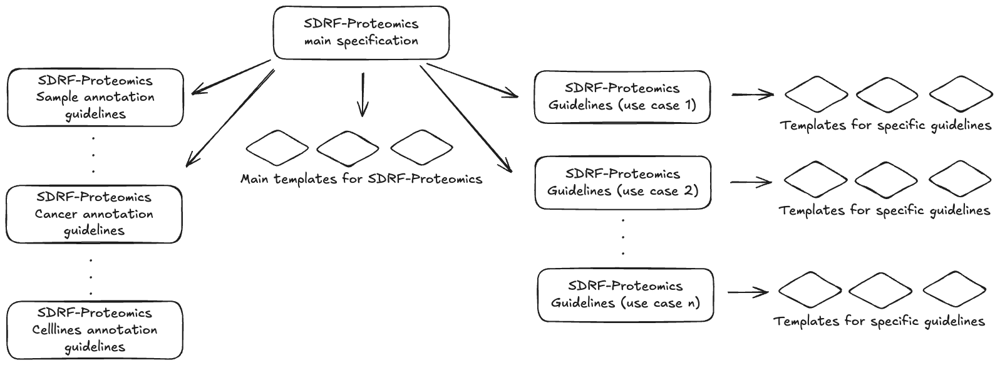

// suppress inspection "GrazieInspection" for whole file
= Sample and Data Relationship Format for Proteomics (SDRF-Proteomics)
:sectnums:
:toc: left
:doctype: book
//only works on some backends, not HTML
:showcomments:
//use style like Section 1 when referencing within the document.
:xrefstyle: short
:figure-caption: Figure
:pdf-page-size: A4

//GitHub specific settings
ifdef::env-github[]
:tip-caption: :bulb:
:note-caption: :information_source:
:important-caption: :heavy_exclamation_mark:
:caution-caption: :fire:
:warning-caption: :warning:
endif::[]

[[status]]
== Status of this document

This document provides information to the proteomics community about a proposed standard for sample metadata annotations in public repositories called Sample and Data Relationship Format (SDRF)-Proteomics. Distribution is unlimited.

**Version v1.1.0** - 2026-01

[[abstract]]
== Abstract

The Human Proteome Organisation (HUPO) Proteomics Standards Initiative (PSI) defines community standards for data representation in proteomics to facilitate data comparison, exchange, and verification. This document presents a specification for the Sample and Data Relationship Format (SDRF-Proteomics).

Further detailed information, including any updates to this document, implementations, and examples is available at https://github.com/bigbio/proteomics-metadata-standard[SDRF GitHub Repository]. The official PSI web page for the document is: https://www.psidev.info/sdrf-sample-data-relationship-format[HUPO-PSI SDRF].

[[motivation]]
== Motivation

Public proteomics data is valuable, but sample metadata is often missing or stored inconsistently across repositories (e.g., https://cptac-data-portal.georgetown.edu/[CPTAC] uses Excel files, https://www.proteomicsdb.org/[ProteomicsDB] captures minimal properties) <<ref1>>. This heterogeneity prevents reproducibility and cross-dataset integration.

SDRF-Proteomics addresses this by providing a standard tab-delimited format to capture (**Figure 1**):

- Sample metadata and characteristics
- Data file acquisition parameters
- Sample-to-file relationships (experimental design)

image::https://github.com/bigbio/proteomics-metadata-standard/raw/master/sdrf-proteomics/images/sample-metadata.png[]

**Figure 1**: SDRF-Proteomics captures sample information and its relationship to data files.

The format is fully compatible with https://www.ebi.ac.uk/arrayexpress/help/magetab_spec.html[MAGE-TAB] SDRF, enabling integration with transcriptomics metadata standards.

== Specification structure

SDRF-Proteomics uses a two-tier system: this **core specification** defines the format rules, and **<<templates,templates>>** provide metadata checklists for specific experiment types (**Figure 2**). Templates are organized in the https://github.com/bigbio/proteomics-metadata-standard/tree/master/sdrf-proteomics/templates[templates/] directory, each with documentation and example files.

**Figure 2**: SDRF-Proteomics specification structure. The main specification defines the core rules and is extended by sample templates (human, vertebrates, etc.) and experiment-type templates (crosslinking, immunopeptidomics, etc.).

The official repository is https://github.com/bigbio/proteomics-metadata-standard[GitHub], where you can find https://github.com/bigbio/sdrf-annotated-datasets/tree/main/datasets[annotated example projects] and the official validator https://github.com/bigbio/sdrf-pipelines[sdrf-pipelines].

[IMPORTANT]
====
Throughout this specification, the keywords "MUST", "REQUIRED", "SHOULD", "RECOMMENDED", and "OPTIONAL" are interpreted as described in https://www.rfc-editor.org/rfc/rfc2119[RFC 2119].
====

[[quick-start]]
== The SDRF-Proteomics Format

SDRF-Proteomics is a **tab-delimited file** where:

- Each **row** = one sample linked to one data file
- Each **column** = a property (sample characteristic, data file attribute, or factor value)
- Each **cell** = the property value for that sample/file or a factor value. 

Here's a minimal example:

[%header,cols="1,1,1,1,1,1,1,1,1,1,1,1,1,1,1"]
|===
|source name |characteristics[organism] |characteristics[organism part] |characteristics[disease] |characteristics[biological replicate] |assay name |technology type |comment[proteomics data acquisition method] |comment[label] |comment[instrument] |comment[cleavage agent details] |comment[fraction identifier] |comment[technical replicate] |comment[data file] |factor value[disease]

|sample_1 |homo sapiens |liver |normal |1 |run_1 |proteomic profiling by mass spectrometry |data-dependent acquisition |label free sample |Q Exactive HF |NT=Trypsin;AC=MS:1001251 |1 |1 |sample_1.raw |normal
|sample_2 |homo sapiens |liver |hepatocellular carcinoma |1 |run_2 |proteomic profiling by mass spectrometry |data-dependent acquisition |label free sample |Q Exactive HF |NT=Trypsin;AC=MS:1001251 |1 |1 |sample_2.raw |hepatocellular carcinoma
|sample_3 |homo sapiens |not available |not available |1 |run_3 |proteomic profiling by mass spectrometry |data-dependent acquisition |label free sample |Q Exactive HF |NT=Trypsin;AC=MS:1001251 |1 |1 |sample_3.raw |not available
|===

The file is organized into three column sections:

1. **Sample metadata** (`characteristics[...]`) - organism, disease, tissue, etc.
2. **Data file metadata** (`comment[...]`) - instrument, label, fraction, data file
3. **Factor values** (`factor value[...]`) - variables under study for statistical analysis

[NOTE]
====
* This example shows **mass spectrometry** proteomics - see https://github.com/bigbio/sdrf-templates/tree/main/ms-proteomics[MS-Proteomics template] for full requirements.
* For **affinity proteomics** (Olink, SomaScan), see https://github.com/bigbio/sdrf-templates/tree/main/affinity-proteomics[Affinity-Proteomics template].
* Unknown values use <<reserved-words,reserved words>>: `not available`, `not applicable`, or `pooled`.
* For a step-by-step tutorial, see the link:quickstart.adoc[Quick Start Guide].
====

[[versioning]]
=== Versioning

The SDRF-Proteomics specification uses https://semver.org/[Semantic Versioning] (MAJOR.MINOR.PATCH). Version numbers are prefixed with "v" (e.g., v1.1.0). Changes are proposed via GitHub pull requests to the dev branch.

For the complete versioning strategy — including template versioning, ontology updates, the deprecation policy, transition timelines, and migration tooling — see link:VERSIONING.adoc[Versioning and Deprecation Policy].

[[sdrf-file-rules]]
=== Format rules

- **Case sensitivity**: Text values are case-insensitive, but **column names are case-sensitive**. Use lowercase for all column names (e.g., `source name`, `characteristics[organism]`, `comment[label]`). Incorrect casing like `Source Name` or `Characteristics[organism]` will cause validation failures.
- **Space sensitivity**: The SDRF is sensitive to spaces in column names (`sourcename` ≠ `source name`). Column names must include appropriate spaces (e.g., `source name`, not `sourcename`) but must NOT have a space before the bracket (e.g., `characteristics[organism]`, not `characteristics [organism]`).
- **Column order**: The SDRF columns follows some structure; first the sample metadata columns in <<from-sample-metadata>>; then the data file metadata columns in <<from-sample-data>>; followed by the factor values columns in <<study-variables>>.
- **Extension**: The extension of the SDRF file SHOULD be **sdrf.tsv (preferred)** or .txt.

[[reserved-words]]
=== Reserved words

There are general scenarios where cell values cannot be provided with actual data. The following reserved words MUST be used in these cases. Reserved words MUST be all lowercase (e.g., `not available`, NOT `Not Available` or `Not available`):

- **not available**: In some cases, the column is mandatory in the format, but for some samples the corresponding value is unknown or could not be determined. In those cases, users SHOULD use *not available*.
- **not applicable**: In some cases, the column is mandatory, but for some samples the corresponding value or concept does not apply. In those cases, users SHOULD use *not applicable*.
- **anonymized**: In some cases, the value exists but has been intentionally redacted for privacy protection (e.g., in clinical studies with de-identified patient data). In those cases, users SHOULD use *anonymized*.
- **pooled**: In some cases, the sample is a pool of multiple samples (e.g., TMT reference channels), and the value cannot be represented as a single value. In those cases, users SHOULD use *pooled*.

.Reserved words for SDRF cell values
|===
|Term |Meaning |Example |Use Case

|not available
|Value exists but is unknown or could not be determined
|characteristics[age] = not available
|Patient age was not recorded in the study

|not applicable
|Value or concept does not apply to this sample
|characteristics[age] = not applicable
|Synthetic peptide library has no age

|anonymized
|Value exists but is redacted for privacy protection
|characteristics[age] = anonymized
|Clinical study with de-identified patient data

|pooled
|Value represents a mixture of multiple samples
|characteristics[biological replicate] = pooled
|TMT reference channel pooled from multiple replicates
|===

[[file-level-metadata]]
=== SDRF file-level metadata

Since version 1.1.0, SDRF-Proteomics supports file-level metadata using dedicated columns. These columns provide information about the SDRF file itself, such as the specification version, template(s) used, annotation tool, and validation status. This column-based approach maintains compatibility with spreadsheet applications (Excel, Google Sheets) and existing data processing tools.

The following metadata columns are supported:

[cols="2,4,2,1,2", options="header"]
|===
|Column |Description |Example Value |Requirement |Ontology Term

|`comment[sdrf version]` |SDRF-Proteomics specification version used. Should follow semantic versioning format (vMAJOR.MINOR.PATCH) |v1.1.0 |RECOMMENDED |PRIDE:0000839
|`comment[sdrf template]` |Template name and version used for annotation. Two formats are supported: simple format (`name vX.Y.Z`) or key=value format (`NT=name;VV=vX.Y.Z`). Multiple templates can be specified using multiple columns. |human v1.1.0 or NT=human;VV=v1.1.0 |OPTIONAL |PRIDE:0000832
|`comment[sdrf annotation tool]` |Software tool, script, or method used to generate or annotate the SDRF file. Two formats are supported: simple format (`name vX.Y.Z`) or key=value format (`NT=name;VV=vX.Y.Z`). |lesSDRF v0.1.0 or NT=lesSDRF;VV=v0.1.0 |OPTIONAL |PRIDE:0000840
|`comment[sdrf validation hash]` |Cryptographic hash (e.g., SHA-256) generated after successful validation |sha256:abc123... |OPTIONAL |PRIDE:0000834
|===

NOTE: When combining multiple templates (e.g., `human` + `ms-proteomics`), use multiple `comment[sdrf template]` columns, one per template. The value in each row should be identical for all samples in the file.

Example of an SDRF file with metadata columns (simplified example showing only select columns; see <<templates>> for complete required columns):

ifndef::env-github[]
++++

<table>
<thead>
<tr>
<th class="sample-col">source name</th>
<th class="sample-col">characteristics[organism]</th>
<th class="sample-col">characteristics[disease]</th>
<th class="data-col">assay name</th>
<th class="data-col">comment[data file]</th>
<th class="data-col">comment[sdrf version]</th>
<th class="data-col">comment[sdrf template]</th>
<th class="data-col">comment[sdrf template]</th>
<th class="data-col">comment[sdrf annotation tool]</th>
</tr>
</thead>
<tbody>
<tr>
<td class="sample-col">sample_1</td>
<td class="sample-col">homo sapiens</td>
<td class="sample-col">normal</td>
<td class="data-col">run_1</td>
<td class="data-col">sample_1.raw</td>
<td class="data-col">v1.1.0</td>
<td class="data-col">human v1.1.0</td>
<td class="data-col">ms-proteomics v1.1.0</td>
<td class="data-col">lesSDRF v0.1.0</td>
</tr>
<tr>
<td class="sample-col">sample_2</td>
<td class="sample-col">homo sapiens</td>
<td class="sample-col">breast cancer</td>
<td class="data-col">run_2</td>
<td class="data-col">sample_2.raw</td>
<td class="data-col">v1.1.0</td>
<td class="data-col">human v1.1.0</td>
<td class="data-col">ms-proteomics v1.1.0</td>
<td class="data-col">lesSDRF v0.1.0</td>
</tr>
</tbody>
</table>

 Sample metadata
 Data file metadata

++++
endif::[]

ifdef::env-github[]
|===
|source name |characteristics[organism] |characteristics[disease] |assay name |comment[data file] |comment[sdrf version] |comment[sdrf template] |comment[sdrf template] |comment[sdrf annotation tool]

|sample_1 |homo sapiens |normal |run_1 |sample_1.raw |v1.1.0 |human v1.1.0 |ms-proteomics v1.1.0 |lesSDRF v0.1.0
|sample_2 |homo sapiens |breast cancer |run_2 |sample_2.raw |v1.1.0 |human v1.1.0 |ms-proteomics v1.1.0 |lesSDRF v0.1.0
|===
endif::[]

[[column-headers]]
=== Table Column headers

Depending on each section the column headers (property names) will be prefixed with the following prefixes: 

- `characteristics`: Sample metadata (e.g. _characteristics[organism]_)
- `comment`: Data file metadata (e.g. _comment[data file]_) 
- `factor value`: Factor values properties (e.g. _factor value[disease]_)

Each property name MUST be a valid ontology term or a valid controlled vocabulary term. Each section will have some specific order for column headers. 

NOTE: A list of all controlled vocabularies and ontologies supported are in the <<ontologies-supported>> section. On each section we also provide a list of properties that are supported.

[[sdrf-file-standardization]]
=== Table Cell values

The value for each property, (e.g. characteristics, comment, factor value) corresponding to each sample or data file can be represented in multiple ways.

- **Free Text (Human readable)**: In the free text representation, the value is provided as text without Ontology support (e.g. colon or providing accession numbers). This is only RECOMMENDED when the text inserted in the table is the exact name of an ontology/CV term in EFO. If the term is not in EFO, other ontologies can be used.

|===
| source name | characteristics[organism]

| sample 1 |homo sapiens
| sample 2 |homo sapiens
|===

- **Ontology url (Computer readable)**: Users can provide the corresponding URI (Uniform Resource Identifier) of the ontology/CV term as a value. This is recommended for enriched files where the user does not want to use intermediate tools to map from free text to ontology/CV terms.

- **Key=value representation (Human and Computer readable)**: The current representation aims to provide a mechanism to represent the complete information of the ontology/CV term including Accession, Name and other additional properties. In the key=value pair representation, the Value of the property is represented as an Object with multiple properties, where the key is one of the properties of the object and the value is the corresponding value for the particular key. The key order MUST be `NT` (name) first, followed by `AC` (accession), then any additional keys. An example of key value pairs is post-translational modification (see link:TEMPLATES.adoc[Protein Modifications]):

  NT=Glu->pyro-Glu;AC=Unimod:27;MT=fixed;PP=Anywhere;TA=E

NOTE: Beyond these three representations, SDRF columns may accept additional structured value types such as numbers with units (`10 ppm`), accession identifiers (`SAMN12345678`), ISO 8601 dates, semantic versions, and more. Each column's YAML template definition declares exactly which value types and formats are accepted. For the complete reference of all value types, parsing rules, and their formal patterns, see link:TEMPLATES.adoc#value-types-reference[Value Types Reference in the Templates Guide].

[[validation]]
== Validating SDRF Files

The official validator for SDRF-Proteomics files is https://github.com/bigbio/sdrf-pipelines[**sdrf-pipelines**], a Python tool that checks your SDRF file for errors and compliance with the specification.

Installation:

[source,bash]
----
pip install sdrf-pipelines
----

Basic Validation:

[source,bash]
----
# Validate an SDRF file
parse_sdrf validate-sdrf --sdrf_file your_file.sdrf.tsv

# Validate with a specific template
parse_sdrf validate-sdrf --sdrf_file your_file.sdrf.tsv --template human
----

For more information, visit: https://github.com/bigbio/sdrf-pipelines[sdrf-pipelines on GitHub]

[[from-sample-metadata]]
== SDRF-Proteomics: Samples metadata

The Sample metadata section provides information about the samples of origin and their characteristics. Each sample contains a _source name_ (unique identifier) and a set of _characteristics_ columns. The first column of the file should be the _source name_ and the following columns should be the characteristics of the sample. For example, for any proteomics experiment (human, vertebrate, cell line), the following characteristics should be provided:

- *source name*: Unique sample name (it can be present multiple times if the same sample is used several times in the same dataset)
- *characteristics[organism]*: The organism of the Sample of origin. Values MUST come from https://www.ebi.ac.uk/ols4/ontologies/ncbitaxon[NCBI Taxonomy].
- *characteristics[organism part]*: The part of organism's anatomy or substance arising from an organism from which the biomaterial was derived (e.g., liver). Values SHOULD come from https://www.ebi.ac.uk/ols4/ontologies/uberon[UBERON] or https://www.ebi.ac.uk/ols4/ontologies/bto[BTO].
- *characteristics[disease]*: The disease under study in the Sample. Values SHOULD come from https://www.ebi.ac.uk/ols4/ontologies/mondo[MONDO], https://www.ebi.ac.uk/ols4/ontologies/efo[EFO], or https://www.ebi.ac.uk/ols4/ontologies/doid[DOID]. For healthy/control samples, use `normal` (https://www.ebi.ac.uk/ols4/ontologies/pato/classes/http%253A%252F%252Fpurl.obolibrary.org%252Fobo%252FPATO_0000461[PATO:0000461]) - see link:SAMPLE-GUIDELINES.adoc#disease-annotation[Disease Annotation Guidelines].
- *characteristics[cell type]*: A cell type is a distinct morphological or functional form of cell (e.g., epithelial, glial). Values SHOULD come from https://www.ebi.ac.uk/ols4/ontologies/cl[Cell Ontology (CL)], https://www.ebi.ac.uk/ols4/ontologies/bto[BTO], or https://www.ebi.ac.uk/ols4/ontologies/clo[Cell Line Ontology (CLO)].

Example:

[%header,cols="1,1,1,1,1"]
|===
|source name |characteristics[organism] |characteristics[organism part] |characteristics[disease] |characteristics[cell type]

|sample_treat |homo sapiens |liver |liver cancer |not available
|sample_control |homo sapiens |liver |liver cancer |not available
|===

[NOTE]
====
* Additional characteristics can be added per experiment type - see https://github.com/bigbio/proteomics-metadata-standard/tree/master/sdrf-proteomics/templates[SDRF-Proteomics templates] for required properties.
* Column headers SHOULD use EFO ontology terms (e.g., `characteristics[organism]`) - see link:SAMPLE-GUIDELINES.adoc#disease-annotation[Disease Annotation Guidelines].
* Multiple columns with the same `characteristics` term are allowed (see <<column-cardinality>>), but RECOMMENDED to use more specific terms (e.g., "immunophenotype" instead of duplicate "phenotype").
====

[[biosamples-integration]]
=== BioSamples database integration

Use the OPTIONAL `characteristics[biosample accession number]` column to link samples to https://www.ebi.ac.uk/biosamples/[BioSamples] <<ref5>>, enabling cross-database integration with genomics and transcriptomics data. Formats: `SAMN*` (NCBI) or `SAMEA*` (EBI).

[[sample-technical-biological-replicates]]
=== Encoding sample technical and biological replicates

SDRF-Proteomics uses two REQUIRED columns to track replicates <<ref4>>:

- **characteristics[biological replicate]**: Independent biological samples. Numbering restarts per experimental condition (factor value group).
- **comment[technical replicate]**: Repeated measurements of the same sample (e.g., multiple injections)

When no replicates are performed, set both columns to `1`. For pooled samples, use `pooled` for biological replicate.

[%header,cols="1,1,1,1,1"]
|===
|source name |characteristics[biological replicate] |comment[fraction identifier] |comment[technical replicate] |comment[data file]

|patient_001 |1 |1 |1 |P001_F1_TR1.raw
|patient_001 |1 |1 |2 |P001_F1_TR2.raw
|patient_002 |2 |1 |1 |P002_F1_TR1.raw
|patient_002 |2 |1 |2 |P002_F1_TR2.raw
|===

[[pooled-samples]]
=== Pooled samples

When multiple samples are pooled into one (e.g., TMT/iTRAQ reference channels for normalization), use the _characteristics[pooled sample]_ column to indicate pooling status. Allowed values:

- **not pooled**: Regular individual samples
- **pooled**: Sample is pooled but individual sources are unknown
- **SN=sample1;SN=sample2;...**: Lists source names of pooled samples when known

Example:

[%header,cols="1,2,1,1,1,1"]
|===
|source name |characteristics[pooled sample] |characteristics[organism] |characteristics[age] |comment[label] |comment[data file]

|sample_1 |not pooled |homo sapiens |45Y |TMT126 |file01.raw
|sample_2 |not pooled |homo sapiens |52Y |TMT127N |file01.raw
|pooled_ref |SN=sample_1;SN=sample_2 |homo sapiens |pooled |TMT131C |file01.raw
|===

TIP: For pooled samples, use `pooled` for individual-specific fields (biological replicate, age, sex) to indicate a mixture rather than a single sample.

=== Sample Metadata Guidelines

For detailed guidance on annotating sample metadata, refer to the following conventions documents:

* link:SAMPLE-GUIDELINES.adoc[Sample Metadata Guidelines] - Detailed guidelines for age, sex, disease, organism part, cell type, developmental stage, spiked-in samples, and other sample characteristics
* https://github.com/bigbio/sdrf-templates/tree/main/human[Human Sample Metadata Guidelines] - Human-specific metadata including disease staging, treatment history, demographics, and lifestyle factors

[[from-sample-data]]
== SDRF-Proteomics: data files metadata

The connection between samples and data files is done using properties annotated with the `comment` prefix. All properties referring to a data file (e.g., MS run file) are annotated with the category `comment`. This differentiates data file properties from sample properties (characteristics).

[[cv-term-format]]
=== CV Term Format for Data File Metadata

For data file metadata (`comment` columns) that reference ontology terms, use the structured format: `NT={term name};AC={accession}`

Examples: `NT=HCD;AC=PRIDE:0000590`, `NT=Orbitrap;AC=MS:1000484`

This format enables automated validation and software extraction from raw files. Sample metadata (characteristics) can use simple term names since they are typically human-annotated.

The following properties MUST be provided for each data file in **mass spectrometry-based proteomics** experiments. For **affinity-based proteomics** (Olink, SomaScan), see the https://github.com/bigbio/sdrf-templates/tree/main/affinity-proteomics[Affinity-Proteomics template] for different required columns.

[cols="3,1,4,2", options="header"]
|===
|Column |Requirement |Description |Ontology

|`assay name` |REQUIRED |Unique identifier for an MS run/data file |Free text
|`technology type` |REQUIRED |Technology used to capture the data |Fixed values
|`comment[proteomics data acquisition method]` |REQUIRED |DDA, DIA, PRM, SRM |PRIDE:0000659
|`comment[label]` |REQUIRED |Label applied to sample (or "label free sample") |PRIDE - Labels
|`comment[instrument]` |REQUIRED |Mass spectrometer model |PSI-MS - Instruments
|`comment[cleavage agent details]` |REQUIRED |Enzyme information (use "not applicable" for top-down/undigested samples) |PSI-MS - Cleavage agents
|`comment[fraction identifier]` |REQUIRED |Fraction number (1 if not fractionated) |Integer
|`comment[technical replicate]` |REQUIRED |Technical replicate number (1 if none) |Integer
|`comment[data file]` |REQUIRED |Name of the raw file (primary/canonical file when the vendor format ships multiple files - see <<multi-file-formats>>) |Free text
|===

Example:

[%header,cols="1,1,2,1,1,1,1"]
|===
|source name |assay name |technology type |comment[proteomics data acquisition method] |comment[label] |comment[instrument] |comment[data file]

|sample_1 |sample1_run1 |proteomic profiling by mass spectrometry |data-dependent acquisition |label free sample |Q Exactive HF |sample1.raw
|===

[[multi-file-formats]]
=== Vendor formats that ship multiple files (e.g. AB Sciex .wiff + .wiff.scan)

Some vendor formats persist a single MS run as **two or more files on disk** that are only useful together. The most common case is AB Sciex, where every acquisition produces a `.wiff` file paired with a `.wiff.scan` (and sometimes `.wiff2`) sidecar; tools such as ProteoWizard/Skyline cannot open one without the other. Bruker `.d` directories, in contrast, are a single logical entity (a folder) and do **not** require this pattern - reference the `.d` folder name directly in `comment[data file]`.

To represent these multi-file formats while keeping one row per MS run, SDRF-Proteomics treats one file as the **primary/canonical** file and the remaining files as **auxiliary** files described by sidecar columns:

[cols="3,1,4", options="header"]
|===
|Column |Cardinality |Description

|`comment[data file]` |1 |Name of the primary/canonical file for the MS run (for AB Sciex, the `.wiff` file).
|`comment[file uri]` |1 |URI to retrieve the primary file. The trailing path segment MUST equal `comment[data file]`.
|`comment[associated data file]` |* |Name of an auxiliary file that must be downloaded alongside the primary file (for AB Sciex, the `.wiff.scan` file). Repeat the column when more than one auxiliary file is required.
|`comment[associated file uri]` |* |URI to retrieve the auxiliary file. The trailing path segment MUST equal the corresponding `comment[associated data file]`. Repeat in the same order as `comment[associated data file]`.
|===

NOTE: When multiple `comment[associated data file]` / `comment[associated file uri]` columns are present, consumers MUST pair them positionally (first associated file with first associated URI, second with second, etc.).

**Example - AB Sciex (.wiff + .wiff.scan):**

[%header,cols="1,1,1,2,2,2,2"]
|===
|source name |assay name |comment[instrument] |comment[data file] |comment[file uri] |comment[associated data file] |comment[associated file uri]

|sample_1 |sample1_run1 |TripleTOF 6600 |OA_3.wiff |\https://ftp.pride.ebi.ac.uk/pride/data/archive/2026/03/PXD073289/OA_3.wiff |OA_3.wiff.scan |\https://ftp.pride.ebi.ac.uk/pride/data/archive/2026/03/PXD073289/OA_3.wiff.scan
|===

TIP: Once repositories standardise on bundling related files into a single `.zip` or `.tar.gz` (as already done for some Bruker timsTOF deposits), `comment[data file]` and `comment[file uri]` can reference the archive directly and `comment[associated data file]` is no longer needed. See the https://github.com/PRIDE-Archive/pride-resources/blob/main/guidelines/pride-submission-formats-guidelines.md[PRIDE submission formats guidelines] for the direction of travel.

[[sample-prep-fragmentation]]
=== Sample Preparation and Fragmentation (MS-based only)

NOTE: This section applies to **mass spectrometry-based proteomics** experiments only. For affinity-based proteomics, these properties do not apply.

For detailed documentation of sample preparation and MS/MS fragmentation properties, see the https://github.com/bigbio/sdrf-templates/tree/main/ms-proteomics[MS-Proteomics Template]:

- **Sample preparation**: depletion, reduction reagent, alkylation reagent
- **Fractionation**: fractionation method (used with `comment[fraction identifier]`)
- **Fragmentation**: collision energy, dissociation method

NOTE: For HCD (Higher-energy C-trap Dissociation), the canonical accession is https://www.ebi.ac.uk/ols4/ontologies/ms/classes/http%253A%252F%252Fpurl.obolibrary.org%252Fobo%252FMS_1000422[MS:1000422 - beam-type collision-induced dissociation]. Use `NT=beam-type collision-induced dissociation;AC=MS:1000422` or the short label `HCD`. Do not use PRIDE:0000590 or MS:1002481.

[[data-acquisition-method]]
=== Proteomics data acquisition method

Proteomics data acquisition method can happen in multiple ways: Data Dependent Acquisition (DDA), Data Independent Acquisition (DIA), and targeted approaches. The SDRF-Proteomics file format REQUIRES capturing the method used for the data acquisition in the _comment[proteomics data acquisition method]_ column. The values MUST be children of the PRIDE ontology term https://www.ebi.ac.uk/ols4/ontologies/pride/classes/http%253A%252F%252Fpurl.obolibrary.org%252Fobo%252FPRIDE_0000659[proteomics data acquisition method (PRIDE:0000659)]. The following values are commonly used:

* https://www.ebi.ac.uk/ols4/ontologies/pride/classes/http%253A%252F%252Fpurl.obolibrary.org%252Fobo%252FPRIDE_0000627[data-dependent acquisition]
* https://www.ebi.ac.uk/ols4/ontologies/pride/classes/http%253A%252F%252Fpurl.obolibrary.org%252Fobo%252FPRIDE_0000450[data-independent acquisition]
  - https://www.ebi.ac.uk/ols4/ontologies/pride/classes/http%253A%252F%252Fpurl.obolibrary.org%252Fobo%252FPRIDE_0000650?lang=en[diaPASEF]
  - https://www.ebi.ac.uk/ols4/ontologies/pride/classes/http%253A%252F%252Fpurl.obolibrary.org%252Fobo%252FPRIDE_0000447[SWATH MS]
* https://www.ebi.ac.uk/ols4/ontologies/pride/classes/http%253A%252F%252Fpurl.obolibrary.org%252Fobo%252FPRIDE_0000629[parallel reaction monitoring]
* https://www.ebi.ac.uk/ols4/ontologies/pride/classes/http%253A%252F%252Fpurl.obolibrary.org%252Fobo%252FPRIDE_0000630[selected reaction monitoring]

IMPORTANT: The _comment[proteomics data acquisition method]_ column is REQUIRED for all mass spectrometry-based SDRF files. This field must be explicitly specified and cannot be omitted or assumed.

You can find an example of a DIA experiment in the following link: https://github.com/bigbio/sdrf-annotated-datasets/blob/main/datasets/PXD018830/PXD018830-DIA.sdrf.tsv[DIA example]

TIP: For DIA experiments, additional properties like MS1 scan range can be captured. See https://github.com/bigbio/sdrf-templates/tree/main/dia-acquisition[DIA Scan Window Limits] in the DIA-Acquisition Template.

=== MS-Proteomics Template

For detailed guidance on data file metadata, refer to the conventions document:

* https://github.com/bigbio/sdrf-templates/tree/main/ms-proteomics[MS-Proteomics Template] - Detailed guidelines for labels, instruments, modifications, cleavage agents, mass tolerances, RAW file URIs, and other data file properties

[[additional-sdrf-rules]]
== Additional SDRF Rules

[[column-cardinality]]
=== Column Cardinality

Some columns can appear multiple times for the same sample. The cardinality rules are:

- **Single (1)**: Column appears exactly once per sample (e.g., `characteristics[biological replicate]`)
- **Multiple (*)**: Column can appear multiple times (e.g., `comment[modification parameters]` can specify multiple post-translational modifications)

Example of multiple `comment[modification parameters]` columns:

[%header,cols="1,1,2,2,1"]
|===
|source name |characteristics[...] |comment[modification parameters] |comment[modification parameters] |...
|sample-1 |... |NT=Carbamidomethyl;AC=UNIMOD:4;TA=C;MT=fixed;PP=Anywhere |NT=Oxidation;AC=UNIMOD:35;TA=M;MT=variable;PP=Anywhere |...
|===

[[row-uniqueness]]
=== Row Uniqueness Requirements

Uniqueness constraints ensure data integrity:

- **MUST be unique** (error): `source name` + `assay name` + `comment[label]`
- **SHOULD be unique** (warning): `source name` + `assay name`
- **Assay name**: Each data file MUST have a unique `assay name`

NOTE: For multiplexed experiments (TMT, iTRAQ), multiple rows share the same `assay name` since samples are in one MS run. The `comment[label]` distinguishes samples within the run.

[[templates]]
== Templates

A **template** is a predefined set of metadata columns that ensures consistent annotation for specific experiment types. Templates define REQUIRED, RECOMMENDED, and OPTIONAL columns to make datasets FAIR-compliant.

=== Template Architecture

Templates follow a layered hierarchy:

|===
|Layer |Templates |Description

|**TECHNOLOGY** (required)
|https://github.com/bigbio/sdrf-templates/tree/main/ms-proteomics[ms-proteomics], https://github.com/bigbio/sdrf-templates/tree/main/affinity-proteomics[affinity-proteomics]
|Minimum valid SDRF - choose one

|**SAMPLE** (recommended)
|https://github.com/bigbio/sdrf-templates/tree/main/human[human], https://github.com/bigbio/sdrf-templates/tree/main/vertebrates[vertebrates], https://github.com/bigbio/sdrf-templates/tree/main/invertebrates[invertebrates], https://github.com/bigbio/sdrf-templates/tree/main/plants[plants], https://github.com/bigbio/sdrf-templates/tree/main/clinical-metadata[clinical-metadata], https://github.com/bigbio/sdrf-templates/tree/main/oncology-metadata[oncology-metadata]
|Organism-specific and clinical metadata

|**EXPERIMENT** (optional)
|https://github.com/bigbio/sdrf-templates/tree/main/cell-lines[cell-lines], https://github.com/bigbio/sdrf-templates/tree/main/crosslinking[crosslinking], https://github.com/bigbio/sdrf-templates/tree/main/dia-acquisition[dia-acquisition], https://github.com/bigbio/sdrf-templates/tree/main/single-cell[single-cell], https://github.com/bigbio/sdrf-templates/tree/main/immunopeptidomics[immunopeptidomics], https://github.com/bigbio/sdrf-templates/tree/main/metaproteomics[metaproteomics], https://github.com/bigbio/sdrf-templates/tree/main/olink[olink], https://github.com/bigbio/sdrf-templates/tree/main/somascan[somascan]
|Methodology-specific columns
|===

Child templates inherit all columns from parents and may add new columns or strengthen requirements (e.g., `optional` → `required`).

=== Template Combination Rules

Some layers enforce **mutually exclusive** choices, while others allow combining multiple templates:

|===
|Layer |Templates |Rule

|TECHNOLOGY
|`ms-proteomics` vs `affinity-proteomics`
|Mutually exclusive — choose one (REQUIRED)

|SAMPLE
|`human` vs `vertebrates` vs `invertebrates` vs `plants`
|Mutually exclusive — choose one based on organism (RECOMMENDED)

|EXPERIMENT (MS)
|`dia-acquisition`, `single-cell`, `crosslinking`, `immunopeptidomics`, `metaproteomics`
|Can be combined (e.g., `dia-acquisition` + `single-cell`)

|EXPERIMENT (affinity platform)
|`olink` vs `somascan`
|Mutually exclusive — choose one if using affinity-proteomics (OPTIONAL)
|===

Templates from different layers can be freely combined. Common valid combinations:

- `ms-proteomics` + `human` (human DDA proteomics)
- `ms-proteomics` + `human` + `dia-acquisition` (human DIA proteomics)
- `ms-proteomics` + `human` + `immunopeptidomics` (human immunopeptidomics)
- `ms-proteomics` + `vertebrates` + `cell-lines` (mouse cell line proteomics)
- `ms-proteomics` + `human` + `crosslinking` (human crosslinking MS)
- `affinity-proteomics` + `human` + `olink` (human Olink)
- `affinity-proteomics` + `human` + `somascan` (human SomaScan)
- `ms-proteomics` + `metaproteomics` (environmental metaproteomics)
- `ms-proteomics` + `human` + `metaproteomics` (human gut microbiome metaproteomics)
- `ms-proteomics` + `human` + `single-cell` (human single-cell proteomics)

=== Specifying Templates in SDRF Files

Declare templates using `comment[sdrf template]` columns. Only list leaf templates (parents are implied). When using multiple templates, add multiple columns with the same name. Two formats are supported:

- Simple format (preferred): `template_name vX.Y.Z`
- Key=value format: `NT=template_name;VV=vX.Y.Z`

[source,tsv]
----
source name	...	comment[sdrf template]	comment[sdrf template]
sample_1	...	human v1.1.0	crosslinking v1.0.0
----

**Common examples:**

|===
|Experiment Type |Template Columns

|Human MS proteomics |`comment[sdrf template]` = `human v1.1.0`
|Mouse MS proteomics |`comment[sdrf template]` = `vertebrates v1.1.0`
|Human crosslinking |Two columns: `human v1.1.0` + `crosslinking v1.0.0`
|Human Olink |Two columns: `human v1.1.0` + `olink v1.0.0`
|===

=== Available Templates

**Sample templates** (organism-specific):

|===
| Template | Use For | Key Columns

| https://github.com/bigbio/sdrf-templates/tree/main/human[Human] | Human clinical samples | disease, age, sex, ancestry
| https://github.com/bigbio/sdrf-templates/tree/main/vertebrates[Vertebrates] | Mouse, rat, zebrafish | disease, developmental stage, strain
| https://github.com/bigbio/sdrf-templates/tree/main/invertebrates[Invertebrates] | Drosophila, C. elegans | disease, developmental stage, genotype
| https://github.com/bigbio/sdrf-templates/tree/main/plants[Plants] | Arabidopsis, crops | disease, developmental stage, growth conditions
|===

**Experiment-type templates**:

- https://github.com/bigbio/sdrf-templates/tree/main/dia-acquisition[DIA Acquisition] - scan windows, isolation width
- https://github.com/bigbio/sdrf-templates/tree/main/cell-lines[Cell Lines] - Cellosaurus integration
- https://github.com/bigbio/sdrf-templates/tree/main/single-cell[Single-Cell] - cell isolation, carrier proteome
- https://github.com/bigbio/sdrf-templates/tree/main/immunopeptidomics[Immunopeptidomics] - MHC protein complex, MHC typing
- https://github.com/bigbio/sdrf-templates/tree/main/crosslinking[Crosslinking MS] - crosslinker reagents
- https://github.com/bigbio/sdrf-templates/tree/main/metaproteomics[Metaproteomics] - environmental sample type

Download templates from the https://github.com/bigbio/proteomics-metadata-standard/tree/master/sdrf-proteomics/templates[templates folder].

=== Extending Templates

You can add custom columns beyond template requirements for study-specific metadata. Rules:

- Use `characteristics[...]` for sample metadata, `comment[...]` for technical metadata
- Column names MUST be valid ontology terms (search https://www.ebi.ac.uk/ols4/[OLS])
- Use controlled vocabularies for values when available

See link:SAMPLE-GUIDELINES.adoc#_additional_sample_related_columns[Additional Sample-Related Columns] and link:TERMS.tsv[SDRF Terms Reference] for commonly used columns.

=== Contributing New Templates

To propose a new template, open an https://github.com/bigbio/proteomics-metadata-standard/issues[issue on GitHub] and submit a pull request.

== Factor Values (Study Variables)

Factor values identify the experimental variables being studied - the conditions you want to compare in your analysis. They highlight which sample characteristics are the focus of your experiment.

=== Column Format

`factor value[{variable name}]`

=== When to Use Factor Values

Use factor values to indicate:

- The primary variable(s) under investigation
- Conditions being compared (e.g., disease vs. normal, treated vs. untreated)
- Variables that define experimental groups

NOTE: Use `normal` (not "control") in the disease field for healthy samples. "Control" is an experimental design concept, not a disease state. See link:SAMPLE-GUIDELINES.adoc#disease-annotation[Disease Annotation Guidelines] for details.

=== Rules

- Factor value columns SHOULD appear after all characteristics and comment columns
- Multiple factor values can be used when studying multiple variables
- The value in a factor value column typically mirrors a characteristics column value

=== Example

In an experiment comparing tumor vs. normal tissue across different cancer stages:

[%header,cols="1,1,1,1,1,1,1"]
|===
|source name |... |characteristics[disease] |characteristics[disease staging] |... |factor value[disease] |factor value[disease staging]
|tumor_sample_1 |... |breast carcinoma |stage II |... |breast carcinoma |stage II
|normal_sample_1 |... |normal |not applicable |... |normal |not applicable
|tumor_sample_2 |... |breast carcinoma |stage III |... |breast carcinoma |stage III
|===

In this example, both `disease` and `disease staging` are factor values because the experiment aims to compare expression differences between disease states and across cancer stages.

[[ontologies-supported]]
== Ontologies and Controlled Vocabularies

SDRF-Proteomics uses ontologies and controlled vocabularies (CVs) to standardize metadata values. The following ontologies are supported:

[cols="^1,<3,<3,<2", options="header"]
|===
|Category |Ontology/CV |Description |Notes

4+^s|*General Purpose*

|General
|https://www.ebi.ac.uk/ols4/ontologies/efo[Experimental Factor Ontology (EFO)]
|General experimental metadata
|

|General
|https://www.ebi.ac.uk/ols4/ontologies/pato[PATO]
|Phenotype and Trait Ontology
|

|General
|https://www.ebi.ac.uk/ols4/ontologies/ncit[NCI Thesaurus (NCIT)]
|Biomedical terminology
|

|General
|https://www.ebi.ac.uk/ols4/ontologies/pride[PRIDE Controlled Vocabulary]
|Proteomics-specific terms
|

4+^s|*Organism and Taxonomy*

|Taxonomy
|https://www.ebi.ac.uk/ols4/ontologies/ncbitaxon[NCBI Taxonomy (NCBITaxon)]
|Organism classification
|

4+^s|*Anatomy and Cell Types*

|Anatomy
|https://www.ebi.ac.uk/ols4/ontologies/uberon[UBERON]
|Cross-species anatomy ontology
|

|Cell Type
|https://www.ebi.ac.uk/ols4/ontologies/cl[Cell Ontology (CL)]
|Cell type classification
|

|Anatomy
|https://www.ebi.ac.uk/ols4/ontologies/bto[BRENDA Tissue Ontology (BTO)]
|Tissues and cell lines
|

|Anatomy
|https://www.ebi.ac.uk/ols4/ontologies/po[Plant Ontology (PO)]
|Plant anatomy and development
|For plant samples

|Anatomy
|https://www.ebi.ac.uk/ols4/ontologies/fbbt[FlyBase Anatomy (FBbt)]
|Drosophila anatomy
|For Drosophila samples

|Anatomy
|https://www.ebi.ac.uk/ols4/ontologies/wbbt[WormBase Anatomy (WBbt)]
|C. elegans anatomy
|For C. elegans samples

|Anatomy
|https://www.ebi.ac.uk/ols4/ontologies/zfa[Zebrafish Anatomy (ZFA)]
|Zebrafish anatomy and development
|For zebrafish samples

4+^s|*Disease* (see link:SAMPLE-GUIDELINES.adoc#disease-annotation[Disease Annotation Guidelines])

|Disease
|https://www.ebi.ac.uk/ols4/ontologies/mondo[Mondo Disease Ontology (MONDO)]
|Unified disease ontology
|RECOMMENDED

|Disease
|https://www.ebi.ac.uk/ols4/ontologies/efo[Experimental Factor Ontology (EFO)]
|Disease terms from EFO
|

|Healthy samples
|https://www.ebi.ac.uk/ols4/ontologies/pato[Phenotype And Trait Ontology (PATO)]
|Use `normal` (PATO:0000461) for healthy samples
|

4+^s|*Cell Lines*

|Cell Lines
|https://www.cellosaurus.org/[Cellosaurus]
|Cell line knowledge resource
|RECOMMENDED

|Cell Lines
|https://www.ebi.ac.uk/ols4/ontologies/clo[Cell Line Ontology (CLO)]
|Cell line ontology
|

4+^s|*Mass Spectrometry and Proteomics*

|MS/Proteomics
|https://www.ebi.ac.uk/ols4/ontologies/ms[PSI Mass Spectrometry CV (PSI-MS)]
|Instruments, methods, parameters
|

|Modifications
|https://www.ebi.ac.uk/ols4/ontologies/unimod[Unimod]
|Protein modifications database
|

|Modifications
|https://www.ebi.ac.uk/ols4/ontologies/mod[PSI-MOD CV]
|Protein modifications ontology
|

4+^s|*Other*

|Chemistry
|https://www.ebi.ac.uk/ols4/ontologies/chebi[ChEBI]
|Chemical Entities of Biological Interest
|

|Environment
|https://www.ebi.ac.uk/ols4/ontologies/envo[Environment Ontology (ENVO)]
|Environmental sample classification
|For metaproteomics

|Ancestry
|https://www.ebi.ac.uk/ols4/ontologies/hancestro[Human Ancestry Ontology (HANCESTRO)]
|Human ancestry categories
|For human samples
|===

[[example-annotated-datasets]]
== Examples of Annotated Datasets

The following table provides links to example SDRF files for different experiment types. Click "View in Explorer" to open the SDRF file in the interactive viewer.

|===
|Experiment Type |Dataset |Description |View |Source

|Label-free
|PXD008934
|Human proteome label-free quantification
|link:sdrf-explorer.html?view=PXD008934[View in Explorer]
|https://github.com/bigbio/sdrf-annotated-datasets/tree/main/datasets/PXD008934[GitHub]

|TMT
|PXD017710
|TMT-labeled quantitative proteomics
|link:sdrf-explorer.html?view=PXD017710[View in Explorer]
|https://github.com/bigbio/sdrf-annotated-datasets/tree/main/datasets/PXD017710[GitHub]

|SILAC
|PXD000612
|SILAC-based quantification
|link:sdrf-explorer.html?view=PXD000612[View in Explorer]
|https://github.com/bigbio/sdrf-annotated-datasets/tree/main/datasets/PXD000612[GitHub]

|DIA
|PXD018830
|data-independent acquisition
|link:sdrf-explorer.html?view=PXD018830[View in Explorer]
|https://github.com/bigbio/sdrf-annotated-datasets/tree/main/datasets/PXD018830[GitHub]

|Phosphoproteomics
|PXD000759
|PTM enrichment study
|link:sdrf-explorer.html?view=PXD000759[View in Explorer]
|https://github.com/bigbio/sdrf-annotated-datasets/tree/main/datasets/PXD000759[GitHub]

|Cell lines
|PXD001819
|Cell line proteomics
|link:sdrf-explorer.html?view=PXD001819[View in Explorer]
|https://github.com/bigbio/sdrf-annotated-datasets/tree/main/datasets/PXD001819[GitHub]
|===

TIP: Use the link:sdrf-explorer.html[SDRF Explorer] to browse all {total_datasets}+ annotated datasets with filtering, statistics, and interactive viewing.

A comprehensive collection of annotated projects is available at: https://github.com/bigbio/sdrf-annotated-datasets/tree/main/datasets[Annotated Projects Repository]

// AUTO-GENERATED: Template Definitions (do not edit below this line)

[[template-definitions]]
== Template Definitions

This section provides the column definitions for each SDRF-Proteomics template. Each template shows only its *own* columns (not inherited ones). See the "Extends" field to identify which parent template's columns are also included.

=== base

**Version:** 1.1.0 | **Layer:** internal | **Extends:** none | **Usable alone:** No

Base SDRF template with infrastructure columns (identifiers, data files, versioning) inherited by all proteomics templates. This is a construction artifact and cannot be used directly.

[cols="2,1,3,2,2", options="header"]
|===
| Column Name | Req. | Description | Validators | Examples

| `source name`
| required
| Unique identifier for the biological sample
| 
| 

| `assay name`
| required
| Unique identifier for the data acquisition run
| 
| 

| `technology type`
| required
| Type of technology used
| single value only; values: proteomic profiling by mass spectrometry, protein expression profiling by antibody array, protein expression profiling by aptamer array
| 

| `comment[technical replicate]`
| required
| Identifier for the technical replicate (integer starting from 1)
| 
| 

| `comment[data file]`
| required
| Name of the primary raw data file. For vendor formats that ship multiple files (e.g. AB Sciex .wiff + .wiff.scan), use `comment[associated data file]` for the auxiliary files - see <<multi-file-formats>>.
|
|

| `comment[sdrf version]`
| recommended
| Version of the SDRF-Proteomics specification used to annotate this file
| semver
| v1.1.0, v2.0.0-dev

| `comment[sdrf template]`
| optional
| Template name and version used for annotation. Two formats are supported - key=value format (NT=template_name;VV=vX.Y.Z) or simple format (template_name vX.Y.Z). Multiple templates can be specified using multiple columns.
| pattern: Template can be specified as 'NT=name;VV=vX.Y.Z' or 'name vX.Y.Z'
| NT=human;VV=v1.1.0, human v1.1.0, NT=ms-proteomics;VV=v1.1.0, ms-proteomics v1.1.0

| `comment[sdrf annotation tool]`
| optional
| Software tool or method used to generate or annotate the SDRF file. Two formats are supported - key=value format (NT=tool_name;VV=vX.Y.Z) or simple format (tool_name vX.Y.Z).
| pattern: Annotation tool can be specified as 'NT=name;VV=vX.Y.Z' or 'name vX.Y.Z' or 'manual curation'
| NT=lesSDRF;VV=v0.1.0, lesSDRF v0.1.0, NT=sdrf-pipelines;VV=v1.0.0, sdrf-pipelines v1.0.0, ...

| `comment[sdrf validation hash]`
| optional
| Hash value for SDRF validation integrity checking
| pattern: Validation hash string
| 

|===

=== sample-metadata

**Version:** 1.0.0 | **Layer:** internal | **Extends:** base | **Usable alone:** No

SDRF template with shared sample metadata columns (organism, tissue, disease). This is an internal construction layer inherited by technology and organism templates - not used directly.

[cols="2,1,3,2,2", options="header"]
|===
| Column Name | Req. | Description | Validators | Examples

| `characteristics[organism]`
| required
| Species of the sample using NCBI Taxonomy
| ontology: ncbitaxon
| homo sapiens, mus musculus, rattus norvegicus, saccharomyces cerevisiae

| `characteristics[organism part]`
| required
| Anatomical part of the organism from which sample was derived
| ontology: uberon, bto
| liver, brain, heart, blood

| `characteristics[cell type]`
| recommended
| Cell type of the sample
| ontology: cl, bto, clo
| hepatocyte, neuron, fibroblast, T cell

| `characteristics[biological replicate]`
| required
| Identifier for the biological replicate (integer starting from 1, or 'pooled' for pooled samples)
| pattern: Biological replicate should be an integer or 'pooled' for pooled reference samples
| 1, 2, pooled

| `characteristics[pooled sample]`
| optional
| Whether the sample is a pooled sample combining material from multiple biological sources. Use 'not pooled' for individual samples, 'pooled' when sources are unknown, or 'SN=sample1;SN=sample2' to list source names.
| values: not pooled, pooled; pattern: Use 'not pooled', 'pooled', or list sample IDs with SN= prefix
| SN=sample1;SN=sample2

| `characteristics[sample type]`
| optional
| Classification of the sample role in the experiment. Distinguishes experimental samples from controls, references, and other roles in multiplexed or plate-based experiments.
| ontology: pride
| single cell, reference, bridge, carrier, ...

| `characteristics[disease]`
| recommended
| Disease state of the sample
| ontology: mondo, efo, doid, ncit, pato
| normal, breast cancer, infection, metabolic disease

| `characteristics[material type]`
| optional
| Type of biological material being analyzed
| values: tissue, cell, cell line, organism part, ...
| 

| `characteristics[tissue mass]`
| optional
| Mass of tissue used for extraction
| number with unit (mg, g, ug)
| 50 mg, 1 g, 500 ug

| `characteristics[biosample accession number]`
| optional
| BioSample accession number for the sample (e.g., SAMN or SAMEA identifiers)
| accession: biosample
| SAMN12345678, SAMEA12345678, SAMD1234567

| `characteristics[sampling time]`
| optional
| Time at which the sample was collected (for longitudinal or time-course studies)
| number with unit (hour, day, minute, week, month, year)
| 0 hour, 24 hour, 7 day, 3 month

| `characteristics[treatment]`
| optional
| Treatment or perturbation applied to the sample (drug, stimulus, environmental stress)
| ontology: ncit, efo
| untreated, LPS stimulation, doxorubicin treatment, drought stress, ...

| `characteristics[synthetic peptide]`
| optional
| Whether the sample is a synthetic peptide library or biological material
| values: synthetic, not synthetic
| 

| `characteristics[spiked compound]`
| optional
| Spiked-in compound details using key-value format (CT=compound type, QY=quantity, PS=peptide sequence, AC=UniProt accession, CN=compound name, CV=vendor)
| pattern: Key-value format for spiked compound details (CT=type, SP=species, QY=quantity, PS=sequence, AC=accession, CN=name, CV=vendor)
| CT=peptide;PS=PEPTIDESEQ;QY=10 fmol, CT=protein;AC=A9WZ33;QY=20 nmol, CT=protein;SP=Homo sapiens;QY=1 pmol;AC=P37840, CT=mixture;CN=iRT mixture;CV=Biognosys;QY=1 pmol

| `characteristics[enrichment process]`
| optional
| Enrichment strategy applied to the sample (e.g., phosphopeptide enrichment, crosslinked peptide enrichment, glycopeptide enrichment)
| ontology: pride, efo
| enrichment of cross-linked peptides, enrichment of phosphorylated protein, enrichment of glycopeptides, enrichment of ubiquitinated proteins

|===

=== ms-proteomics

**Version:** 1.1.0 | **Layer:** technology | **Extends:** sample-metadata | **Usable alone:** Yes

Base SDRF template for mass spectrometry-based proteomics. This is the minimum valid template for any MS experiment.

[cols="2,1,3,2,2", options="header"]
|===
| Column Name | Req. | Description | Validators | Examples

| `technology type`
| required
| Type of technology used
| single value only; values: proteomic profiling by mass spectrometry
| 

| `comment[proteomics data acquisition method]`
| required
| Mass spectrometry acquisition method
| ontology: pride
| data-dependent acquisition, data-independent acquisition, parallel reaction monitoring, selected reaction monitoring

| `comment[instrument]`
| required
| Mass spectrometer instrument used
| ontology: ms, pride
| LTQ Orbitrap, Q Exactive, Orbitrap Fusion Lumos, timsTOF Pro

| `comment[cleavage agent details]`
| required
| Enzyme or chemical used for protein digestion
| ontology: ms
| NT=Trypsin;AC=MS:1001251, NT=Lys-C;AC=MS:1001309, NT=Chymotrypsin;AC=MS:1001306

| `comment[label]`
| required
| Labeling strategy used for quantification
| ontology: pride
| label free sample, SILAC light, SILAC heavy, TMT126, ...

| `comment[fraction identifier]`
| required
| Fraction number for fractionated samples (integer, use 1 for non-fractionated). In MS proteomics, this identifies the chromatographic or electrophoretic fraction (e.g., SCX, hpHRP, SEC fractions). Each fraction maps to one data file.
| 
| 

| `comment[dissociation method]`
| recommended
| Fragmentation method used in MS/MS
| ontology: ms, pride
| HCD, CID, ETD, EThcD

| `comment[fractionation method]`
| optional
| Peptide fractionation method used before MS analysis
| ontology: pride
| High-pH reversed-phase chromatography (hpHRP), Strong cation-exchange chromatography (SCX), Strong anion-exchange chromatography (SAX), Size-exclusion chromatography (SEC)

| `comment[collision energy]`
| optional
| Collision energy used for fragmentation
| pattern: Collision energy format: {value} {unit} where unit is NCE or eV. For multiple values, use semicolon-separated entries.
| 30 NCE, 30% NCE, 27 eV, 25 NCE;27 NCE;30 NCE

| `comment[precursor mass tolerance]`
| recommended
| Precursor mass tolerance for database search
| number with unit (ppm, Da, mmu)
| 10 ppm, 20 ppm, 0.5 Da, 20 mmu

| `comment[fragment mass tolerance]`
| recommended
| Fragment mass tolerance for database search
| number with unit (ppm, Da, mmu)
| 0.02 Da, 20 ppm, 50 mmu

| `comment[reduction reagent]`
| optional
| Chemical reagent used for disulfide bond reduction
| ontology: pride, ms
| dithiothreitol, tris(2-carboxyethyl)phosphine

| `comment[alkylation reagent]`
| optional
| Chemical reagent used for cysteine alkylation
| ontology: pride, ms
| iodoacetamide, chloroacetamide

| `characteristics[depletion]`
| optional
| Whether abundant protein depletion was performed
| values: no depletion, depletion
| 

| `comment[modification parameters]`
| recommended
| Post-translational modifications searched
| ontology: unimod, mod
| NT=Oxidation;MT=Variable;TA=M;AC=Unimod:35, NT=Carbamidomethyl;TA=C;MT=fixed;AC=UNIMOD:4

| `comment[ms2 mass analyzer]`
| optional
| Mass analyzer used for MS2 acquisition
| ontology: ms
| orbitrap, ion trap, TOF

| `comment[sample preparation batch]`
| optional
| Batch identifier for sample preparation (plate, chip, processing batch). Useful for batch effect correction in multi-batch experiments.
| pattern: Sample preparation batch identifier
| plate1, batch_20220601, prep_A

| `comment[lc batch]`
| optional
| Liquid chromatography batch identifier for batch effect tracking (e.g., column changes, LC system swaps)
| pattern: LC batch identifier
| LC1, column_A

| `comment[acquisition date]`
| optional
| Date of MS data acquisition (ISO 8601 format recommended). Useful for tracking instrument drift and batch effects.
| pattern: Acquisition date/time
| 2022-06-01, 2022-06-01T18:28:37

| `comment[ms min mz]`
| optional
| MS method-defined minimum precursor (MS1) m/z setting used to acquire the data
| m/z value
| 100m/z, 200m/z, 350.5m/z

| `comment[ms max mz]`
| optional
| MS method-defined maximum precursor (MS1) m/z setting used to acquire the data
| m/z value
| 1200m/z, 1600m/z, 2000m/z

| `comment[ms min charge]`
| optional
| MS method-defined minimum precursor charge state setting used to acquire the data
| pattern: Integer charge state
| 1, 2

| `comment[ms max charge]`
| optional
| MS method-defined maximum precursor charge state setting used to acquire the data
| pattern: Integer charge state
| 6, 7, 8

| `comment[ms min rt]`
| optional
| LC method-defined minimum retention time setting used to acquire the data (in minutes)
| pattern: Numeric retention time in minutes
| 0, 5, 10.5

| `comment[ms max rt]`
| optional
| LC method-defined maximum retention time setting used to acquire the data (in minutes)
| pattern: Numeric retention time in minutes
| 60, 90, 120

| `comment[ms min im]`
| optional
| MS method-defined minimum ion mobility setting used to acquire the data (1/K0 or Vs/cm2)
| pattern: Numeric ion mobility value
| 0.6, 0.7

| `comment[ms max im]`
| optional
| MS method-defined maximum ion mobility setting used to acquire the data (1/K0 or Vs/cm2)
| pattern: Numeric ion mobility value
| 1.3, 1.4, 1.6

| `comment[ms2 min mz]`
| optional
| MS method-defined minimum product ion (MS2) m/z setting used to acquire the data
| m/z value
| 100m/z, 200m/z

| `comment[ms2 max mz]`
| optional
| MS method-defined maximum product ion (MS2) m/z setting used to acquire the data
| m/z value
| 1800m/z, 2000m/z

| `comment[ms3 min mz]`
| optional
| MS method-defined minimum product ion (MS3) m/z setting used to acquire the data
| m/z value
| 100m/z, 200m/z

| `comment[ms3 max mz]`
| optional
| MS method-defined maximum product ion (MS3) m/z setting used to acquire the data
| m/z value
| 1500m/z, 2000m/z

| `comment[ms1 scan range]`
| optional
| m/z scan range for MS1 spectra as an interval. Alternative to separate ms min mz / ms max mz columns
| m/z range interval
| 400m/z-1200m/z, 350m/z-1600m/z

| `comment[ms2 scan range]`
| optional
| m/z scan range for MS2 spectra as an interval. Alternative to separate ms2 min mz / ms2 max mz columns
| m/z range interval
| 100m/z-2000m/z, 200m/z-1800m/z

| `comment[ms3 scan range]`
| optional
| m/z scan range for MS3 spectra as an interval. Alternative to separate ms3 min mz / ms3 max mz columns
| m/z range interval
| 100m/z-1500m/z, 200m/z-2000m/z

| `comment[elution conditions]`
| optional
| Conditions used for peptide/protein elution
| pattern: Free-text elution conditions
| 0.1% TFA in water, 80% acetonitrile, gradient 5-35% ACN in 60 min

|===

=== affinity-proteomics

**Version:** 1.0.0 | **Layer:** technology | **Extends:** sample-metadata | **Usable alone:** Yes

SDRF template for affinity-based proteomics experiments (Olink, SomaScan). This is the base template for all affinity proteomics experiments.

[cols="2,1,3,2,2", options="header"]
|===
| Column Name | Req. | Description | Validators | Examples

| `technology type`
| required
| Type of technology used
| single value only; values: protein expression profiling by antibody array, protein expression profiling by aptamer array
| 

| `comment[platform]`
| required
| Affinity proteomics platform used (e.g. Olink Explore HT, SomaScan Assay 7K)
| single value only; ontology: pride
| Olink Explore HT, Olink Target 96, SomaScan Assay 11K

| `comment[instrument]`
| optional
| Instrument used for data acquisition (e.g. sequencer, qPCR machine, microarray reader)
| ontology: ms, pride
| Illumina NovaSeq X, Illumina NextSeq 2000, Agilent SureScan Microarray Scanner

| `comment[panel name]`
| recommended
| Name of the commercial panel used
| pattern: Panel name
| Olink Explore 3072, Olink Explore 1536, Olink Target 96 Inflammation, SomaScan 7K, ...

| `comment[panel version]`
| optional
| Version of the assay panel
| pattern: Panel version
| v4.1, 2023-01, 7K v4.1

| `comment[quantification unit]`
| optional
| Unit of quantification for the assay (platform-specific)
| values: NPX, RFU
| 

| `comment[plate]`
| optional
| Plate identifier for batch effect analysis
| pattern: Plate identifier
| 1, 2

| `characteristics[sample matrix]`
| recommended
| Type of biological matrix used as input (e.g. serum, plasma, CSF, urine)
| ontology: uberon, bto
| serum, plasma, cerebrospinal fluid, urine, ...

| `comment[normalization method]`
| optional
| Normalization method applied to quantification values
| pattern: Normalization method
| plate control normalized, bridge normalized, median normalization, not normalized

| `comment[fraction identifier]`
| optional
| Fraction or dilution series identifier. While fractionation is rare in affinity proteomics, dilution series are used in some protocols (e.g. SomaScan alternative matrix validation).
| pattern: Fraction or dilution identifier
| 1, 2, 3

|===

=== human

**Version:** 1.1.0 | **Layer:** sample | **Extends:** sample-metadata | **Usable alone:** No

Human SDRF template with human-specific sample metadata fields. Must be combined with a technology template (ms-proteomics or affinity-proteomics).

[cols="2,1,3,2,2", options="header"]
|===
| Column Name | Req. | Description | Validators | Examples

| `characteristics[disease]`
| required
| _(override: requirement set to required)_
| 
| 

| `characteristics[ancestry category]`
| recommended
| Ancestry or ethnic background of the donor
| ontology: hancestro
| European, African, Asian, Hispanic or Latin American

| `characteristics[age]`
| required
| Age of the donor at sample collection
| pattern: Age format: 45Y, 6M, 30Y6M (Y>M>W>D order), ranges like 40Y-50Y, or comparison operators like >18Y, >=21Y, <65Y. Use "not available" if unknown, "anonymized" if redacted, or "pooled" for pooled samples.
| 45Y, 6M, 30Y6M, 30Y6M2W, ...

| `characteristics[sex]`
| required
| Biological sex of the donor
| values: male, female, intersex
| 

| `characteristics[developmental stage]`
| optional
| Developmental stage of the donor
| ontology: efo
| adult, embryonic stage, fetal stage, infant stage

| `characteristics[individual]`
| recommended
| Unique identifier for the donor individual
| identifier
| patient_001, donor-A1, subject_12, anonymized, ...

|===

=== vertebrates

**Version:** 1.1.0 | **Layer:** sample | **Extends:** sample-metadata | **Usable alone:** No

SDRF template for non-human vertebrate samples (mammals, birds, fish, reptiles, amphibians). Must be combined with a technology template (ms-proteomics or affinity-proteomics).

[cols="2,1,3,2,2", options="header"]
|===
| Column Name | Req. | Description | Validators | Examples

| `characteristics[disease]`
| required
| _(override: requirement set to required)_
| 
| 

| `characteristics[developmental stage]`
| required
| Developmental stage of the organism
| ontology: efo
| adult, embryo, juvenile, larval stage

| `characteristics[strain or breed]`
| recommended
| Strain or breed of the organism
| ontology: ncbitaxon
| C57BL/6, Sprague-Dawley, BALB/c, Wistar

| `characteristics[sex]`
| recommended
| Biological sex of the organism
| values: male, female, hermaphrodite
| 

|===

=== invertebrates

**Version:** 1.1.0 | **Layer:** sample | **Extends:** sample-metadata | **Usable alone:** No

SDRF template for invertebrate samples (Drosophila, C. elegans, insects, etc.). Must be combined with a technology template (ms-proteomics or affinity-proteomics).

[cols="2,1,3,2,2", options="header"]
|===
| Column Name | Req. | Description | Validators | Examples

| `characteristics[disease]`
| required
| _(override: requirement set to required)_
| 
| 

| `characteristics[developmental stage]`
| required
| Developmental stage of the organism
| ontology: efo
| adult stage, larval stage, pupal stage, embryonic stage

| `characteristics[strain or breed]`
| required
| Strain of the organism
| ontology: ncbitaxon
| Oregon-R, w1118, N2, Canton-S

| `characteristics[genotype]`
| optional
| Genotype of the organism
| pattern: Genotype notation following standard conventions
| wild type, daf-2(e1370), w[*]; P{GAL4}

|===

=== plants

**Version:** 1.1.0 | **Layer:** sample | **Extends:** sample-metadata | **Usable alone:** No

SDRF template for plant samples (Arabidopsis, crops, etc.). Must be combined with a technology template (ms-proteomics or affinity-proteomics).

[cols="2,1,3,2,2", options="header"]
|===
| Column Name | Req. | Description | Validators | Examples

| `characteristics[organism part]`
| 
| 
| ontology: uberon, bto, po
| flower bud, leaf, root, seed

| `characteristics[disease]`
| required
| _(override: requirement set to required)_
| 
| 

| `characteristics[developmental stage]`
| required
| Developmental stage of the plant
| ontology: efo
| seedling stage, flowering stage, rosette growth stage, senescent stage

| `characteristics[strain or breed]`
| recommended
| Cultivar, ecotype, or accession of the plant
| pattern: Plant cultivar or ecotype name
| Col-0, Ler-0, Nipponbare, B73

| `characteristics[growth condition]`
| recommended
| Growth conditions for the plant
| pattern: Description of growth conditions
| long day (16h light/8h dark), short day (8h light/16h dark), continuous light, greenhouse

| `characteristics[treatment]`
| recommended
| _(override: requirement set to recommended)_
| 
| 

|===

=== clinical-metadata

**Version:** 1.0.0 | **Layer:** sample | **Extends:** sample-metadata | **Usable alone:** No

SDRF template for clinical study samples with treatment, demographics, and lifestyle metadata. Applicable to any organism. Combine with organism template (human, vertebrates) and technology template (ms-proteomics, affinity-proteomics).

[cols="2,1,3,2,2", options="header"]
|===
| Column Name | Req. | Description | Validators | Examples

| `characteristics[disease]`
| required
| _(override: requirement set to required)_
| 
| 

| `characteristics[compound]`
| optional
| Chemical compound or drug applied to sample
| ontology: chebi, ncit, efo
| doxorubicin, cisplatin, tamoxifen, metformin

| `characteristics[dose]`
| optional
| Dose or concentration of compound treatment
| number with unit (mg/kg, uM, nM, mg, ug, mg/mL, ug/mL, mM)
| 10 mg/kg, 50 uM, 100 nM, 5 mg

| `characteristics[exposure duration]`
| optional
| Duration of treatment exposure
| number with unit (hour, day, minute, week, month)
| 24 hour, 5 day, 30 minute, 2 week

| `characteristics[treatment status]`
| optional
| Treatment status at time of sampling
| values: pre-treatment, on treatment, post-treatment, treatment naive
| 

| `characteristics[treatment response]`
| optional
| Response to treatment (for studies measuring therapeutic outcomes)
| ontology: ncit
| complete response, partial response, progressive disease, stable disease

| `characteristics[pre-existing condition]`
| optional
| Pre-existing medical conditions or comorbidities
| ontology: mondo, efo, doid
| diabetes mellitus, hypertension, obesity

| `characteristics[body mass index]`
| optional
| Body mass index (BMI) in kg/m^2
| pattern: Numeric BMI value
| 24.5, 31.2, 18.7

| `characteristics[smoking status]`
| optional
| Patient smoking status
| ontology: ncit
| never smoker, former smoker, current smoker

| `characteristics[menopausal status]`
| optional
| Menopausal status for female patients
| values: pre-menopausal, peri-menopausal, post-menopausal
| 

| `characteristics[genetic modification]`
| optional
| Method of genetic modification (knockout, knockdown, overexpression, transduction)
| ontology: efo
| knockout, knockdown, overexpression, transduction, ...

| `characteristics[phenotype]`
| optional
| Observable characteristics or traits (drug sensitivity, molecular markers, expression phenotypes)
| ontology: pato, efo
| drug resistant, HER2-positive, high expresser, wild-type phenotype

| `characteristics[weight]`
| optional
| Body weight of the subject
| number with unit (kg, g, lb)
| 70 kg, 55 kg, 154 lb

| `characteristics[height]`
| optional
| Height of the subject
| number with unit (cm, m)
| 175 cm, 1.75 m, 160 cm

| `characteristics[sampling site]`
| optional
| Specific anatomical location or context of sampling within the organism part
| ontology: uberon, bto
| tumor, normal tissue adjacent to tumor, left ventricle, frontal cortex

| `characteristics[genotype]`
| optional
| Known genetic variant, mutation, or genotype of the subject
| pattern: Genotype as free text (gene name + variant)
| BRCA1 mutation carrier, KRAS G12D mutant, wild type, TP53 R175H

|===

=== oncology-metadata

**Version:** 1.0.0 | **Layer:** sample | **Extends:** clinical-metadata | **Usable alone:** No

SDRF template for cancer/oncology study samples with tumor staging, grading, and clinical outcome metadata. Extends clinical-metadata with oncology-specific columns. Combine with organism template (human, vertebrates) and technology template (ms-proteomics, affinity-proteomics).

[cols="2,1,3,2,2", options="header"]
|===
| Column Name | Req. | Description | Validators | Examples

| `characteristics[disease staging]`
| optional
| Disease progression stage (stage I-IV, chronic phase, end stage)
| ontology: ncit, efo
| stage I, stage II, stage III, stage IV, ...

| `characteristics[tumor grading]`
| optional
| Histological tumor grade (describes how abnormal cells look)
| ontology: ncit
| grade 1, grade 2, grade 3, grade 4, ...

| `characteristics[tumor stage]`
| optional
| TNM staging notation (describes extent of cancer spread)
| ontology: ncit
| T2N1M0, T3N0M0, T1N0M0, T4N2M1

| `characteristics[tumor size]`
| optional
| Tumor size measurement
| number with unit (cm, mm)
| 2.5 cm, 15 mm, 0.8 cm

| `characteristics[tumor mass]`
| optional
| Tumor mass/weight measurement
| number with unit (g, mg)
| 15 g, 250 mg

| `characteristics[histologic subtype]`
| optional
| Cancer molecular or histologic subtype
| ontology: ncit
| luminal A, luminal B, HER2-enriched, triple-negative, ...

| `characteristics[metastasis site]`
| optional
| Location where cancer has spread from primary site
| ontology: uberon, bto
| liver, lung, bone, brain

| `characteristics[biopsy site]`
| optional
| Specific anatomical location of biopsy
| ontology: uberon, bto
| breast, colon, prostate, lung

| `characteristics[clinical data]`
| optional
| Free-text clinical details (receptor status, treatment history, surgical details)
| pattern: Free-text clinical data
| ER+/PR+/HER2-, prior chemotherapy with doxorubicin, surgical resection performed

| `characteristics[clinical history]`
| optional
| Relevant medical history information for the patient
| pattern: Free-text clinical history
| family history of breast cancer, previous radiation therapy, no significant medical history

| `characteristics[survival time]`
| optional
| Patient survival time for survival analysis studies
| number with unit (month, year, day, week)
| 24 month, 3 year, 180 day

| `characteristics[last follow up]`
| optional
| Time of last clinical follow-up for longitudinal studies
| number with unit (month, year, day, week)
| 36 month, 5 year, 365 day

| `characteristics[mitotic rate]`
| optional
| Number of mitoses per high-power field (indicator of tumor proliferation)
| pattern: Mitotic rate as count or count per HPF
| 5, 12/10 HPF, 3/10 HPF

| `characteristics[dukes stage]`
| optional
| Dukes staging for colorectal cancer (A, B, C, D)
| values: A, B, C, D
| 

| `characteristics[ann arbor stage]`
| optional
| Ann Arbor staging for lymphoma (I, II, III, IV with optional A/B suffix)
| pattern: Ann Arbor stage (I-IV with optional A/B suffix for symptoms, E for extranodal, S for spleen)
| IA, IIB, IIIA, IVB, ...

| `characteristics[gleason score]`
| optional
| Gleason score for prostate cancer grading (sum of two pattern grades, range 2-10)
| pattern: Gleason score as sum (e.g., 7) or component pattern (e.g., 3+4)
| 7, 3+4, 4+3, 9, ...

| `characteristics[weiss grade]`
| optional
| Weiss scoring system for adrenal cortical carcinoma (low or high)
| values: low, high
| 

|===

=== dia-acquisition

**Version:** 1.1.0 | **Layer:** experiment | **Extends:** ms-proteomics | **Usable alone:** No

SDRF template for Data-independent acquisition (DIA) experiments. Extends ms-proteomics with DIA-specific columns.

[cols="2,1,3,2,2", options="header"]
|===
| Column Name | Req. | Description | Validators | Examples

| `comment[proteomics data acquisition method]`
| required
| Mass spectrometry acquisition method (restricted to DIA for this template)
| single value only; values: Data-independent acquisition
| 

| `comment[scan window lower limit]`
| recommended
| Lower m/z limit of the DIA scan window
| pattern: m/z value as a number
| 400, 350.5

| `comment[scan window upper limit]`
| recommended
| Upper m/z limit of the DIA scan window
| pattern: m/z value as a number
| 1200, 1000

| `comment[isolation window width]`
| recommended
| Width of the isolation window in m/z units
| pattern: Width in m/z
| 25, 8, 4

| `comment[dia method]`
| recommended
| Specific DIA method variant used
| ontology: pride
| SWATH-MS, MSE, All ion fragmentation, diaPASEF

|===

=== single-cell

**Version:** 1.0.0 | **Layer:** experiment | **Extends:** ms-proteomics | **Usable alone:** No

SDRF template for single-cell proteomics (SCP) experiments. Works with any organism - combine with appropriate sample template (human, vertebrates, invertebrates, or plants). Aligned with Nature Methods SCP guidelines (Gatto et al., 2023).

[cols="2,1,3,2,2", options="header"]
|===
| Column Name | Req. | Description | Validators | Examples

| `characteristics[sample type]`
| recommended
| _(override: requirement set to recommended)_
| 
| 

| `characteristics[single cell isolation protocol]`
| required
| Method used to isolate single cells (FACS, cellenONE, LCM, etc.)
| values: FACS, cellenONE, microfluidics, laser capture microdissection, ...
| 

| `characteristics[cell identifier]`
| required
| Unique identifier for each single cell within the experiment. Required per SCP guidelines for tracking cells through analysis.
| identifier
| cell_001, SC_A1, well_B3, barcode_ATCGATCG, ...

| `comment[sample preparation batch]`
| recommended
| Batch identifier for sample preparation (plate, chip, processing batch). Critical for batch effect correction.
| 
| 

| `characteristics[cells per well]`
| recommended
| Number of cells per well/reaction. Use 1 for true single cells, higher numbers for small pools.
| pattern: Number of cells
| 1, 5, 10, 100

| `comment[carrier channel]`
| recommended
| TMT/TMTpro channel used for the carrier proteome
| pattern: TMT channel label for carrier
| TMT131C, TMTpro134N, TMT126

| `comment[reference channel]`
| recommended
| TMT/TMTpro channel used for the reference sample (for normalization across sets)
| pattern: TMT channel label for reference
| TMT131N, TMTpro133C, TMT127N

| `characteristics[forward scatter]`
| optional
| Forward scatter (FSC) value from flow cytometry - proxy for cell size
| pattern: FSC value (numeric)
| 316.0, 250

| `characteristics[side scatter]`
| optional
| Side scatter (SSC) value from flow cytometry - proxy for cell granularity/complexity
| pattern: SSC value (numeric)
| 301.0, 184

| `characteristics[enrichment marker]`
| optional
| Markers used for cell sorting/enrichment with optional intensity values
| pattern: Enrichment marker(s) and optional intensity
| CD45+, GFP+, CD3+CD4+, CD34:APC-Cy7-A=276.0, ...

| `characteristics[cell viability]`
| optional
| Viability status of the cell at isolation
| values: live, viable, dead, unknown
| 

| `characteristics[cell cycle phase]`
| optional
| Cell cycle phase if determined (e.g., by FACS or computational inference)
| values: G1, S, G2, G2/M, ...
| 

| `characteristics[cell diameter]`
| optional
| Physical diameter of the isolated cell if measured (in micrometers)
| number with unit (um, μm)
| 15 um, 20.5 um, 12 μm

| `characteristics[spatial coordinates]`
| optional
| X,Y coordinates if cells were isolated from a spatial context (e.g., LCM from tissue)
| pattern: Spatial coordinates
| X=100;Y=250, X=50.5;Y=120.3

| `comment[tissue section]`
| optional
| Tissue section identifier for spatially resolved single-cell proteomics
| pattern: Tissue section identifier
| section_001, slide_A_section_3

| `comment[facs nozzle size]`
| optional
| Nozzle diameter used for FACS-based single cell isolation (in micrometers)
| number with unit (um, μm)
| 70 um, 100 um, 130 μm

| `comment[facs sorting mode]`
| optional
| Sorting mode used during FACS isolation
| values: single cell, purity, yield, 4-way purity
| 

| `comment[microfluidics chip type]`
| optional
| Type and manufacturer of the microfluidics chip used for single cell isolation
| pattern: Chip type/manufacturer identifier
| Fluidigm C1, Cellenion cellenCHIP, nanowell chip

| `comment[lcm microscope model]`
| optional
| Model of the laser capture microdissection microscope used for cell isolation
| pattern: LCM microscope model name
| Leica LMD7, Zeiss PALM MicroBeam, Thermo LCM

| `comment[nanopots chip version]`
| optional
| Version of the nanoPOTS chip used for single cell sample preparation
| pattern: nanoPOTS chip version identifier
| nanoPOTS v1, nanoPOTS v2, 9-well chip

|===

=== immunopeptidomics

**Version:** 1.0.0 | **Layer:** experiment | **Extends:** ms-proteomics | **Usable alone:** No

SDRF template for immunopeptidomics experiments (MHC-bound peptide identification). Works with any organism - combine with appropriate sample template (human for HLA typing, vertebrates for H-2/MHC typing in mouse, etc.).

[cols="2,1,3,2,2", options="header"]
|===
| Column Name | Req. | Description | Validators | Examples

| `characteristics[mhc protein complex]`
| required
| MHC protein complex targeted for immunopeptidome enrichment (GO:0042611)
| values: MHC class I protein complex, MHC class II protein complex, non-classical MHC protein complex, mutant MHC protein complex, MHC protein complex with serotype
| 

| `characteristics[immunopeptidome enrichment method]`
| required
| Method used to enrich MHC-bound peptides
| values: immunoaffinity purification, immunoaffinity purification (iodoacetamide), mild acid elution, detergent lysis
| 

| `characteristics[mhc typing]`
| recommended
| MHC alleles expressed by the sample (PRIDE:0000893) following IPD-MHC nomenclature (https://www.ebi.ac.uk/ipd/mhc/). Use IPD-IMGT/HLA notation for human (HLA-A*02:01), H-2 notation for mouse (H-2Kb, H-2Db), or appropriate IPD-MHC notation for other species. Multiple alleles can be separated by semicolons.
| pattern: MHC allele notation (HLA for human, H-2 for mouse). Supports multi-allele (semicolon-separated), 2-4 field resolution.
| HLA-A*02:01, HLA-B*07:02, HLA-A*02:01;HLA-B*07:02;HLA-C*07:02, HLA-A*02:01:01, ...

| `characteristics[mhc typing method]`
| optional
| MHC typing method used (PRIDE:0000894). Values mapped to NCIT where available: NGS-based typing (NCIT:C101293), sequence-based typing (NCIT:C130180), PCR-SSO (NCIT:C130181), PCR-SSP (NCIT:C130179), PCR-based genotyping (NCIT:C17003)
| values: NGS-based typing, sequence-based typing, PCR-SSO, PCR-SSP, ...
| 

| `characteristics[antibody enrichment]`
| recommended
| Antibody clone used for MHC immunoprecipitation
| pattern: Antibody clone name
| W6/32, BB7.2

|===

=== crosslinking

**Version:** 1.0.0 | **Layer:** experiment | **Extends:** ms-proteomics | **Usable alone:** No

SDRF template for crosslinking mass spectrometry (XL-MS) experiments. Extends ms-proteomics with crosslinking-specific columns for data analysis.

[cols="2,1,3,2,2", options="header"]
|===
| Column Name | Req. | Description | Validators | Examples

| `comment[chemical cross-linking coupled with ms]`
| recommended
| MS-based cross-linking methodology used to identify this as a crosslinking dataset
| values: cross-linking mass spectrometry
| 

| `characteristics[enrichment process]`
| recommended
| _(override: requirement set to recommended)_
| 
| 

| `comment[cross-linker]`
| required
| Cross-linker compound with structured properties for analysis tools.
Format: NT=name;AC=accession;CL=cleavable;TA=targets;MH/ML=stub masses
Uses XLMOD ontology (parent term XLMOD:00004).

| structured_kv
| NT=DSS;AC=XLMOD:02001, NT=BS3;AC=XLMOD:02000, NT=DSSO;AC=XLMOD:02010;CL=yes;TA=K,S,T,Y,nterm;MH=54.01;ML=85.98, NT=EDC;AC=XLMOD:02009;CL=no;TA=K,D,E

| `comment[dissociation method]`
| required
| Fragmentation method used in MS2. Critical for cleavable crosslinkers (DSSO, DSBU)
which generate diagnostic stub ions under specific fragmentation conditions.

| ontology: ms, pride
| HCD, CID, ETD, EThcD, ...

| `comment[collision energy]`
| recommended
| Collision energy used for fragmentation. Important for cleavable crosslinker analysis.
| pattern: Collision energy format: {value} {unit} where unit is NCE or eV. For stepped collision energies, use semicolon-separated values or 'stepped' prefix.
| 30 NCE, 30% NCE, 27 eV, 25 NCE;27 NCE;30 NCE, ...

| `comment[crosslink enrichment method]`
| recommended
| Method used to enrich crosslinked peptides before MS analysis
| ontology: pride, ms
| size exclusion chromatography, strong cation exchange chromatography, high-pH reversed-phase chromatography, FAIMS

| `characteristics[crosslink distance]`
| optional
| Maximum Cα-Cα distance constraint provided by the crosslinker (for structural interpretation)
| number with unit (Å)
| 30 Å, 26.4 Å, 11.4 Å

| `comment[crosslinker concentration]`
| optional
| Concentration of crosslinking reagent used
| number with unit (mM, uM, µM)
| 2 mM, 500 uM, 1 mM

| `characteristics[crosslinking reaction time]`
| optional
| Duration of the crosslinking reaction
| number with unit (min, h, s)
| 30 min, 1 h, 45 min

| `characteristics[crosslinking temperature]`
| optional
| Temperature at which crosslinking was performed
| number with unit (°C)
| 25°C, 4°C, 37°C, room temperature

| `comment[crosslinker to protein ratio]`
| optional
| Molar ratio of crosslinker to protein
| pattern: Ratio format (e.g., 50:1 or 1:1 w/w)
| 3001, 6001, 1:1 w/w

| `comment[quenching reagent]`
| optional
| Reagent used to quench the crosslinking reaction
| pattern: Chemical name of quenching reagent
| Tris-HCl, ammonium bicarbonate, glycine

|===

=== cell-lines

**Version:** 1.1.0 | **Layer:** experiment | **Extends:** sample-metadata | **Usable alone:** No

SDRF template for cell line samples with Cellosaurus-based annotation. Cell lines can originate from any organism - combine with appropriate organism template (human for HeLa, vertebrates for NIH 3T3, invertebrates for Sf9).

[cols="2,1,3,2,2", options="header"]
|===
| Column Name | Req. | Description | Validators | Examples

| `characteristics[cell line]`
| required
| Name of the cell line
| ontology: clo, bto, efo
| HeLa, HEK293, MCF7, A549

| `characteristics[disease]`
| required
| Disease state of the donor tissue from which the cell line was established
| 
| 

| `characteristics[cellosaurus accession]`
| required
| Cellosaurus accession number for the cell line
| accession: cellosaurus
| CVCL_0030, CVCL_0004

| `characteristics[cellosaurus name]`
| recommended
| Official Cellosaurus name for the cell line
| 
| 

| `characteristics[sampling site]`
| optional
| Tissue or organ from which the cell line was derived
| ontology: uberon, bto
| cervix, kidney, breast

| `characteristics[passage number]`
| recommended
| Passage number of the cell line used in the experiment
| pattern: Passage number should be an integer or range
| 10, 15-20, 5

| `characteristics[biorepository]`
| optional
| BioBank or source from which the cell line was obtained
| pattern: Source of the cell line
| ATCC, DSMZ, ECACC, Sigma-Aldrich

| `characteristics[cell line authentication]`
| optional
| Method used to authenticate the cell line identity
| pattern: Authentication method used
| STR profiling, SNP fingerprinting, cytogenetic analysis

| `characteristics[culture medium]`
| recommended
| Culture medium used to grow the cell line
| ontology: ncit
| DMEM, RPMI 1640, MEM, Ham's F-12

| `characteristics[developmental stage]`
| optional
| Developmental stage of the donor from which the cell line was derived
| ontology: efo
| adult, embryonic, fetal, neonatal

| `characteristics[ancestry category]`
| optional
| Ancestry category of the cell line donor (if known)
| ontology: hancestro
| European, African, East Asian, South Asian

| `characteristics[sample storage temperature]`
| recommended
| Storage temperature of the cell line (in Celsius)
| number with unit (°C)
| -80 °C, -20 °C, 4 °C

|===

=== olink

**Version:** 1.0.0 | **Layer:** experiment | **Extends:** affinity-proteomics | **Usable alone:** No

SDRF template for Olink Proximity Extension Assay (PEA) experiments. Extends affinity-proteomics with Olink-specific columns.

[cols="2,1,3,2,2", options="header"]
|===
| Column Name | Req. | Description | Validators | Examples

| `comment[olink panel]`
| required
| Specific Olink panel name
| pattern: Olink panel name
| Target 96 Inflammation, Target 96 Cardiovascular II, Explore 384 Cardiometabolic, Explore 1536, ...

| `comment[olink platform]`
| required
| Olink platform version
| values: Olink Target 96, Olink Explore 384, Olink Explore HT, Olink Reveal
| 

| `comment[npx normalization]`
| recommended
| Normalization method applied to NPX values
| values: plate control normalized, intensity normalized, bridge normalized, not normalized
| 

| `comment[olink lot number]`
| optional
| Reagent lot number for traceability
| pattern: Lot number
| lot_2023_001, B12345

|===

=== somascan

**Version:** 1.0.0 | **Layer:** experiment | **Extends:** affinity-proteomics | **Usable alone:** No

SDRF template for SomaScan aptamer-based proteomics experiments. Extends affinity-proteomics with SomaScan-specific columns.

[cols="2,1,3,2,2", options="header"]
|===
| Column Name | Req. | Description | Validators | Examples

| `comment[somascan menu]`
| required
| SomaScan assay menu (number of aptamers/proteins measured)
| values: SomaScan 1.1K, SomaScan 1.3K, SomaScan 5K, SomaScan 7K, SomaScan 11K
| 

| `comment[somascan platform]`
| required
| SomaScan instrument/platform version
| values: SomaScan Assay, SomaScan Assay v4, SomaScan Assay v4.1
| 

| `comment[dilution]`
| recommended
| Sample dilution factor used
| pattern: Standard SomaScan dilution factors
| 0.005%, 0.5%, 20%, 40%

| `comment[somascan lot number]`
| optional
| Reagent lot number for traceability
| pattern: Lot number
| SS-2023-001, lot_12345

|===

=== metaproteomics

**Version:** 1.0.0 | **Layer:** sample | **Extends:** base | **Usable alone:** No

Base SDRF template for metaproteomics experiments (microbial community proteomics). Extends base directly and defines MIxS-aligned sample metadata. When combined with ms-proteomics, sample-metadata columns (organism, disease, cell type) are excluded. Use a child template (human-gut, soil, water) for environment-specific fields.

[cols="2,1,3,2,2", options="header"]
|===
| Column Name | Req. | Description | Validators | Examples

| `characteristics[environmental sample type]`
| required
| Type of environmental sample analyzed (ENVO or EFO term). Corresponds to MIxS env_medium (MIXS:0000014).
| ontology: envo, efo
| soil, seawater, gut microbiome, wastewater, ...

| `characteristics[geographic location]`
| recommended
| Geographic location where sample was collected (GAZ term or coordinates). Corresponds to MIxS geo_loc_name (MIXS:0000010).
| ontology: gaz
| Pacific Ocean, Amazon rainforest, 47.6062 N, 122.3321 W

| `characteristics[environmental medium]`
| recommended
| Environmental material from which the sample was obtained (ENVO term). Corresponds to MIxS env_medium (MIXS:0000014).
| ontology: envo
| soil, seawater, freshwater, feces, ...

| `characteristics[collection date]`
| optional
| Date when sample was collected (ISO 8601)
| date
| 2024, 2024-01, 2024-01-15

| `characteristics[sample collection method]`
| optional
| Method used to collect the environmental sample
| pattern: Collection method description
| grab sample, core sample, swab, filtration

| `characteristics[depth]`
| optional
| Depth at which sample was collected. Corresponds to MIxS depth (MIXS:0000018).
| number with unit (m, cm, mm)
| 10 m, 50 cm, 100 m

| `characteristics[altitude]`
| optional
| Altitude or elevation of sampling site. Corresponds to MIxS elevation (MIXS:0000093).
| number with unit (m)
| 500 m, 1200 m, 0 m

| `characteristics[temperature]`
| optional
| Temperature at sampling location. Corresponds to MIxS temperature (MIXS:0000113).
| number with unit (°C)
| 25 °C, 4 °C, -20 °C

| `characteristics[ph]`
| optional
| pH at sampling location
| pattern: pH value
| 7.0, 5.5, 8.2

| `characteristics[sample storage]`
| optional
| Storage conditions for the sample before analysis
| pattern: Storage conditions
| -80C, liquid nitrogen, 4C

| `comment[metagenome accession]`
| optional
| Accession number for matched metagenome data
| accession: 
| MGYA00001234, SRP123456

| `characteristics[microbiome source]`
| optional
| Source of the microbiome being studied (e.g., gut microbiome, rhizosphere microbiome)
| pattern: Microbiome source description
| gut microbiome, rhizosphere microbiome, oral microbiome, skin microbiome

| `characteristics[biomass estimation]`
| optional
| Estimated microbial biomass in the sample
| pattern: Biomass estimation
| 1e9 cells/g, high biomass, low biomass

| `characteristics[host contamination]`
| optional
| Level of host protein contamination if known
| pattern: Host contamination level
| low (<5%), moderate (5-20%), high (>20%)

| `comment[contaminant database]`
| optional
| Contaminant database(s) used in database search
| pattern: Contaminant database name(s)
| cRAP, MaxQuant contaminants, cRAP;MaxQuant contaminants

| `characteristics[mock community]`
| optional
| Identifier or name of mock community standard used
| pattern: Mock community identifier
| ZymoBIOMICS Microbial Community Standard, ATCC MSA-1000

| `characteristics[mock community composition]`
| optional
| Description of mock community composition (species and ratios)
| pattern: Community composition description
| 8 bacteria + 2 yeasts at defined ratios, even mix of 10 species

| `comment[expected organism list]`
| optional
| Semicolon-separated list of organisms expected in mock community
| pattern: Semicolon-separated organism list
| E. coli;B. subtilis;S. cerevisiae;L. fermentum, Bacillus subtilis;Staphylococcus aureus

|===

=== human-gut

**Version:** 1.0.0 | **Layer:** sample | **Extends:** metaproteomics | **Usable alone:** No

SDRF template for human gut metaproteomics. Extends metaproteomics with host-associated columns aligned with the GSC MIxS human-gut extension (0016004). Combine with ms-proteomics for MS acquisition columns.

[cols="2,1,3,2,2", options="header"]
|===
| Column Name | Req. | Description | Validators | Examples

| `characteristics[host organism]`
| required
| Host organism for host-associated microbiome samples
| ontology: ncbitaxon
| Homo sapiens

| `characteristics[host subject id]`
| recommended
| De-identified unique identifier for the host subject. Corresponds to MIxS host_subject_id (MIXS:0000861).
| identifier
| subject_001, patient_A, anonymized

| `characteristics[host disease status]`
| recommended
| Host disease diagnoses. Corresponds to MIxS host_disease_stat (MIXS:0000031).
| ontology: mondo, doid
| inflammatory bowel disease, colorectal cancer, healthy

| `characteristics[host body site]`
| recommended
| Body site where sample was obtained. Corresponds to MIxS host_body_site (MIXS:0000867).
| ontology: uberon, bto
| stool, oral cavity, colon

| `characteristics[host age]`
| optional
| Age of host at the time of sampling. Corresponds to MIxS host_age (MIXS:0000255).
| pattern: Age in standard format (Y=year, M=month, W=week, D=day, H=hour)
| 45Y, 8W, 3M

| `characteristics[host sex]`
| optional
| Sex of the host organism. Corresponds to MIxS host_sex (MIXS:0000811).
| values: male, female, intersex
| 

| `characteristics[host body-mass index]`
| optional
| Body mass index (weight/height^2). Corresponds to MIxS host_body_mass_index (MIXS:0000317).
| pattern: BMI numeric value
| 22.5, 30.1, 18.5

| `characteristics[host height]`
| optional
| Height of the host. Corresponds to MIxS host_height (MIXS:0000264).
| number with unit (cm, m)
| 175 cm, 1.75 m

| `characteristics[host total mass]`
| optional
| Total mass of the host. Corresponds to MIxS host_tot_mass (MIXS:0000263).
| number with unit (kg, g)
| 70 kg, 85 kg

| `characteristics[ethnicity]`
| optional
| Ethnicity of the host. Corresponds to MIxS ethnicity (MIXS:0000895).
| pattern: Ethnicity description
| European, East Asian, African

| `characteristics[host diet]`
| optional
| Diet type of the host. Corresponds to MIxS host_diet (MIXS:0000869).
| pattern: Diet description
| omnivore, vegan, western diet, high-fiber

| `characteristics[special diet]`
| optional
| Special dietary restrictions. Corresponds to MIxS special_diet (MIXS:0000905).
| pattern: Special diet description
| gluten-free, low FODMAP, ketogenic

| `characteristics[host last meal]`
| optional
| Content of last meal and time since feeding. Corresponds to MIxS host_last_meal (MIXS:0000870).
| pattern: Last meal description
| breakfast 4 hours prior, fasting 12 hours

| `characteristics[gastrointestinal tract disorder]`
| optional
| History of GI tract disorders. Corresponds to MIxS gastroint_disord (MIXS:0000280).
| pattern: GI disorder description
| Crohn's disease, ulcerative colitis, irritable bowel syndrome, none

| `characteristics[liver disorder]`
| optional
| History of liver disorders. Corresponds to MIxS liver_disord (MIXS:0000282).
| pattern: Liver disorder description
| none, fatty liver disease, hepatitis

| `characteristics[antibiotic treatment]`
| optional
| Recent antibiotic exposure of the host
| pattern: Antibiotic treatment description
| none, amoxicillin 7 days prior, broad-spectrum

| `characteristics[ihmc medication code]`
| optional
| Medication codes (IHMC). Corresponds to MIxS ihmc_medication_code (MIXS:0000884).
| pattern: Medication code(s)
| none, A02BC01, N02BE01

| `characteristics[host body product]`
| optional
| Substance produced by the body where sample was obtained. Corresponds to MIxS host_body_product (MIXS:0000888).
| pattern: Body product description
| stool, mucus, saliva

| `characteristics[host body temperature]`
| optional
| Core body temperature at sample collection. Corresponds to MIxS host_body_temp (MIXS:0000874).
| number with unit (°C)
| 36.6 °C, 37.2 °C

| `characteristics[perturbation]`
| optional
| Type of perturbation applied. Corresponds to MIxS perturbation (MIXS:0000754).
| pattern: Perturbation description
| antibiotic administration, dietary intervention, none

| `characteristics[chemical administration]`
| optional
| Chemical compounds administered to the host. Corresponds to MIxS chem_administration (MIXS:0000751).
| pattern: Chemical administration description
| metformin 500mg daily, probiotics, none

|===

=== soil

**Version:** 1.0.0 | **Layer:** sample | **Extends:** metaproteomics | **Usable alone:** No

SDRF template for soil metaproteomics. Extends metaproteomics with soil-specific columns aligned with the GSC MIxS soil extension (0016012). Combine with ms-proteomics for MS acquisition columns.

[cols="2,1,3,2,2", options="header"]
|===
| Column Name | Req. | Description | Validators | Examples

| `characteristics[soil type]`
| recommended
| Soil classification type (ENVO term)
| ontology: envo
| sandy loam, clay, peat, silt

| `characteristics[soil horizon]`
| optional
| Soil horizon from which sample was collected
| values: O horizon, A horizon, B horizon, C horizon, ...
| 

| `characteristics[land use]`
| optional
| Land use type at sampling site
| pattern: Land use type
| agricultural, forest, urban, grassland, ...

| `characteristics[vegetation]`
| optional
| Dominant vegetation at sampling site
| pattern: Vegetation description
| deciduous forest, corn field, prairie, tropical rainforest

| `characteristics[total organic carbon]`
| optional
| Total organic carbon content. Corresponds to MIxS tot_org_carb (MIXS:0000533).
| pattern: Total organic carbon with unit
| 15.2 g/kg, 2.5 %

| `characteristics[total nitrogen]`
| optional
| Total nitrogen content. Corresponds to MIxS tot_nitro_content (MIXS:0000530).
| pattern: Total nitrogen with unit
| 1.2 g/kg, 0.15 %

| `characteristics[water content]`
| optional
| Water content of soil sample. Corresponds to MIxS water_content (MIXS:0000185).
| pattern: Water content with unit
| 25 %, 0.25 g/g

| `characteristics[soil texture measurement]`
| optional
| Soil texture measurement (sand/silt/clay percentages). Corresponds to MIxS soil_text_measure (MIXS:0000335).
| pattern: Soil texture description
| sand 60%;silt 25%;clay 15%, loamy sand

| `characteristics[current vegetation]`
| optional
| Current vegetation type at sampling site. Corresponds to MIxS cur_vegetation (MIXS:0000312).
| ontology: envo
| grassland, deciduous forest, cropland

| `characteristics[crop rotation]`
| optional
| Crop rotation history. Corresponds to MIxS crop_rotation (MIXS:0000318).
| pattern: Crop rotation description
| corn-soybean rotation, wheat-fallow, continuous corn

| `characteristics[perturbation]`
| optional
| Type of perturbation applied. Corresponds to MIxS perturbation (MIXS:0000754).
| pattern: Perturbation description
| fertilizer application, tillage, none

| `characteristics[chemical administration]`
| optional
| Chemical compounds administered to the site. Corresponds to MIxS chem_administration (MIXS:0000751).
| pattern: Chemical administration description
| nitrogen fertilizer, pesticide, none

|===

=== water

**Version:** 1.0.0 | **Layer:** sample | **Extends:** metaproteomics | **Usable alone:** No

SDRF template for aquatic metaproteomics. Extends metaproteomics with water-specific columns aligned with the GSC MIxS water extension (0016014). Combine with ms-proteomics for MS acquisition columns.

[cols="2,1,3,2,2", options="header"]
|===
| Column Name | Req. | Description | Validators | Examples

| `characteristics[water body type]`
| recommended
| Type of water body from which sample was collected (ENVO term)
| ontology: envo
| ocean, lake, river, estuary, ...

| `characteristics[salinity]`
| optional
| Salinity measurement. Corresponds to MIxS salinity (MIXS:0000183).
| pattern: Salinity value with unit or descriptive term
| 35 PSU, freshwater, brackish

| `characteristics[dissolved oxygen]`
| optional
| Dissolved oxygen concentration. Corresponds to MIxS diss_oxygen (MIXS:0000119).
| pattern: Dissolved oxygen with unit or descriptive term
| 8.5 mg/L, hypoxic, anoxic

| `characteristics[chlorophyll]`
| optional
| Chlorophyll concentration if measured
| number with unit (ug/L, mg/L)
| 2.5 ug/L, 0.1 mg/L

| `characteristics[sampling depth zone]`
| optional
| Ecological depth zone of the sampling site
| values: epipelagic, mesopelagic, bathypelagic, abyssopelagic, ...
| 

| `characteristics[turbidity]`
| optional
| Turbidity measurement. Corresponds to MIxS turbidity (MIXS:0000191).
| pattern: Turbidity with unit
| 5.2 NTU, 12 FNU

| `characteristics[alkalinity]`
| optional
| Alkalinity measurement. Corresponds to MIxS alkalinity (MIXS:0000421).
| number with unit (mg/L, meq/L)
| 120 mg/L, 2.5 meq/L

| `characteristics[nitrate]`
| optional
| Nitrate concentration. Corresponds to MIxS nitrate (MIXS:0000425).
| number with unit (mg/L, umol/L)
| 0.5 mg/L, 10 umol/L

| `characteristics[phosphate]`
| optional
| Phosphate concentration. Corresponds to MIxS phosphate (MIXS:0000505).
| number with unit (mg/L, umol/L)
| 0.1 mg/L, 1.5 umol/L

| `characteristics[conductivity]`
| optional
| Electrical conductivity of water sample. Corresponds to MIxS conduc (MIXS:0000544).
| pattern: Conductivity with unit
| 450 uS/cm, 1.2 mS/cm

| `characteristics[total dissolved solids]`
| optional
| Total dissolved solids (TDS) concentration in the water sample.
| number with unit (mg/L, g/L)
| 350 mg/L, 1.2 g/L

| `characteristics[light intensity]`
| optional
| Light intensity at sampling depth. Corresponds to MIxS light_intensity (MIXS:0000706).
| pattern: Light intensity with unit
| 500 lux, 100 umol/m2/s

| `characteristics[current]`
| optional
| Water current velocity. Corresponds to MIxS current (MIXS:0000051).
| number with unit (m/s, cm/s, knots)
| 0.5 m/s, 15 cm/s

|===

// AUTO-GENERATED: End of Template Definitions

== Intellectual Property Statement

The PSI takes no position regarding the validity or scope of any intellectual property or other rights that might be claimed to pertain to the implementation or use of the technology described in this document or the extent to which any license under such rights might or might not be available; neither does it represent that it has made any effort to identify any such rights. Copies of claims of rights made available for publication and any assurances of licenses to be made available or the result of an attempt made to obtain a general license or permission for the use of such proprietary rights by implementers or users of this specification can be obtained from the PSI Chair.

The PSI invites any interested party to bring to its attention any copyrights, patents or patent applications, or other proprietary rights which may cover technology that may be required to practice this recommendation. Please address the information to the PSI Chair (see contacts information at PSI website).

== Copyright Notice

Copyright (C) Proteomics Standards Initiative (2020). All Rights Reserved.

This document and translations of it may be copied and furnished to others, and derivative works that comment on or otherwise explain it or assist in its implementation may be prepared, copied, published, and distributed, in whole or in part, without the restriction of any kind, provided that the above copyright notice and this paragraph are included on all such copies and derivative works. However, this document itself may not be modified in any way, such as by removing the copyright notice or references to the PSI or other organizations, except as needed for the purpose of developing Proteomics Recommendations in which case the procedures for copyrights defined in the PSI Document process must be followed, or as required to translate it into languages other than English.

The limited permissions granted above are perpetual and will not be revoked by the PSI or its successors or assigns.

This document and the information contained herein is provided on an "AS IS" basis and THE PROTEOMICS STANDARDS INITIATIVE DISCLAIMS ALL WARRANTIES, EXPRESS OR IMPLIED, INCLUDING BUT NOT LIMITED TO ANY WARRANTY THAT THE USE OF THE INFORMATION HEREIN WILL NOT INFRINGE ANY RIGHTS OR ANY IMPLIED WARRANTIES OF MERCHANTABILITY OR FITNESS FOR A PARTICULAR PURPOSE."

== How to cite

Please cite this document as:

Dai C, Füllgrabe A, Pfeuffer J, Solovyeva EM, Deng J, Moreno P, Kamatchinathan S, Kundu DJ, George N, Fexova S, Grüning B, Föll MC, Griss J, Vaudel M, Audain E, Locard-Paulet M, Turewicz M, Eisenacher M, Uszkoreit J, Van Den Bossche T, Schwämmle V, Webel H, Schulze S, Bouyssié D, Jayaram S, Duggineni VK, Samaras P, Wilhelm M, Choi M, Wang M, Kohlbacher O, Brazma A, Papatheodorou I, Bandeira N, Deutsch EW, Vizcaíno JA, Bai M, Sachsenberg T, Levitsky LI, Perez-Riverol Y. A proteomics sample metadata representation for multiomics integration and big data analysis. Nat Commun. 2021 Oct 6;12(1):5854. doi: 10.1038/s41467-021-26111-3. PMID: 34615866; PMCID: PMC8494749. [Manuscript - https://www.nature.com/articles/s41467-021-26111-3]

[bibliography]
== References

- [[[ref1,1]]] Y. Perez-Riverol, S. European Bioinformatics Community for Mass, Toward a Sample Metadata Standard in Public Proteomics Repositories, J Proteome Res 19(10) (2020) 3906-3909. https://doi.org/10.1021/acs.jproteome.0c00376[doi:10.1021/acs.jproteome.0c00376]
- [[[ref2,2]]] A. Gonzalez-Beltran, E. Maguire, S.A. Sansone, P. Rocca-Serra, linkedISA: semantic representation of ISA-Tab experimental metadata, BMC Bioinformatics 15 Suppl 14 (2014) S4. https://doi.org/10.1186/1471-2105-15-S14-S4[doi:10.1186/1471-2105-15-S14-S4]
- [[[ref3,3]]] T.F. Rayner, P. Rocca-Serra, P.T. Spellman, et al., A simple spreadsheet-based, MIAME-supportive format for microarray data: MAGE-TAB, BMC Bioinformatics 7 (2006) 489. https://doi.org/10.1186/1471-2105-7-489[doi:10.1186/1471-2105-7-489]
- [[[ref4,4]]] P. Blainey, M. Krzywinski, N. Altman, Points of significance: replication, Nat Methods 11(9) (2014) 879-80. https://doi.org/10.1038/nmeth.3091[doi:10.1038/nmeth.3091]
- [[[ref5,5]]] D. Gupta, I. Liyanage, Y. Perez-Riverol, et al., BioSamples database: the global hub for sample metadata and multi-omics integration, Nucleic Acids Res (2025). https://doi.org/10.1093/nar/gkaf1133[doi:10.1093/nar/gkaf1133]