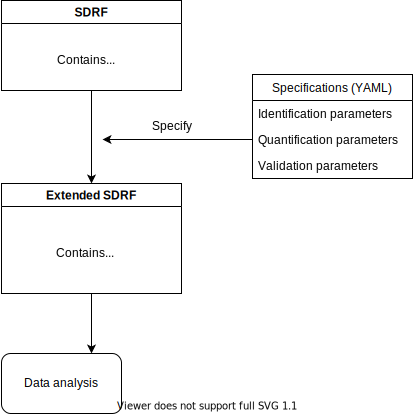

= Additional metadata describing data analysis parameters 
:sectnums:
:toc: left
:doctype: book
//only works on some backends, not HTML
:showcomments:
//use style like Section 1 when referencing within the document.
:xrefstyle: short
:figure-caption: Figure
:pdf-page-size: A4

//GitHub specific settings
ifdef::env-github[]
:tip-caption: :bulb:
:note-caption: :information_source:
:important-caption: :heavy_exclamation_mark:
:caution-caption: :fire:
:warning-caption: :warning:
endif::[]

== Motivation

Both differently parametrized data analysis and usage of different software tools and algorithms mostly leads to different results, and thus are building big
challenges for the reproducibility of the results. 

We tackle part of these differences by adding a set of generalized parameters to the SDRF file format that will facilitate reproducing the data analysis results, 
particularly when combined with details about the used software.

We are well aware of potential issues with the transferability of data analysis parameters across different data analysis pipelines. On the other hand, this collection
can be used to further standardize data analysis workflows and their settings. 

The collection and definition of these parameters has been part of the ELIXIR Implementation Study
and are, until now, heavily based on standard bottom-up LC-MS proteomics experiments without labelling.

All parameters, their type and allowed values are specified in link:assets/param2sdrf.yml[param2sdrf.yml]. These specifications intend to describe data analysis parameters in a standardized way.

=== Authors of this document

Veit Schwämmle

David Bouyssié

==== Use case scenarios

_Reproducibility of data analysis_ 

The set of parameters in the SDRF file will make the main features of the data analysis more transparent and particularly machine-readable.

_Transparent re-processing of public data sets_

By knowing the main parameters for the analysis, re-analysis with other software tools or changed parameter values is much easier.

Several workflows (e.g., https://github.com/nf-core/proteomicslfq[ProteomicsLFQ] and https://github.com/wombat-p[WOMBAT-P]) can already process SDRF files and thus will strongly benefit from this additional information.

== Overview of parameters

In the following, you find the names and short descriptions of the parameters, which have been separated into the different parts of the data analysis.

==== Peptide and protein identification

_Note:_ Relevant parameters like variable and fixed modifications, precursor and fragment tolerances and the enzyme are already part of the metadata standard
and not described here.

The following parameters are generally used in database search but might be transferable to other ways of identification such as _de novo_

|=== 
| short name | sdrf name | short description 

| fions | comment[forward ions] | N-terminal fragment ions 
| rions | comment[reverse ions] | C-terminal fragment ions 
| isotope_error_range | comment[isotope error range] | allowed isotope offsets of the precursor 
| add_decoys | comment[add decoys] | decoys been added to the database file 
| num_hits | comment[num peptide hits] | number of peptide hits reported by the database search engine 
| allowed_miscleavages | comment[allowed miscleavages] | number of allowed miscleavages 
| min_precursor_charge | comment[minimum precursor charge] | lowest allowed precursor charge 
| max_precursor_charge | comment[maximum precursor charge] | highest allowed precursor charge 
| min_peptide_length | comment[minimum peptide length] | lowest considered peptide length 
| max_peptide_length | comment[maximum peptide length] | highest considered peptide length
| max_mods | comment[maximum allowed modifications] | highest number of modifications on a peptide in the database search
| ident_fdr_psm | comment[fdr on psm level] | false discovery rate for peptide-spectrum matches
| ident_fdr_peptide | comment[fdr on peptide level] | false discovery rate for peptide identifications
| ident_fdr_protein | comment[fdr on protein level] | false discovery rate for protein identifications
|===

==== Peptide and protein quantification

These parameters are commonly used in quantitative analyses.

|=== 
| short name | sdrf name | short description 

| enable_match_between_runs | comment[run match between runs] | whether match between runs has been performed
| protein_inference | comment[protein inference method] | algorithm/method  used to infer proteins
| quantification_method | comment[quantification method] | how was the peptide quantified (intensity, precursor, MS2)
| summarization_peptides | comment[summarization to peptides method] | method to summarize PSMs to peptides
| summarization_proteins | comment[summarization to proteins method] | method to summarize peptide to proteins
| min_num_peptides | comment[minimum number of peptides per protein] | proteins are only quantified when having this number of different peptides
| quant_transformation | comment[transformation of quantitative values] | transformation of quantitative values for further processing is (usually logarithm)
| normalization_method |  comment[normalization method] | used method to normalize samples to remove systematic error

|===

==== Statistical testing

General parameters for determining differentially regulated features. We do not aim to include details about contrasts and batches as they are supposed to be readible from the experimental design.

|=== 
| short name | sdrf name | short description 

| run_statistics | comment[run statistical tests] | the data analysis includes tools to determine differentially regulated proteins and/or peptides
| quant_fdr_method | comment[method for correction of multiple testing] | method used to correct the resulting p-values to false discovery rates
| quant_fdr_threshold | comment[threshold for statistical test fdr] | FDR threshold to determine differentially regulated features

|===

=== Implementation and values

As this is work in progress with parameters being added and their values being updated, we refer to the `params2sdrf.yml` specification file. As an example, see the entry for the
parameter _protein_inference_
....
 - name: protein_inference
 type: class
 sdrf: protein inference method
 default: unique
 value:
 - unique
 - shared
 - parsimonious
 - other
....

The `+type`+ field defines whether the parameter is a `+boolean`+, an `+integer`+, a `+float`+, a `+string`+ or a `+class`+ that is restricted to the set of values given by the `+value`+ field.

For an example of an SDRF file with this metadata, see link:assets/sdrf_local.tsv[sdrf_local.tsv]
