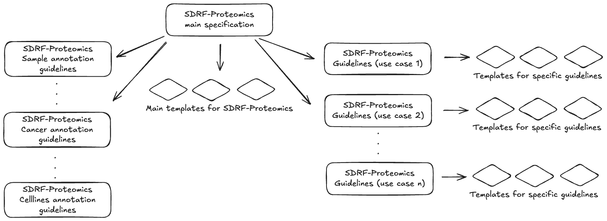

= SDRF-Proteomics: Use Case Specifications
:sectnums:
:toc: left
:doctype: book

== Introduction

This directory contains specifications for specific types of proteomics experiments that require additional metadata fields beyond the standard SDRF-Proteomics format. These specifications extend the core SDRF-Proteomics specification to address the unique requirements of specialized experiment types.

== Specification Structure

The SDRF-Proteomics use case specifications are part of a larger hierarchical structure as shown in the diagram below:

**Figure 1**: SDRF-Proteomics specification structure. The main specification defines the core rules and is extended by specific use case guidelines (highlighted on the right side of the diagram). Each use case has associated templates.

== Available Use Case Specifications

=== Immunopeptidomics

Immunopeptidomics is a specialized field of proteomics that focuses on the identification and characterization of peptides presented by major histocompatibility complex (MHC) molecules on the cell surface.

* link:immunopeptidomics/README-TEMPLATE.adoc[Work in progress specification]
* link:immunopeptidomics/template.sdrf.tsv[Template]

=== Single Cell Proteomics

Single cell proteomics (SCP) aims to characterize the proteome at the level of individual cells, providing insights into cellular heterogeneity that are not accessible through bulk proteomics methods.

* link:single-cell/README-TEMPLATE.adoc[Work in progress specification]
* link:single-cell/template.sdrf.tsv[Template]

=== Crosslinking Proteomics

Crosslinking mass spectrometry (XL-MS) is a technique for studying protein-protein interactions and protein structures using chemical reagents to covalently link amino acid residues that are in close proximity.

* link:crosslinking/README-TEMPLATE.adoc[Work in progress specification]
* link:crosslinking/template.sdrf.tsv[Template]

== Structure of Use Case Specifications

Each use case specification follows a consistent structure:

1. **Introduction**: An overview of the specific experiment type and its importance in proteomics research.

2. **Additional Required Columns**: Columns that must be included in SDRF files for this experiment type, beyond those required by the core specification.

3. **Optional Recommended Columns**: Additional columns that provide valuable metadata for this experiment type but are not strictly required.

4. **Template**: A sample SDRF file template that includes the required and recommended columns for this experiment type. This template can be used as a starting point for creating SDRF files.

5. **Example SDRF File**: A template SDRF file with example data showing how to use the required and recommended columns.

6. **Best Practices**: Guidelines for effectively annotating experiments of this type.

7. **Authors and Maintainers**: Information about the authors of the use case specification.

== Adding New Use Case Specifications

To propose a new use case specification:

1. Create an issue on the GitHub repository describing the experiment type and its specific metadata requirements
2. Develop a draft specification following the structure outlined above
3. Create a pull request with the new specification and template

== Versioning

Following the versioning proposal in GitHub issue #732:

* Major release (X.0.0 → Y.0.0): Changes to the Main SDRF-Proteomics Specification
* Minor release (X.Y.0 → X.Y+1.0): New Guidelines for Specific Use Cases
* Patch release (X.Y.Z → X.Y.Z+1): Refinements to Sample Metadata Guidelines

Adding a new use case specification would typically constitute a minor release.